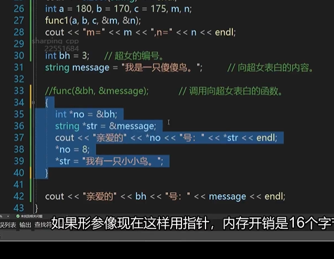
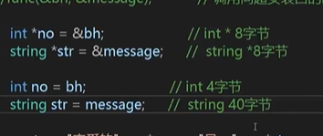

# 指针
申明指针变量之后，在没有赋值之前，里面存放的是乱码
指针存放的是地址；
*是**解引用运算符**，可以得到地址中存放的值，&是**取地址运算符**，拿到变量的地址。
那么，C++中有两种存储数据的方式：

- 正常声明变量，由编译器跟踪该变量；
- 声明指针变量，这个指针变量存储地址，访问的时候直接访问该地址

特点：

1. 可以通过指针指向不同变量
2. 指针变量尺寸相同

## 1. 指针用于函数
地址传递：形参定义为指针，传参传变量地址，在函数中直接修改指针变量的值，但值传递不会影响原来的值
值传递：函数形参为普通变量
	
意义：

1. 地址传递可以直接改变传入形参的值，比如：函数的功能需要修改形参，但值传递不会直接改变形参，地址传递会更方便
2. 可以减少数据拷贝
```cpp 
void func1(int a, int b, int c, int* max, int* min)
{
	*max = a > b ? a : b;               // 取a和b中的大者。
	*min = a < b ? a : b;                // 取a和b中的小者。
	*max = *max > c ? *max : c;   // 取*max和c中的大者。
	*min = *min < c  ? *min : c;    // 取*min和c中的大者。
}
int a = 180, b = 170, c = 175, m, n;
func1(a, b, c, &m, &n);
cout << "m=" << m << ",n=" << n << endl;
```

## 2. const修饰指针

