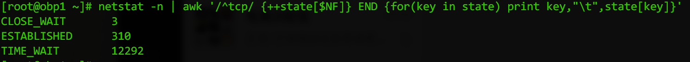

最近业务系统需要使用Nginx做负载均衡支撑起**单机**大概每天10亿次量级的请求，踩了一些坑之后，正好借此机会对系统的参数配置，网络协议，Nginx的配置等做了全面的梳理，特此记录一下。


# Linux系统配置

要想支持这么大量级的请求，所以对Linux的一些参数要做出调整。

## 文件打开数

文件打开数的意思是对一个进程，允许同时打开的句柄数是多少。对于网络程序，也就是能够支持的最大并发连接数了。系统默认的值是`65535`，我们可以通过下面的命令来查看

```
$ ulimit -a
```

如下图显示的，就是默认的Linux系统的一些信息。


那如何修改呢，直奔主题，可以**永久**修改文件打开数的方法是，修改`/etc/security/limits.conf`文件中的配置信息
默认的配置文件最后是这样的

```
# End of file
*	hard	nproc	65535
*	soft	nproc	65535
*	hard	nofile	65535
*	soft	nofile	65535
```

我们要修改的就是`nofile`这两个配置，`hard`表示当前可以设置的最大值，`soft`表示当前的值，我们就把这两个值改成比如`500000`好了，因为单机的话，50万的并发连接基本也到nginx的极限了。

> 注意，nofile的最大值不能超过`/proc/sys/fs/nr_open`这个值，默认是(1048576)

完成后再次执行`ulimit -a`查看是否生效了。

> 注：有些服务器因为系统配置原因，可能通过ssh登录时无法看到生效信息，可以通过配置`/etc/ssh/sshd_config`中的UsePAM 和 UseLogin参数来。
> 在文件中修改/添加`UsePAM yes`和`UseLogin yes`，然后重新登录ssh即可。

## TCP连接配置

先看结论，打开`/etc/sysctl.conf`文件，默认的应该都是注释掉的一些内容，在文件末尾加入以下内容：

```
# It enables fast recycling of TIME_WAIT sokcets. Known to cause some issues with hoststated(NAT and load balancing) if enabled, should be used with caution.
net.ipv4.tcp_tw_recycle = 0
# This allows resuing sockets in TIME_WAIT state for new connections when it is safe from protocol viewpoint. It is generally a safer alternative to tcp_tw_recycle
net.ipv4.tcp_tw_reuse = 1
# Determines the time that must elapse before TCP/IP can release a closed connection and reuse its resource. During this TIME_WAIT state, reopening the connection to
# the client costs less then establishing a new connection. By reducing the value of the entry, TCP/IP can release closed connections faster, making more resources
# available for new connections.
net.ipv4.tcp_fin_timeout = 5
# The wait time between isAlive interval probes(seconds)
net.ipv4.tcp_keepalive_intvl = 15
# The number of probes before timing out.
net.ipv4.tcp_keepalive_probes = 3
# The time of keepalive remined time(seconds)
net.ipv4.tcp_keepalive_time = 300

# The length of the syn quene
net.ipv4.tcp_max_syn_backlog = 65535
# The length of the tcp accept queue
net.core.somaxconn = 65535

# port range
net.ipv4.ip_local_port_range = 1024 65000
```

然后执行

```
$ sysctl -p
```

接下来我们再来花大篇幅讲解一下为何要这样配置。

### Time_wait

关于time_wait, close_wait, fin等TCP握手协议，这本篇文章里就不做赘述，可以参见最后的附录(强烈推荐第一篇)，里面有很多文章都讲到了网络协议相关的内容。大家需要知道的一个概念就是：

> 当client发起一个tcp连接到server后，这个连接被client主动断开后，在client所在的服务器和server所在的服务器上，这个tcp连接(fd)的状态都会被设置成time_wait。只有过去足够安全的时间后，这个tcp连接(fd)才会被重复使用。

为什么我在这里把tcp连接后面备注了fd，其实对web服务器来说，一个tcp连接的建立就相当于使用了一个句柄，或者叫文件打开数，也就是我们上一个小节修改过的nofile的值。毕竟在Linux内核中，万物皆文件。

我们再来假设一个典型的系统架构如下图：

```
+--------+  HTTP   +-------+  HTTP   +----------+
| Client | ------> |       | ------> | Upstream |
+--------+         |       |         +----------+
                   |       |  HTTP   +----------+
                   | Nginx | ------> | Upstream |
                   |       |         +----------+
                   |       |  HTTP   +----------+
                   |       | ------> | Upstream |
                   +-------+         +----------+
```

如果Client到Nginx的连接都是短链接，那么在client和nginx所在的服务器上，都会出现大量的time_wait状态的连接。这种连接对Nginx服务器，也就是server是没问题的，因为不会消耗特别多的性能，只是会多消耗一些内存与端口链表查找的CPU资源，这点资源对现代的服务器来说基本上可以忽略。但是对client来说就不一样了，client每建立一个连接，都要占用一个本地的端口，而端口数量是有限的(65535个)，这也是为什么我们推荐用长连接的方式来进行业务处理。

我们来结合实际用例看一下。

我们先看一下服务器上的TCP连接的总情况：

```
$ netstat -n | awk '/^tcp/ {++state[$NF]} END {for(key in state) print key,"\t",state[key]}'
```

你会得到如下的信息：




如上图，close_wait是server主动关闭连接是产生的关闭状态，establish是在使用中的连接，time_wait就是我们要分析的目标了。如果没有做好相关配置时，可能服务器这个值会有十几甚至几十万。

我们来看一下client主动关闭的连接情况：


如上图所示，我们的grep筛选条件里面筛选了查看由client主动连上来的连接，且状态是time_wait的，并且只看了最后几条，可以从图中清楚地得到一下几点：

1. server的端口443上连上了很多连接，但是这些连接其实不是特别消耗主机资源，我们的最大fd设置的是50万，所以是足够的，server是没问题的。
2. client(88.194)明显用的是短链接，而且能看到是从不同的端口连接上来的，所以client如果请求量很大，会把它自己的端口占用完，导致连接不上来的。

所以，如果我们的nginx连接到负载均衡节点时是短链接，那么nginx这台服务器的本地端口就会被耗尽，client就会得到nginx502的错误响应，错误原因大致是`Cannot assign requested address for upstream`
对于nginx的配置，我们下个小节在详细描述。
了解了tcp的连接状态，我们再回到开头提到的配置文件，让我们逐条分析一下。

------

#### net.ipv4.tcp_tw_recycle

recycle可以加快tcp连接的回收速度，但是recycle这个值的使用很容易出现问题，尤其在NAT的环境下，很多正常的连接会被丢弃。原理是当连接被很快复用后，从不同的服务器发来的请求，会被认为是从通一个remote过来的连接，但是这些服务器的时间戳是不一样的，就很容易被server认为tcp包序乱而丢弃掉。从client看来就是很多连接超时了没有响应。
所以，这个值保险期间，我们都设置成0，即不启用。之前的内容也提到了，作为server，只要它和后端的负载节点之间是长连接，就不会出现很多time_wait的连接。而作为server，被动连接进来的time_wait的tcp连接并不会占用server本身的资源。

------

#### net.ipv4.tcp_tw_reuse

recycle不安全，但是reuse就要安全地多，所以这个值可以打开，reuse可以安全地回收利用tcp连接。

------

#### net.ipv4.tcp_fin_timeout

对于本端断开的socket连接，TCP保持在FIN-WAIT-2状态的时间。对方可能会断开连接或一直不结束连接或不可预料的进程死亡。默认值为 60 秒。降低这个值可以一定程度上防范DDOS攻击。

------

#### net.ipv4.tcp_keepalive_intvl

两次检测tcp连接活动状态的间隔时间，默认75秒

------

#### net.ipv4.tcp_keepalive_probes

最大多少次连接检测tcp非活动状态后断开连接，默认9次

------

#### net.ipv4.tcp_keepalive_time

长连接超时时间，默认7200秒

------

#### net.core.somaxconn

其实就是决定了tcp全连接队列的backlog数，详细内容参见[这篇博文](http://lipeng1667.github.io/2019/10/28/nginx-error-troubleshoot/)中的TCP连接队列

------

这些值的配置，都可以有效地缩短tcp连接的超时时间，从而加快tcp的回收。

# Nginx配置

接着上一章节中提到的，如果nginx所在的服务器和下游的负载均衡节点之间是短链接，会导致nginx所在的服务器有大量的time_wait连接，而且，这些连接都是要占用本地的端口的。而本地端口又是有限的，而nginx默认的负载节点之间的连接正好是短链接，所以需要对nginx的配置做一定的修改。

还是先来看最终的配置文件`/etc/nginx/nginx.conf`

```
user                    nginx;
worker_processes        auto;
worker_cpu_affinity     auto;
worker_rlimit_nofile    409600;
error_log               /var/log/nginx/error.log warn;
pid                     /var/run/nginx.pid;

events {
    use                 epoll;
    worker_connections  409600;
    multi_accept        on;
    accept_mutex        off;
}

http {
    include             /etc/nginx/mime.types;
    default_type        application/octet-stream;

    log_format  main    '$remote_addr - $remote_user [$time_local] "$request" '
                        '$status $body_bytes_sent "$http_referer" '
                        '"$http_user_agent" "$http_x_forwarded_for"';

    access_log          /var/log/nginx/access.log  main;

    sendfile            on;
    tcp_nopush          on;
    tcp_nodelay         on;

    keepalive_timeout   300;
    keepalive_requests  20000000;

    open_file_cache max=10240 inactive=20s;
    open_file_cache_valid 30s;
    open_file_cache_min_uses 1;

    gzip                on;
    gzip_min_length     1k;
    gzip_buffers        4 16k;
    gzip_http_version   1.0;
    gzip_comp_level     2;
    gzip_types          text/plain application/x-javascript text/css application/xml text/javascript application/x-httpd-php image/jpeg image/gif image/png;
    gzip_vary           on;

    upstream nis {
        server obp2:5001 max_fails=0;
        server obp2:5002 max_fails=0;
        server obp2:5003 max_fails=0;
        server obp2:5004 max_fails=0;
        keepalive 300;
    }

    server {
        listen              443 ssl http2 backlog=65535;
        listen              [::]:443 ssl http2 backlog=65535;
        server_name         localhost.com;
        access_log          off;

        ssl_certificate     your-cert-file-path;
        ssl_certificate_key your-cert-key-file-path;
        ssl_session_timeout 1d;
        ssl_session_cache   shared:SSL:50m;
        ssl_session_tickets off;

        # modern configuration
        ssl_protocols       TLSv1.2;
        ssl_ciphers 'ECDHE-ECDSA-AES256-GCM-SHA384:ECDHE-RSA-AES256-GCM-SHA384:ECDHE-ECDSA-CHACHA20-POLY1305:ECDHE-RSA-CHACHA20-POLY1305:ECDHE-ECDSA-AES128-GCM-SHA256:ECDHE-RSA-AES128-GCM-SHA256:ECDHE-ECDSA-AES256-SHA384:ECDHE-RSA-AES256-SHA384:ECDHE-ECDSA-AES128-SHA256:ECDHE-RSA-AES128-SHA256';
        ssl_prefer_server_ciphers on;

        # HSTS (ngx_http_headers_module is required) (15768000 seconds = 6 months)
        add_header Strict-Transport-Security max-age=15768000;

        location /nis {
            proxy_pass http://nis;
            proxy_set_header Host $host:$server_port;
            proxy_set_header X-Forwarded-Host $server_name;
            proxy_set_header proxy_x_forward_ip $remote_addr;
            proxy_set_header X-Forwarded-For $proxy_add_x_forwarded_for;
            proxy_set_header X-Forwarded-Proto $scheme;
            proxy_set_header X-Forwarded-Port $server_port;
            proxy_http_version 1.1;
            proxy_set_header Connect "";
        }
    }

    include /etc/nginx/conf.d/*.conf;
}
```

> 这里为了方便显示，我把所有的配置都放到`/etc/nginx/nginx.conf`文件中了。实际情况下，`upstream`负载节点信息和`server`信息可以放到`conf.d`目录下，然后由nginx.conf统一加载进去。

我们来分别看一下nginx都做了哪些配置：

## worker多线程

```
user                    nginx;
worker_processes        auto;
worker_cpu_affinity     auto;
worker_rlimit_nofile    409600;
error_log               /var/log/nginx/error.log warn;
pid                     /var/run/nginx.pid;
```

这部分表示启用多线程处理，默认情况下，nginx只有一个master线程来处理，这段配置告诉nginx尽可能多地启用worker线程来帮助处理高并发的任务。

## 主配置

```
events {
    use                 epoll;
    worker_connections  409600;
    multi_accept        on;
    accept_mutex        off;
}

http {
    include             /etc/nginx/mime.types;
    default_type        application/octet-stream;

    log_format  main    '$remote_addr - $remote_user [$time_local] "$request" '
                        '$status $body_bytes_sent "$http_referer" '
                        '"$http_user_agent" "$http_x_forwarded_for"';

    access_log          /var/log/nginx/access.log  main;

    sendfile            on;
    tcp_nopush          on;
    tcp_nodelay         on;

    keepalive_timeout   300;
    keepalive_requests  20000000;

    open_file_cache max=10240 inactive=20s;
    open_file_cache_valid 30s;
    open_file_cache_min_uses 1;

    gzip                on;
    gzip_min_length     1k;
    gzip_buffers        4 16k;
    gzip_http_version   1.0;
    gzip_comp_level     2;
    gzip_types          text/plain application/x-javascript text/css application/xml text/javascript application/x-httpd-php image/jpeg image/gif image/png;
    gzip_vary           on;

    include /etc/nginx/conf.d/*.conf;
}
```

events表示启用epoll模型来处理高并发的请求，epoll模型是linux底层的高性能、高并发处理模型，nginx也是基于此实现的。
在http的主配置中，开启`sendfile`、`tcp_nopush`和`tcp_nodelay`；
同时keepalive一定要配置上，timeout表示超时时间；requests表示同一个连接接收多少请求后断开；
剩下的就是一些常用的配置，记得在最后如果有其他额外的配置，要放到`conf.d`目录下。

## 负载节点信息

```
upstream nis {
    server obp2:5001 max_fails=0;
    server obp2:5002 max_fails=0;
    server obp2:5003 max_fails=0;
    server obp2:5004 max_fails=0;
    keepalive 300;
}
```

这里相当于我们申请了一个叫做`nis`的负载结构，里面把请求均匀地分配到4个节点上，同时**一定**要加上keepalive，否则，这个节点的负载就是短链接，而不是长连接。
注意max_fails=0表示忽略当前负载节点的报错，如果不配置，默认值为1，即当负载节点报错1次后，即暂停向当前节点分发请求。

> 注：对于可靠性较高的负载节点，可以像我一样，忽略掉报错，因为极端情况下，如果所有节点均出错，则当前服务即不可用。

## 监听端口信息

```
server {
    listen              443 ssl http2 backlog=65535;
    listen              [::]:443 ssl http2 backlog=65535;
    server_name         localhost.com;
    access_log          off;

    ssl_certificate     your-cert-file-path;
    ssl_certificate_key your-cert-key-file-path;
    ssl_session_timeout 1d;
    ssl_session_cache   shared:SSL:50m;
    ssl_session_tickets off;

    # modern configuration
    ssl_protocols       TLSv1.2;
    ssl_ciphers 'ECDHE-ECDSA-AES256-GCM-SHA384:ECDHE-RSA-AES256-GCM-SHA384:ECDHE-ECDSA-CHACHA20-POLY1305:ECDHE-RSA-CHACHA20-POLY1305:ECDHE-ECDSA-AES128-GCM-SHA256:ECDHE-RSA-AES128-GCM-SHA256:ECDHE-ECDSA-AES256-SHA384:ECDHE-RSA-AES256-SHA384:ECDHE-ECDSA-AES128-SHA256:ECDHE-RSA-AES128-SHA256';
    ssl_prefer_server_ciphers on;

    # HSTS (ngx_http_headers_module is required) (15768000 seconds = 6 months)
    add_header Strict-Transport-Security max-age=15768000;

    location /nis {
        proxy_pass http://nis;
        proxy_set_header Host $host:$server_port;
        proxy_set_header X-Forwarded-Host $server_name;
        proxy_set_header proxy_x_forward_ip $remote_addr;
        proxy_set_header X-Forwarded-For $proxy_add_x_forwarded_for;
        proxy_set_header X-Forwarded-Proto $scheme;
        proxy_set_header X-Forwarded-Port $server_port;
        proxy_http_version 1.1;
        proxy_set_header Connection "";
    }
}
```

最后的sever部分就是实际监听的端口配置了。这里我们监听在443端口上。注意看最后一部分，nginx根据路径，当url路径是`/nis`时，将请求转发到之前的负载均衡配置节点`nis`上，然后最后两个配置项

监听项后的`backlog`参数，就决定了tcp连接队列的最大长度。默认nginx的tcp监听连接队列是511，我们这里改成较大的值。

```
proxy_http_version 1.1;
proxy_set_header Connection "";
```

保险期间也一并加上，防止意外情况下默认使用1.0协议的短链接http请求。

------

以上配置完成后，`systemctl reload nginx`重载nginx的配置信息。