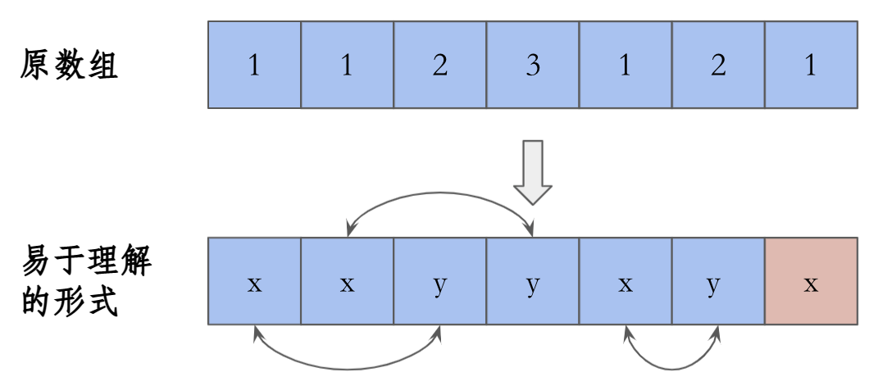

## [只出现一次的数字](https://leetcode-cn.com/leetbook/read/top-interview-questions/xm0u83/)

给定一个非空整数数组，除了某个元素只出现一次以外，其余每个元素均出现两次。找出那个只出现了一次的元素。（**只有一个元素是不重复的**）

说明：

你的算法应该具有线性时间复杂度。 你可以不使用额外空间来实现吗？

**示例 1:**

```
输入: [2,2,1]
输出: 1
```

**示例 2:**

```
输入: [4,1,2,1,2]
输出: 4
```

```python
class Solution:
    def singleNumber(self, nums: List[int]) -> int:
        #return sum(set(nums))*2-sum(nums)
        a = 0
        for num in nums:
            a = a ^ num
        return a
```

> 数组内所有元素异或
>
> 归零律：a ^ a = 0
> 恒等律：a ^ 0 = a
> 交换律：a ^ b = b ^ a
> 结合律：a ^b ^ c = a ^ (b ^ c) = (a ^ b) ^ c;
> 自反：a ^ b ^ a = b.
> d = a ^ b ^ c 可以推出 a = d ^ b ^ c.
> 例：x是二进制数0101，y是二进制数1011；则x^y=1110
> **[0,1,2,1,2] 则 0^1^2^1^2=0** 故思路为该数组内所有元素异或最后的结果则为目标元素

## 给定一个大小为 *n* 的数组，找到其中的多数元素。多数元素是指在数组中出现次数 **大于** `⌊ n/2 ⌋` 的元素。

假设数组是非空的，并且给定的数组总是存在多数元素。



上图为摩尔投票的理解图，题目的众数总是多余其他数的总量，那么我们设为：众数为x，其他数为y，摩尔投票，碰到x加1，碰到y-1，那么剩余的x的票数总是大于1的，题解为：

```
def moel(self, nums: List[int])-> int:
	count = 0# 计票
	temp = 0# 存储众数x
	for i in range(len(nums)):
		if count ==  0:
			temp = nums[i]
			count += 1
        elif temp == nums[i]:
        	count +=1
        else: 
        	count -= 1
    return temp
```

