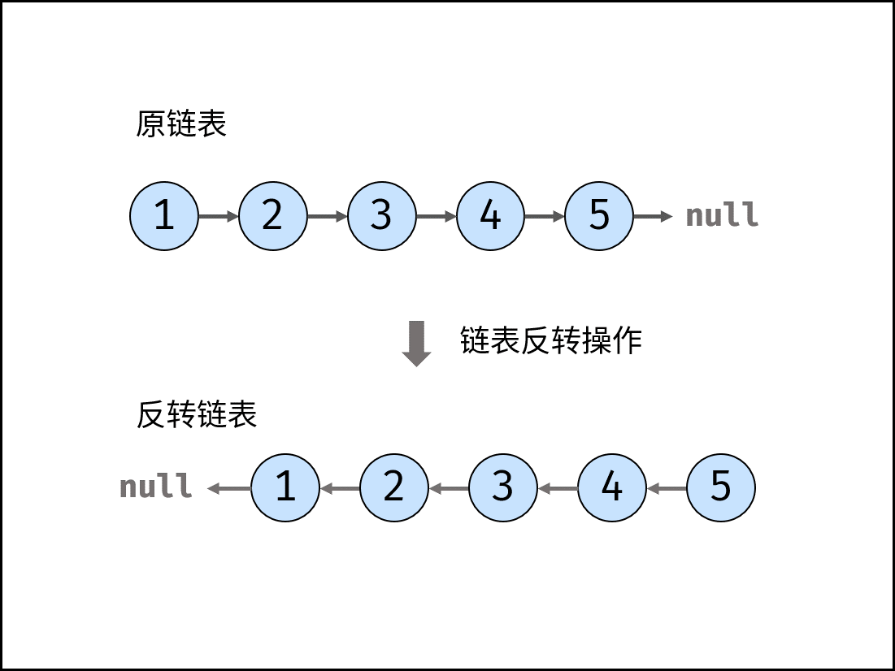

# 03，数组中重复的数字

1. set，自动去重

2. 原地交换：`在一个长度为 n 的数组 nums 里的所有数字都在 0 ~ n-1 的范围内` 。 此说明含义：数组元素的 **索引** 和 **值** 是 **一对多** 的关系。


```python
class Solution:
    def findRepeatNumber(self, nums: List[int]) -> int:
# solution 1
        # var_set = set()
        # for i in range(len(nums)):
        #     if nums[i] in var_set:
        #         return nums[i]
        #     else:
        #         var_set.add(nums[i])
        # 时间复杂度O(N)，空间复杂度：O(N)
# solution 2
        i = 0
        while i < len(nums):
            if nums[i] == i:
                i += 1
                continue
                # 若 nums[i] = i ： 说明此数字已在对应索引位置，无需交换，因此跳过；
            if nums[nums[i]] == nums[i]:
                return nums[i]
				# 若 nums[nums[i]] = nums[i]： 代表索引 nums[i] 处和索引 ii 处的元素值都为 nums[i] ，即找到一组重复值，返回此值 nums[i];
                
            nums[nums[i]], nums[i] = nums[i], nums[nums[i]] 
    			# 否则： 交换索引为 i 和 nums[i]的元素值，将此数字交换至对应索引位置。
        return -1
    # 时间复杂度O(N)，空间复杂度：O(1)
```

> Python 中， a, b = c, d 操作的原理是先暂存元组 (c, d)，然后 “按左右顺序” 赋值给 a 和 b 。因此，若写为：
>
> ```
> nums[i], nums[nums[i]] = nums[nums[i]], nums[i]
> ```
>
> ，则左nums[i] 会先被赋值，之后左nums[nums[i]]指向的元素则会出错。

# 09，两个栈实现一个队列

请实现它的两个函数 appendTail 和 deleteHead ，分别完成在队列尾部插入整数和在队列头部删除整数的功能。(若队列中没有元素，deleteHead 操作返回 -1 )

```
def __init__(self):
	self.A, self.B = [], []
def appendTail (self, value: int) -> None:
	self.A.append(value)
def deleteHead(self) -> int:
	if not self.A: return -1
	if self.B return self.B.pop()
	while self.A:
		self.B.append(self.A.pop())
    return self.B.pop()
```


# 30，包含min函数的栈（栈与队列）

定义栈的数据结构，请在该类型中实现一个能够得到栈的最小元素的 min 函数在该栈中，调用 min、push 及 pop 的时间复杂度都是 O(1)。

>  普通栈的 push() 和 pop() 函数的复杂度为 O(1)O(1) ；而获取栈最小值 min() 函数需要遍历整个栈，复杂度为 O(N)O(N) 。

本题难点： 

1. 将 min() 函数复杂度降为 O(1)O(1) ，可通过建立辅助栈实现；
   数据栈 AA ： 栈 AA 用于存储所有元素，保证入栈 push() 函数、出栈 pop() 函数、获取栈顶 top() 函数的正常逻辑。
2. 辅助栈 BB ： 栈 BB 中存储栈 AA 中所有 非严格降序 的元素，则栈 AA 中的最小元素始终对应栈 BB 的栈顶元素，即 min() 函数只需返回栈 BB 的栈顶元素即可。

因此，只需设法维护好 栈 BB 的元素，使其保持非严格降序，即可实现 min() 函数的 O(1)O(1) 复杂度。

```
    def __init__(self):
        """
        initialize your data structure here.
        """
        self.A, self.B = [], []

    def push(self, x: int) -> None:
        self.A.append(x)
        if not self.B or self.B[-1] >= x: #如果不把和栈顶元素相等的新最小元素放进去的话，弹栈后A会和B不相等
            self.B.append(x)

    def pop(self) -> None:
        if self.A.pop() == self.B[-1]:
            self.B.pop()

    def top(self) -> int:
        return self.A[-1]

    def min(self) -> int:
        return self.B[-1]
```

# 24. 反转链表（链表）

迭代（双指针） / 递归，[题解](https://leetcode-cn.com/problems/fan-zhuan-lian-biao-lcof/solution/jian-zhi-offer-24-fan-zhuan-lian-biao-die-dai-di-2/)



我们要把上图列表反转，有两种方法迭代（双指针） / 递归：

1. ```
   class Solution:
       def reverseList(self, head: ListNode) -> ListNode:
       	cur, pre = head, None
      		while cur:
      			tmp = cur.next # 先把cur指针的下个位置缓存
      			cur.next=pre # 修改cur指针的指向位置，从默认的指向后改为指向前
      			pre = cur # 把pre指针指向当前位置
      			cur = tmp # 把当前位置的cur指针指向下个位置
   ```

2. **链表具有天然的递归性**

   一个链表例如 1->2->3->4->5->NULL，可以看成头节点(节点值为 1 的节点)后面挂接一个更短的链表(缺少节点值为 1 的节点，以节点值为 2 的节点为头节点) 1->更短的链表，依次类推。如下如示：

   这样的话，就可以先翻转头节点后面挂接的链表，然后把翻转后的链表的后面再挂接头节点，这样就实现了链表的翻转，如下图示：

   

   先翻转以节点值为 2 的节点作为头节点的链表

   

   将原头节点(节点值为 1 的节点)挂接在翻转之后的链表的后面

   

   **例子：**

   以链表 1->2->3->null 为例子，其递归反转过程如下动图示：

   

   **递归结束条件：**

   1. 节点是空节点；

   2. 当前只有这一个节点，无需再翻转。

```
class Solution:
    def reverseList(self, head: ListNode) -> ListNode:
    	# if not head.next: return []
    	# return reverseList(head.next) + [head.val] #06，从后到前打印链表
    	if not head or not head.next:
    		return head
        node = self.reverseList(head.next)
        head.next.next=head
        head.next=null
        return 
```

