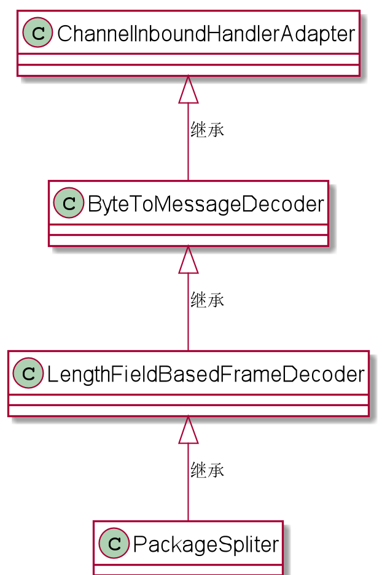

1. 正文

    本分背景基于netty通过串口与硬件设备通信，但解决方案和思路在类似的通信应用里面基本都是通用的；具体介绍基于数据长度拆包，这种相对来说是比较灵活的解决方案。

    具体方案如下：
    - 对数据包(16进制)进行包装：
    在前面加上设备地址和数据包长度，最后两位为CRC校验位。
    - 在服务端对数据包进行拆包

        使用Netty中，基于长度域拆包器 LengthFieldBasedFrameDecoder，按照实际的应用层数据包长度来拆分。

        需要做两个工作：

        设置长度信息（长度域）在数据包中的位置。
        设置长度信息（长度域）自身的长度，也就是占用的字节数。
    ```java
    public class PackageSpliter extends LengthFieldBasedFrameDecoder{

        public PackageSpliter() {
            super(Integer.MAX_VALUE, 1,1);
        }

        @Override
        protected Object decode(ChannelHandlerContext ctx, ByteBuf in) throws Exception {

            return super.decode(ctx, in);
        }
    }
    ```
    我们可以看到，分割器PackageSpliter继承了LengthFieldBasedFrameDecoder
    并在构造里传入了三个参数。

    - 长度的偏移量 ，这里是 Constants.LENGTH_OFFSET，值为 2；
    - 长度的字节数，这里是 Constants.LENGTH_BYTES_COUNT，值为 2
    - 最大的应用包长度，这里是 Integer.MAX_VALUE，表示不限制

    分割器 写好之后，只需要在pipeline的最前面加上这个分割器，就可以使用这个分割器（自定义的拆包器）。

    但是为什么拆包器在pipline的最前面？

    

    由此可见，分割器 PackageSpliter 继承了ChannelInboundHandlerAdapter。
      本质上，它是一个入站处理器。
      Netty的入站处理的顺序，是从pipelin 流水线的前面到后面。
      所以，在入站过程中，解码器 ProtobufDecoder 进行应用层 protobuf 的数据包的解码，而在此之前，必须完成应用包的正确分割。
      所以， 分割器 PackageSpliter 必须处于入站流水线处理的第一站，放在最前面。
