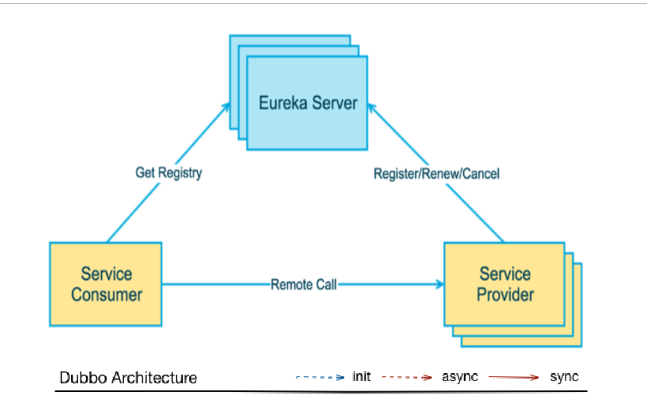

## SpringCloud

### Eureka服务注册与发现

#### 1.概念：

Spring Cloud 封装了 Netflix 公司开发的 Eureka 模块来实现服务注册和发现(请对比Zookeeper)。

Eureka 采用了 C-S 的设计架构。Eureka Server 作为服务注册功能的服务器，它是服务注册中心。而系统中的其他微服务，使用 Eureka 的客户端连接到 Eureka Server并维持心跳连接。这样系统的维护人员就可以通过 Eureka Server 来监控系统中各个微服务是否正常运行。SpringCloud 的一些其他模块（比如Zuul）就可以通过 Eureka Server 来发现系统中的其他微服务，并执行相关的逻辑。

- 组件：Eureka Server（提供注册服务）、 Eureka Client（JAVA客户端，负责发送心跳）
  Eureka Server提供服务注册服务
  各个节点启动后，会在EurekaServer中进行注册，这样EurekaServer中的服务注册表中将会存储所有可用服务节点的信息，服务节点的信息可以在界面中直观的看到

  EurekaClient是一个Java客户端，用于简化Eureka Server的交互，客户端同时也具备一个内置的、使用轮询(round-robin)负载算法的负载均衡器。在应用启动后，将会向Eureka Server发送心跳(默认周期为30秒)。如果Eureka Server在多个心跳周期内没有接收到某个节点的心跳，EurekaServer将会从服务注册表中把这个服务节点移除（默认90秒）



#### 2.服务端配置：

- 配置pom.xml

```xml
	<dependencies>
		<!--eureka-server服务端 -->
		<dependency>
			<groupId>org.springframework.cloud</groupId>
			<artifactId>spring-cloud-starter-eureka-server</artifactId>
		</dependency>
		<!-- 修改后立即生效，热部署 -->
		<dependency>
			<groupId>org.springframework</groupId>
			<artifactId>springloaded</artifactId>
		</dependency>
		<dependency>
			<groupId>org.springframework.boot</groupId>
			<artifactId>spring-boot-devtools</artifactId>
		</dependency>
	</dependencies>
```

- 配置application.yml

```yaml
server:
  port: 7001

eureka:
  instance:
    hostname: eureka7001.com #eureka服务端的实例名称
  client:
    register-with-eureka: false     #false表示不向注册中心注册自己。
    fetch-registry: false     #false表示自己端就是注册中心，我的职责就是维护服务实例，并不需要去检索服务
    service-url:
      #单机 defaultZone: http://${eureka.instance.hostname}:${server.port}/eureka/       #设置与Eureka Server交互的地址查询服务和注册服务都需要依赖这个地址（单机）。
      defaultZone: http://eureka7002.com:7002/eureka/,http://eureka7003.com:7003/eureka/
```

启动类配置注解：

```java
@EnableEurekaServer
```

#### 3.客户端配置：

- 配置pom.xml

```xml
<dependency>
    <groupId>org.springframework.cloud</groupId>
    <artifactId>spring-cloud-starter-eureka</artifactId>
</dependency>
<dependency>
    <groupId>org.springframework.cloud</groupId>
    <artifactId>spring-cloud-starter-config</artifactId>
</dependency>
```

- 配置application.yml

```yaml
eureka:
  client:
    service-url:
      defaultZone: http://localhost:7001/eureka
```

- 配置启动类

```java
@EnableEurekaClient //本服务启动后会自动注册进eureka服务中
@EnableDiscoveryClient //服务发现
```

#### 4. Actuator监控

[Actuator用法很多，参照这个](https://blog.csdn.net/dong_19890208/article/details/52836436)

- 配置pom.xml

```xml
<dependency>
    <groupId>org.springframework.boot</groupId>
    <artifactId>spring-boot-starter-actuator</artifactId>
</dependency>
```

- 在总的父工程下添加

```xml
<build>
    <finalName>microservicecloud</finalName>
    <resources>
        <resource>
            <!--允许扫描该路径下的资源文件-->
            <directory>src/main/resources</directory>
            <filtering>true</filtering>
        </resource>
    </resources>
    <plugins>
        <plugin>
            <groupId>org.apache.maven.plugins</groupId>
            <artifactId>maven-resources-plugin</artifactId>
            <configuration>
                <delimiters>
                    <!--指定动态获取以$标志开头结尾的信息-->
                    <delimit>$</delimit>
                </delimiters>
            </configuration>
        </plugin>
    </plugins>
</build>
```

- 配置application.yml

```yaml
info:
  app.name: atguigu-microservicecloud
  company.name: www.atguigu.com
  build.artifactId: ${project.artifactId}
  build.version: ${project.version}
```

#### 5. Eureka的自我保护机制

Eureka的自我保护机制主要是为了网络异常时保持高可用设计的，当在Eureka中注册的微服务超过设定是时间内（默认90秒）没有向Eureka服务端发送心跳，该微服务会进入自我保护模式。在自我保护模式中，Eureka会保护服务注册表中的信息，不会注销任何服务实例，直至收到的心跳数恢复至阈值以上，该微服务退出自我保护模式。

- 可以在application.yml修改开启或关闭状态

```yaml
  server:
    enable-self-preservation: false
```

#### 6.Eureka服务发现

系统中的微服务可以通过Eureka的服务发现去获得在Eureka中注册的服务的信息，这是一个对外暴露的接口。使用方法（provider中）

- 注入DiscoveryClient 对象（spring包下的），在controller方法中获取

```java
@Autowired
private DiscoveryClient discoveryClient;

@ResponseBody
@GetMapping("/provider/discovery")
public Object discovery(){
        List<String> list = discoveryClient.getServices();
        System.out.println(list);
        List<ServiceInstance> insList = discoveryClient.getInstances("MICROSERVICECLOUD-DEPT");
        for (ServiceInstance si:insList) {
            System.out.println(si.getHost() +"," + si.getServiceId() +"," +si.getPort() +"," +si.getUri() +"," +si.getMetadata());
        }
        return this.discoveryClient;
    }
```

- 在主启动类中加入@EnableDiscoveryClient注解

```java
@SpringBootApplication
@EnableEurekaClient
@EnableDiscoveryClient
public class Provider8001_APP {
    public static void main(String[] args) {
        SpringApplication.run(Provider8001_APP.class,args);
    }
}
```

#### 使用方法（consumer中）

在controller方法中使用restTemplate对象调用provider中暴露的URL 并获得返回对象即可

```java
@GetMapping("/discovery")
public Object discovery() {
        return restTemplate.getForObject(URL_PREFIX+"/provider/discovery",Object.class);
}
```

#### 7. Eureka集群配置

##### 集群

集群就是在不同的机器上配置相同的服务来构建要一个大的运算整体

##### 实现集群

1. 新建N个Eureka Server模块
2. 每个模块的pom.xml中加入与单个Eureka Server相同的依赖
3. 每个模块加入主程序（记得加@EnableEurekaServer注解）
4. 修改hosts文件（Win7的路径是C:\Windows\System32\drivers\etc）

```shell
127.0.0.1 eureka7001.com
127.0.0.1 eureka7002.com
127.0.0.1 eureka7003.com
```

1. 修改Eureka Server模块的application.yml文件，加入集群，主要修改两个地方：

- hostname：修改为hosts文件中映射的地址
- service-url下的defaultZone节点：填入集群中另外的server服务端的地址

```yml
server:
  port: 7001
eureka:
  instance:
    hostname: eureka7001.com    #hostname为hosts文件中映射的地址
  client:
    register-with-eureka: false     #false表示不向注册中心注册自己
    fetch-registry: false           #false表示自己就是注册中心，职责是维护实例，不参加检索
    service-url:
      #defaultZone: http://${eureka.instance.hostname}:${server.port}/eureka/    #设置eureka server的交互地址
      defaultZone: http://eureka7002.com:7002/eureka/,http://eureka7003.com:7003/eureka/  #其他两个服务端的地址
```

1. 修改Eureka Client模块的application.yml文件，使其向集群注册服务

- service-url下的defaultZone节点：填入集群中需要向其注册server服务端的地址

```yml
eureka:
  client:
    service-url:
      defaultZone: http://eureka7001.com:7001/eureka,http://eureka7002.com:7002/eureka,http://eureka7003.com:7003/eureka
```

1. 访问地址

```shell
http://eureka7001.com:7001
http://eureka7002.com:7002
http://eureka7003.com:7003
```

1. ==注：defaultZone中eureka/后缀是必须的，如果删除，Server类不会报错，但是Client注册时会报404错误==

##### Eureka与Zookeeper对比

##### CAP设计原则不同

Eureka遵守AP，Zookeeper遵守CP（C：强一致性，A：高可用，P：分区容错性，三者只能选其二，高并发下P必选）

##### 网络波动下两者的处理对比

| Zookeeper                                                    | Eureka                                                       |
| :----------------------------------------------------------- | ------------------------------------------------------------ |
| 当网络出现故障时，剩余zk集群会发起投票选举新的leader，但是此过程会持续30~120s，此过程对于高并发来说十分漫长，会导致整个注册服务的瘫痪，这是不可容忍的 | 在15分钟内85%的节点都没有心跳，则注册中心 会认为客户端与之出现了网络故障，则会进入自动保护模式。1.Eureka不会移除没有收到心跳的服务；2.新的服务仍能在服务端注册，但是暂时不会被同步到其他节点上直到网络稳定 |

##### 结论

Eureka可以很好的应对网络故障导致部分节点失去连接的情况，而不会像zookeeper那样导致整个注册服务系统的瘫痪。

