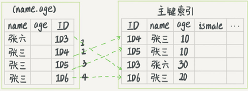

## 常见的索引模型：
哈希表、有序数组、搜索树

- 哈希表k,v
哈希思路，把value放在数组里；用哈希函数把key换算成数组里的一个具体位置，然后把value放在这位置。

如果冲突，拉出一个链表就可以了

使用在只有等值查询的场景里

- 有序数组
按顺序存储，查询用二分法查询。

查询效率高，更新效率低

适用于静态存储引擎

## InnoDB的索引模型
在InnoDB中，表都是根据主键顺序以索引的形式存放的，这种存储方式的表称为索引组织表。而且InnoDB使用的是B+树，所以数据都是存储在B+树上的。
说白了，每一个索引在InnoDB里面对应着一棵B+树。

假设，一个表T中对ID做主键索引和对k做普通索引，某一数据行ID为500，k为5

- 查询语句为

    ```sql
    select * from T where ID=500;
    ```
    则只需要搜索ID这颗B+树
- 查询语句为

    ```sql
    select * from T where k=5;
    ```
    则需要搜索k的索引树，得到的ID为500，然后由于要查的数据只有主键索引有，所以再搜索ID索引树

    回到主键索引树搜索，这个过程称为回表

## 索引维护
B+树在插入新值的时候，需要做必要的维护。以上面为例，如果插入新的ID为600，那么没什么问题，在树后面插入即可，
如果在中间插入，那么位置需要挪动；如果一个数据页满了，按照B+树算法，需要进行页分裂，不仅性能下降，空间利用率减少了50%
当相邻两个数据页利用率很低的时候会做数据页合并，合并的过程是分裂过程的逆过程。

所以从性能和存储空间来考量，自增主键往往是更合理的选择。

## 重建索引
要先删除普通索引，再删除主键索引，新建主键索引再建普通索引；


## 最左前缀原则
所以多列索引是从最左列开始的，所以常用的列放在最左边，对于索引的顺序要根据业务灵活调整，如果可以通过调整顺序减少维护一个索引，那么就是好事儿（孙一峰永远是我大哥）

- 索引下推(index condition pushdown)
    5.6之后引入，可以在索引遍历过程中，对索引中包含的字段先做判断，直接过滤掉不满足条件的记录，减少回表次数。

    ```sql
    select * from t_user where name like '张%' and age = 10 and ismale=1;
    ```

    无索引下推

    

    索引下推会提前把不符合age=10的过滤掉，从而减少回表的过程。
    只需要回表两次就可以了
