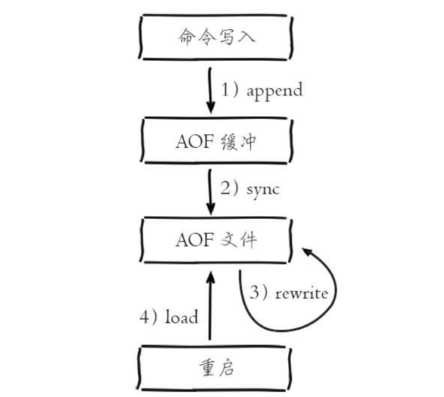
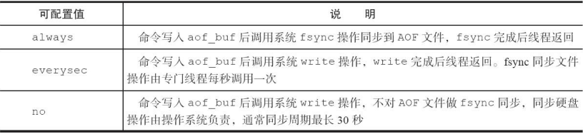

### AOF持久化的流程
aof持久化可以做到尽量接近实时持久化，而且当aof和rdb文件同时存在时有先加载aof

    1. 所有的写入命令会追加到aof_buf（缓冲区） 中。
    2. AOF缓冲区根据对应的策略向硬盘做同步操作。
    3. 随着AOF文件越来越大， 需要定期对AOF文件进行重写， 达到压缩
    的目的。
    4. 当Redis服务器重启时， 可以加载AOF文件进行数据恢复。

## 各步的意义
    1. 写入缓冲区
       AOF为什么把命令追加到aof_buf中？ Redis使用单线程响应命令， 如
       果每次写AOF文件命令都直接追加到硬盘， 那么性能完全取决于当前硬盘负
       载。 先写入缓冲区aof_buf中， 还有另一个好处， Redis可以提供多种缓冲区
       同步硬盘的策略， 在性能和安全性方面做出平衡。
    2. 硬盘同步
       Redis提供了多种AOF同步策略，由参数appendfsync控制，不同值的含义如图所示：

   

   > 系统调用write和fsync说明：
     write操作会触发延迟写（delayed write） 机制。 Linux在内核提供页缓
     冲区用来提高硬盘IO性能。 write操作在写入系统缓冲区后直接返回。 同步
     硬盘操作依赖于系统调度机制， 例如： 缓冲区页空间写满或达到特定时间周
     期。 同步文件之前， 如果此时系统故障宕机， 缓冲区内数据将丢失。
     fsync针对单个文件操作（比如AOF文件） ， 做强制硬盘同步， fsync将
     阻塞直到写入硬盘完成后返回， 保证了数据持久化。

   - 配置为always时， 每次写入都要同步AOF文件， 在一般的SATA硬盘
   上， Redis只能支持大约几百TPS写入， 显然跟Redis高性能特性背道而驰，
   不建议配置。
   - 配置为no， 由于操作系统每次同步AOF文件的周期不可控， 而且会加
   大每次同步硬盘的数据量， 虽然提升了性能， 但数据安全性无法保证。
   - 配置为everysec， 是建议的同步策略， 也是默认配置， 做到兼顾性能和
   数据安全性。 理论上只有在系统突然宕机的情况下丢失1秒的数据。

    3. 重写机制
    随着命令不断写入AOF， 文件会越来越大， 为了解决这个问题， Redis
    引入AOF重写机制压缩文件体积。 AOF文件重写是把Redis进程内的数据转
    化为写命令同步到新AOF文件的过程。这个过程中，
        - 进程内超时的数据不再写入文件
        - 如del,zdel,hmset等。重写使用进程内的数据直接生成，命令直接保留最终数据的写入命令
        - 多条命令可以写成一个命令

        这样减小了aof文件的大小

    重写可以使用bgwriteaof命令手动触发
    在配置文件中配置auto-aof-rewrite-min-size和auto-aof-rewrite-percentage
    确定触发时机

    auto-aof-rewrite-min-size： 表示运行AOF重写时文件最小体积， 默认
    为64MB。
    ·auto-aof-rewrite-percentage： 代表当前AOF文件空间
    （aof_current_size） 和上一次重写后AOF文件空间（aof_base_size） 的比
    值。
    自动触发时机=aof_current_size>auto-aof-rewrite-minsize&&（aof_current_size-aof_base_size） /aof_base_size>=auto-aof-rewritepercentage
    其中aof_current_size和aof_base_size可以在info Persistence统计信息中查
    看。

4. 文件校验
    损坏的aof无法加载，通过redis-check-aof --fix修复，修复后使用diff -u找出差异的数据
    进行数据的修复。
    aof-load-truncated 是配置aof兼容aof文件尾部写入不全的情况，通常在机器掉电等情况发生。

5. fork
    当Redis做RDB或AOF重写时， 一个必不可少的操作就是执行fork操作创
    建子进程。 虽然fork创建的子进程不需要拷贝父进程的物理内存空间，但是会复制父进程的空间内存页
    表。例如对于10GB的Redis进程，需要复制大约20MB的内存页表，因此fork
    操作耗时跟进程总内存量息息相关， 如果使用虚拟化技术， 特别是Xen虚拟
    机， fork操作会更耗时。

    fork耗时问题定位：对于高流量的Redis实例OPS可达5万以上，如果fork
    操作耗时在秒级别将拖慢Redis几万条命令执行，对线上应用延迟影响非常
    明显。正常情况下fork耗时应该是每GB消耗20毫秒左右。

    可以在info stats统计中查latest_fork_usec指标获取最近一次fork操作耗时，单位微秒。

    **如何改善fork操作的耗时**：
    1. 优先使用物理机或者高效支持fork操作的虚拟化技术， 避免使用
    Xen。
    2. 控制Redis实例最大可用内存， fork耗时跟内存量成正比， 线上建议
    每个Redis实例内存控制在10GB以内。
    3. 合理配置Linux内存分配策略， 避免物理内存不足导致fork失败， 具
    体细节见12.1节“Linux配置优化”。
    4. 降低fork操作的频率， 如适度放宽AOF自动触发时机， 避免不必要
    的全量复制等

