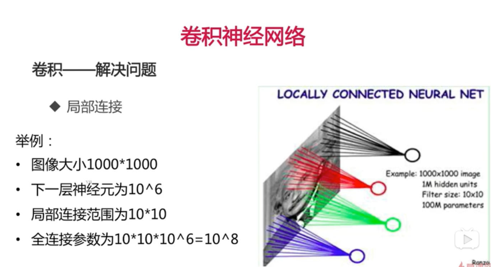

[TOC] 

# CNN

参考： https://www.cnblogs.com/wj-1314/p/9593364.html 

为了图像问题做了一些特有操作。

- 卷积
- 激活函数
- 池化
- 全连接

## 神经网络处理图像时遇到的问题

- **参数量太多**

    

    - 模型参数太多，对训练集的表达能力就过强，可以理解为记住了这个训练集图像，从而导致过拟合即泛化能力太弱。
- **某些数据会导致模型容易收敛到较差的局部极值。**
  
- **没有利用到位置信息**

    对于图像任务来说，关键部位的像素之间关系紧密，但不同关键部位之间的联系不紧密；对于全连接来说，相当于把所有位置的信息都要注意到，那么非关键位置的权重最后就会很小，但是训练这些位置要花费很长时间，太亏了。

- **网络层数限制**

    网络层数越多，其表达能⼒越强，但是通过梯度下降⽅方法训练深度全连接神经⽹网络很困难，因为**全连接神经⽹网络的梯度很难传递超过三层**。**我们不能得到一个很深的全连接NN，也就限制了它的表达能力。**

## 解决问题

### 1. 卷积

#### 原理：

- 不使用全连接，使用Locally Connected Neural Net局部连接，利用了图像的区域性。

- 参数共享

    不让神经元只学固定位置的特征，使用参数共享，即强制每个神经元使用同样的权值和偏置参数，则全连接参数：

    $10\times 10 = 10^2$，利用了图像特征与位置无关。

#### 性质：

1. 输入图像、卷积核和输出之间的size关系：$输出size = 输入size-卷积核size+1$；如图所示，输入图像是5x5，卷积核3x3，对应输出3x3。

    

2. 计算方法：求 数量积 ，如上图。

3. 步长：

    但是发现，通过卷积核的方式，输出的图像都缩小了，所以我们要把原图像放大，即padding

    #### padding

    

#### 公式：

1. **池化层公式**：$N_f=\frac {N+2P-F} {S}+1$，

$其中N是图像宽度，P是padding圈数，F是fillter宽度，S是步长。$

2. **问题**：卷积层，输入三通道输出192通道，卷积核大小3*3，该**卷积层多少个参数**？

    答：(三通道x(3x3))x192=5184个参数

    **即**：$卷积核面积 \times 输入通道数 \times 输出通道数 = 卷积层参数$

#### 卷积——处理多通道

多通道图像用多通道卷积核，每个通道之间不共享参数。

#### 多个卷积核

？：[通道(channel)]( https://blog.csdn.net/sscc_learning/article/details/79814146 )

多个卷积核提取不同的特征；

### [2. 激活函数]( https://blog.csdn.net/tyhj_sf/article/details/79932893 )

特点：单调性、非线性函数

单调性保证，输入和输出成正比。

[为什么需要非线性激活函数]( http://www.ai-start.com/dl2017/html/lesson1-week3.html#header-n152 )， 因为这两个线性函数的组合本身就是线性函数，所以除非你引入非线性，否则你无法计算更有用的函数，即使你的网络层数再多也不行； 除非回归问题，可以在输出层用线性激活函数。总之，不能在隐藏层使用线性激活函数。

#### Summary

##### 公式：卷积核的参数

- P=padding圈数(padding)
- S=步长(stride)
- $输出尺寸=(n-p)/s+1 $
    - $n$是输入的大小
- $参数数目=kw\times kh\times Ci\times Co$
    - $Ci$输入通道数
    - $Co$输出通道数
    - $Kw,Kh$卷积核长宽

### 3. 池化

- 最大值池化

    取滑过区域的最大值

- 平均值池化

    

#### 性质：

- 使用时：一般不重叠、不补零

- 没有用于求导的参数

    直接求的某个区域的最大值和平均值

- 步长、池化层大小

    一般默认设为相等的，可以达到滑动不重叠的效果。

优点：

- 用于减少图像尺寸，从而减少计算量

- 一定程度解决了**平移不变性**

      例如稍稍移动一副猫的图像，它仍然是一副猫的图像 ；

- 损失了空间位置精度，是计算量和精度的trade off

### 4. 全连接层

全连接，即上一层和下一层的神经元全部连接在一起。

假如卷积层的输出要做全连接的话，会把**二维、多通道、图像形式的**卷积层展开，使得之后的输出变成一维的了，之后不能接卷积层和池化层。

- 即普通的层
- 相比于卷积层，参数数目大
- $参数数目=Ci\times Co$
    - Ci、Co即输入和输出的通道数

### 5. CNN结构

因为输出用到了全连接层，不是图像形式输出的，所以去掉即可输出图像。

# 模型进化

- 更深更宽-AlexNet,VGGNet
- 不同的模型结构-VGG到InceptionNet/ResNet
- 优势组合 InceptionResNet
- NN自我学习：强化学习，不依靠人为设计网络结构
- 实用角度的：MobileNet

# AlexNet

2012年推出，在ImageNet LSVRC-2010。

## 结构:

​	(224-11+padding) / 4 +1，因为213/4不能整除，可以加padding，也可以减小图大小，那么padding=3。

### trick：

- 首次使用Relu函数，高效

- 2个GPU并行

- 1、2、5个卷积层使用max pooling

    其实也可以不用这个，可以改变步长，使得高效一点。

- 全连接层之间使用**dropout**

    dropout：随机把神经单元砍掉一半

    ​		为什么用在全连接层：全连接层参数占很多，容易过拟合，那么减少参数，以减少过拟合。

    原理解释：

    1. 组合解释

        - 每次dropout之后的网络，都相当于一个子网络

        - 最后的结果就是多个子网络结合

    2. 动机解释

        - 消除了神经单元之间组合记忆数据的依赖，增加了泛化能力

    3. 数据解释

        - 相当于增加数据，即数据增强，增加了泛化能力

###　其他细节

  

# VGGnet

参考： https://www.jianshu.com/p/3510872fb186 

ImageNet Challenge2014

物体检测no.1，分类no.2

## Summary:

- 更深

- 经验：多使用3x3的卷积层

    2个3x3的卷积层可以看作一层5x5的卷积层

    3个3x3的卷积层可以看作一层7x7的卷积层

- **1x1卷积层**可看作非线性变换

- 每经过一个pooling层，通道数目翻倍

    信息丢失没有那么多

### 视野域：

- 2个3x3=1个5x5

    

- 2层比1层多一次非线性变换

- 卷积层参数降低28%

    假设输入和输出通道数一样，那么：

    $ \frac {2 \times 2 - 5 \times 5} {5 \times 5} = 0.28=28\%$

- **1x1卷积核**

    又称Network in Network

    降维，可以加多层的情况下不损失信息。

### 网络结构：

从11-19层

 

### 训练trick：

- 逐步训练：先训练A-再训练A-LRN、B等
- 图像尺度缩放：
    - 不同的图像尺度训练多个模型，然后做ensemble
    - 使用随机尺度的图像训练模型

# ResNet

ILSVRC 2015，分类比赛的no1

参考： https://www.jianshu.com/p/93990a641066 

上章说到VGG在19层是最佳状态，为了可以让nn更加deep，我们假设：深层网络更难优化，而非深层网络学不到东西，所以：

- 深层网络至少可以和浅层网络持平
- 在deep nn里，加一层恒等变换y=x，误差相较deep nn不会增加

  

## 模型结构：

大体结构是：

- 一个普通的卷积层，7x7,64,stride 2
- 再经过一个3x3的maxpooling,stride 2
- 残差结构
- 无fc，经过softmax输出1000维向量。

**为什么没有fc**:

对于一个更深的nn来说，卷积层已经有很多参数了，能学到一定的模式，加入fc可能会导致过拟合，所以去掉了fc。

- 残差结构因为恒等变换的存在，使得nn需要学习的知识变少，容易学习。

- 残差结构使得每一层的数据分布接近，容易学习。

    

# InceptionNet

参考： https://www.jianshu.com/p/57cccc799277 

 https://www.jianshu.com/p/d6ca52105cb5 

 https://www.jianshu.com/p/006248a3fd7f 

即GoogleNet；ILSVRC 2014，no1；

在此之前经典的CNN模型像LeNet/Alexnet/VGG等无不是一个模子即使用Conv/Pool/Normalization/Activation等层来不断累积而成。模型对数据集概率分布的表达能力则往往通过单纯增加模型的深度（层数）或宽度（层的channels数）来提高（当然这也亦是当下深度学习领域的共识）。但这样进行网络设计一般会等来巨量的计算开销，因为每一层channels数目的增加都会随着层深而指数级增加，这大大地限制了模型的实际应用。

##　背景：

此时deepnn遇到的问题：

- 更深的网络容易过拟合
- 更深的网络有更大的计算量
    - 稀疏网络虽然减少了参数但没有减少计算量且当下用于CPU/GPU上的一些高效加速库多是在密集计算上进行优化的，同时也会带来较多的cache miss及内存地址非连续搜索的overhead.

最终,GoogleNet团队选择了中间路线,即使用密集计算子结构组合成的系数模块来用于特征提取及表达.

##　结构：

- v1

    

    分组卷积：

    - 把卷积核分组处理，一层可以使用多种卷积核，可以取到不同的featureMap；

    - 不同组之间特征不共享，减少计算量。

        计算量的计算：

        

    对上图优化:

​	增加1x1卷积核,对Previous Layer降维.

  

- V2

    3x3换5x5,类似VGG

- V3

    3x3=3x1+1x3

    

    

- V4

    

# MobileNet

参考: https://www.jianshu.com/p/7f77faf1776d 

## 结构:

 

 其中,有BN批归一化,和Depthwise Conv.

- Depthwise Conv

    

    

    