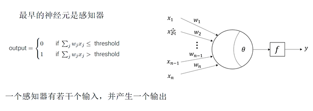
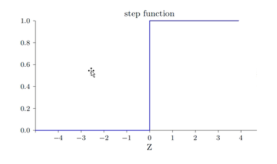
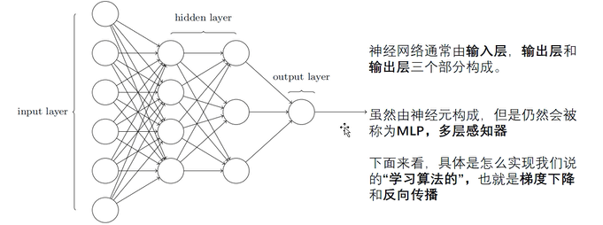
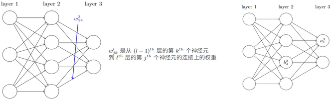
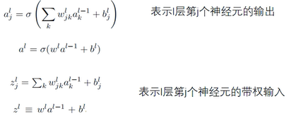
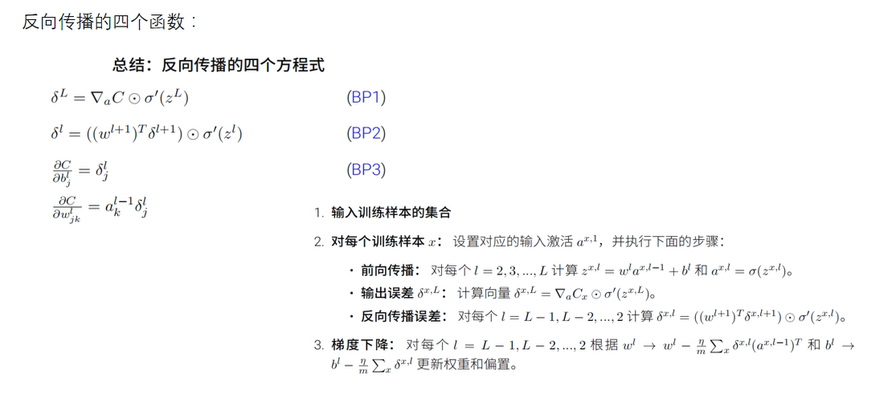

# 神经网络

## 感知器：

最早的神经元是感知器，输入乘权重之和，根据threshold输出0/1。

但是感知机的阶跃性质，非常不利于网络学习。例如：Z的输出在0附近并发生改变时，结果从0->1，回头对nn的权重造成不好的影响，这种情况重复多次的话是非常不利于模型学习的。

如图，这样的s型神经元(sigmoid函数)就可以用在我们的学习算法中。

讲完了单个神经元的学习，先看看神经网络的概念：

## 梯度下降与反向传播

先记住几个标记。

 

