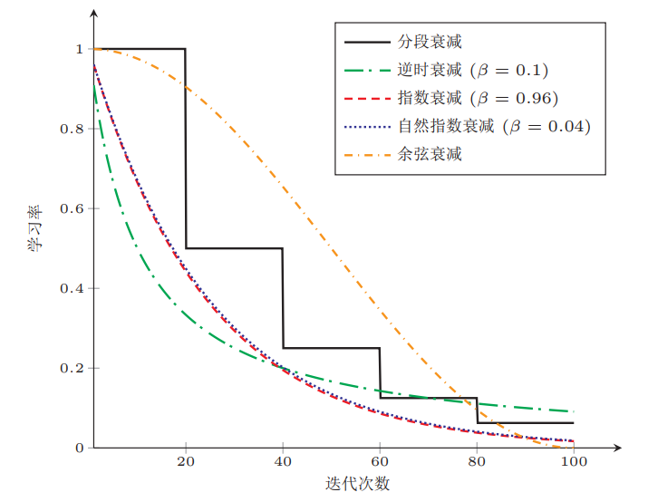
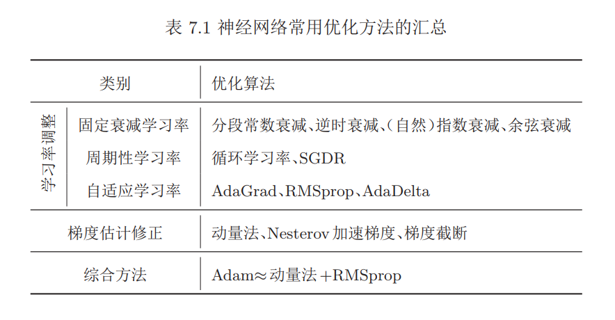
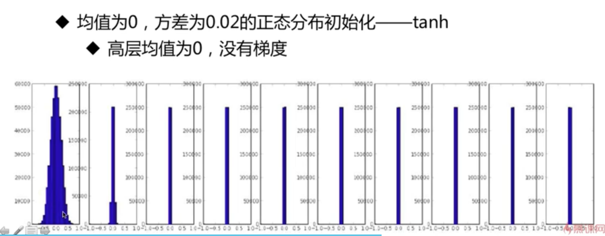
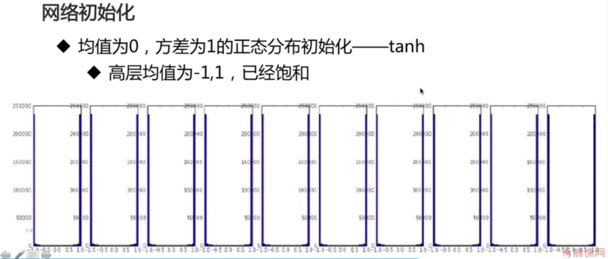
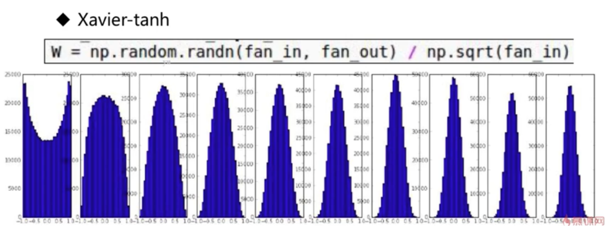
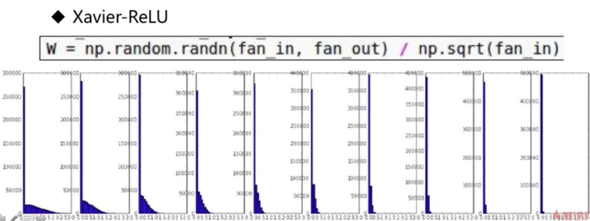
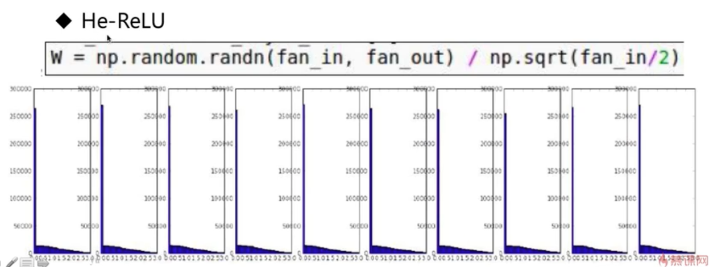
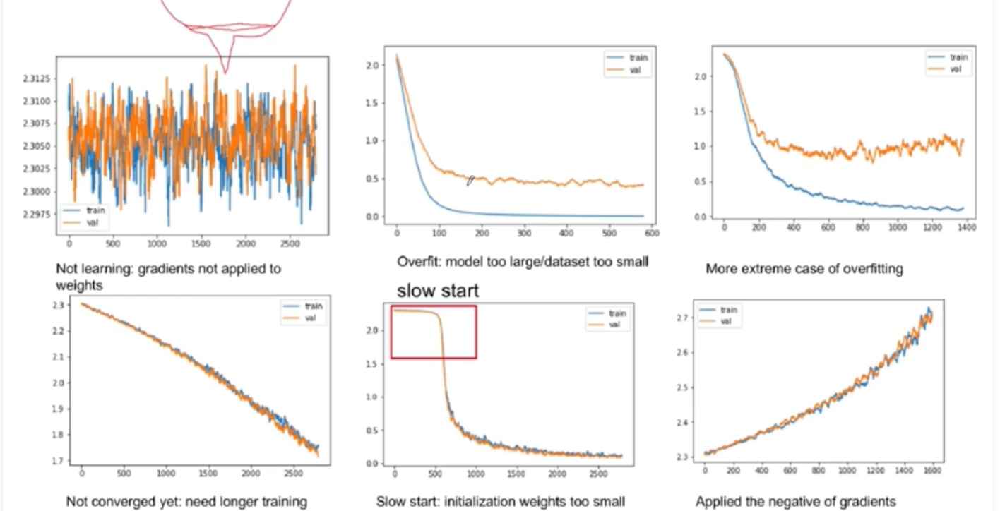

[TOC] 

# fine tuning

参考: https://blog.csdn.net/cuicheng01/article/details/83305854 

- 更多优化算法
- 激活函数
- 网络设计
- 批归一化BN
- 数据增强
- ...

## 优化算法

参考：https://www.cnblogs.com/ying-chease/p/9152427.html

https://www.zhihu.com/people/junezth/posts

回顾

- SGD
    - 局部极值问题
    - 鞍点问题
- 提出了动量梯度下降SGDM( with momentum )

共同的问题:

- 受初始学习率影响大

    梯度爆炸不收敛等问题

- 每个维度的学习率一样

    $\alpha$是针对全局设计的，对每个参数的态度都是一样的。尤其对于稀疏数据，一碗水端平的态度会导致。

梯度下降由batchsize,learningrate,梯度估计三种因素影响。

### 优化：

#### batch size

一般来说，batch size的大小不影响期望，但影响方差。batch size越大方差越小，训练越稳定。

学习率通常要随着批量大小的增大而相应地增大。一个简单有效的方法是线性缩放规则（Linear Scaling Rule）[Goyal等人， 2017]：当批量大小增加m倍时，学习率也增加m倍。线性缩放再batch size比较小时适用。

#### learning rate

- 学习率衰减

    exponential decay：$\alpha=\alpha_{t-1}e^{-kt}$

    1/t decay：$\alpha_t=\alpha_{t-1}/(1+kt)$

    - 逆时衰减

    $$
    \alpha_t=\alpha_0 \frac 1 {1+\beta\times t}，\beta为衰减率。
    $$

    - 指数衰减
        $$
        \alpha_t=\alpha_0\beta^t，\beta<1为衰减率。
        $$

    - 自然指数衰减
        $$
        \alpha_t=\alpha_0e^{-\beta t}，\beta为衰减率。
        $$

    - 余弦衰减
        $$
        \alpha_t=\frac 1 2\alpha_0(1+cos(\frac {t\pi} T))，T为总的迭代次数
        $$

    

- 学习率预热

    在sgd中由于刚开始训练时，模型的权重(weights)是随机初始化的，此时若选择一个较大的学习率，可能带来模型的不稳定(振荡)。为了**提高初期训练稳定性**，采用较小学习率，当梯度下降到一定程度后再恢复到初始的学习率。
    $$
    \alpha_t=\frac t {T'}\alpha_0，1\leq t\leq 
    T'，T'为迭代次数，\alpha_0为初始学习率。
    $$

- 周期性学习率调整

    - 循环学习率 

        即让learning rate再一个区间内周期性地增大和缩小。

    - 热重启SGD

        周期性重启初始化为某个设定值，然后继续衰减，每次重启后参数从重启前的参数基础上继续优化。

- 自适应学习率算法

    - AdaGrad (Adaptive Gradient)

        adagrad借鉴l2正则化的思想，每次迭代时自适应地调整每个参数的学习率。

        求出二阶动量：
        $$
        G_t=\sum _{\tau=1}^t g_\tau^2
        $$
        更新的梯度：
        $$
        \Delta\theta_t=-\frac {\alpha} {\sqrt {G_t+\epsilon}}\cdot g_t
        $$
        可以看出，现在的学习率$\alpha$实质上是$\frac {\alpha} {\sqrt {G_t+\epsilon}}$，学习率由偏导数$g_t$的累计和控制：在偏导数累积变大的时候，学习率$\alpha$变小，相反，偏导数较小则较大。但是，**整体学习率逐渐缩小**。

    - RMSprop

        RMSprop算法是 Geoff Hinton 提出的一种自适应学习率的方法 [Tieleman
        等人， 2012]，可以在有些情况下避免AdaGrad算法中学习率不断单调下降变化过于激进以至于学习率过早衰减的缺点。

        因为上述缺点，所以提出了改进，即采用**滑动平均**（或[指数加权平均](https://blog.csdn.net/sinat_29957455/article/details/81175894)），由累计二阶动量变为平均二阶动量，来限制偏导数的累积。
        $$
        G_t= \beta G_{t-1} + (1-\beta)\mathbf{g_t}\odot \mathbf{g_t}\\ 
        =(1-\beta)\sum_{\tau-1}^t\beta^{t-\tau}\mathbf{g_t}\odot\mathbf{g_t}
        $$

    - Adadelta

        在RMSprop之上加入每次参数更新差$\Delta\theta$的滑动平均，即：
        $$
        \Delta X_{t-1}^{2}= \beta\Delta X_{t-2}^{2}+(1-\beta_1)\Delta\theta_{t-1}\odot\Delta\theta_{t-1}
        $$
        其中$\beta_{1}$为衰减率。此时$\Delta\theta_{t-1}$ 还未知，因此只能计算到$\Delta X_{t-1}$。  

        $\theta$的更新梯度：
        $$
        \Delta\theta_t=-\frac {\sqrt {\Delta X_{t-1}^{2}+\epsilon}} {\sqrt {G_t+\epsilon}}\cdot g_t
        $$

#### 梯度估计

为了缓解梯度估计随机性。

- 动量法：
    $$
    \Delta\theta_t=\rho\Delta\theta_{t-1}-\alpha\mathbf{g_t}\\
    =-\alpha\sum_{\tau=1}^t\rho^{t-\tau}\mathbf{g_\tau}
    $$
    其中，$\rho$为动量因子，通常设0.9。

- Nesterov Momentum/NAG

    $\Delta\theta_t$可以拆成两步，先根据$\Delta\theta_{t-1}$更新一次得到参数$\hat \theta$，再用$-\alpha\mathbf g_t$更新。
    $$
    \hat \theta=\theta _{t-1}+\rho\Delta\theta_{t-1},\\
    \theta_t=\hat \theta-\alpha\mathbf g_t
    $$
    其中梯度$\mathbf g_t$为点$\theta_{t-1}$上的梯度，因此第二步，更新差值为：
    $$
    \Delta\theta_t=\rho\Delta\theta_{t-1}-\alpha g_t(\theta_{t-1}+\rho\Delta\theta_{t-1})
    $$

- 动量调整和learning rate调整的结合

    - Adam

        是RMSprop和动量法的结合。

        **公式：**
        $$
        m_t=\beta_1M_{t-1}+(1-\beta_1)\mathbf g_t \\
        G_t=\beta_2G_{t-1}+(1-\beta_2)\mathbf g_t\odot\mathbf g_t
        $$
        beta通常取：$\beta_1=0.9,\beta_2=0.99$

        但假设$M-0=0,G_0=0$，那么在迭代初期$m_t,G_t$比真实的均值和方差要小。因此需要进行**偏差修正**。

        **公式：**
        $$
        \hat{m_t}=\frac {M_t} {1-\beta_1^t}\\
        \hat{G_t}=\frac {G_t}{1-\beta_2^t}
        $$
        Adam的更新差值为：
        $$
        \Delta\theta_t=-\frac {\alpha} {\sqrt {\hat {G_t}+\epsilon}}\hat M_t
        $$
        $\alpha$通常为0.001，并且也可以进行衰减，比如$\alpha_t=\frac {\alpha_0} {\sqrt t}$。

    - Nadam

        把计算梯度的方法换成：
        $$
        \mathbf g_t=\mathbf g_t(\theta_{t-1}+\rho\Delta\theta_{t-1})
        $$

    - Adam的两宗罪（Adam被怼）。

        ​	参考：https://zhuanlan.zhihu.com/p/32262540

        - 学习率不断变化可能不收敛

            ICLR 2018 中的 [On the Convergence of Adam and Beyond](https://link.zhihu.com/?target=https%3A//openreview.net/forum%3Fid%3DryQu7f-RZ)指出，Adam在一些情况下可能不收敛。

            SGD学习率通常采用衰减策略，AdaGrad的二阶动量不断累计，学习率也是单调递减。因此学习率会收敛到0，模型也收敛。

            但Adam和AdaDelta的学习率可能因为数据震荡而震荡。导致模型无法收敛。

            论文也给出了修正方法：
            $$
            G_t=max(\beta_2\times G_{t-1}+（1-\beta_2)\mathbf g_t^2,G_{t-1})
            $$
            通过这种方法，保证$||G_t||\geqslant||G_{t-1}||$

        - 可能错过全局最优解

            1. [The Marginal Value of Adaptive Gradient Methods in Machine Learning](https://link.zhihu.com/?target=https%3A//arxiv.org/abs/1705.08292) 

                文中说到，同样的一个优化问题，不同的优化算法可能会找到不同的答案，但自适应学习率的算法往往找到非常差的答案。他们通过一个特定的数据例子说明，自适应学习率算法可能会对前期出现的特征过拟合，后期才出现的特征很难纠正前期的拟合效果。

            2. [Improving Generalization Performance by Switching from Adam to SGD](https://link.zhihu.com/?target=http%3A//arxiv.org/abs/1712.07628)

                他们CIFAR-10数据集上进行测试，Adam的收敛速度比SGD要快，但最终收敛的结果并没有SGD好。他们进一步实验发现，主要是后期Adam的学习率太低，影响了有效的收敛。他们试着对Adam的学习率的下界进行控制，发现效果好了很多。

                于是他们提出了一个用来改进Adam的方法：前期用Adam，享受Adam快速收敛的优势；后期切换到SGD，慢慢寻找最优解。这一方法以前也被研究者们用到，不过主要是根据经验来选择切换的时机和切换后的学习率。这篇文章把这一切换过程傻瓜化，给出了切换SGD的时机选择方法，以及学习率的计算方法，效果看起来也不错。

            但是怎么怼，**数据和经验才是根本。**

### 使用策略

- 对于稀疏数据，使用学习率自适应方法。
- SGD通常训练时间更长，最终效果更好，但需要好的初始化和learning rate。
- 训练更深更复杂的网络且需要快速收敛时，推荐使用adam，并设置比较小的learning rate。
- AdaGrad、RMSprop、Adam是比较相似的算法，效果差不多。

### Summary

上述内容主要有两类：调整学习率，使得优化更稳定；梯度估计修正，优化训练速度。
$$
<Empty \space Math \space Block>
$$

## 网络初始化

- [参数全部为0](https://zhuanlan.zhihu.com/p/75879624)
    - 单层网络可以，多层网络会使梯度消失

### 如何分析初始化结果好不好

- 查看激活函数输出（激活值）分布

    分布在固定的区间内，√

    集中在某些值上。×

#### 初始化

- tanh

- Xavier初始化

    

    

    

    

#### 批归一化

批归一化（Batch Normalization， BN）  方法，可以对神经网络中任意的中间层进行归一化操作。

## 数据增强

### 方法

- 归一化

    将数据归一化到统一的区间内。

- 图像

    - 图像变换

        - 翻转

        - 拉伸

        - 裁剪

            多尺度裁剪：例：256x256转换到224x224（vggnet）

        - 变形

    - 色彩变换

        - 对比度
        - 亮度

#### 更多的方法

- 更多的数据

- 更深的网络

- 跟进最新进展，使用新方法

- 增大训练的迭代次数

- 尝试正则化${||w||}^2$

- 加更多的卡

- 可视化工具

    - loss

        训练集，测试集loss比较

    - 梯度

        分布，nn的训练程度，比较小就是训练完了

    - 准确率

        比如交叉熵，并不能完全反映准确率高低

    - 学习率

        学习率较低，训练完成，或者这种方法的效果也就这样了

    例子：X-迭代次数，Y-Loss

    

- 先在标准数据集训练

    - 先看网络能否收敛，和别的思路做对比等

- 在小数据集过拟合

    - 比如自己数据集很大，先用小部分数据集测试，并达到过拟合。

- 数据集分布平衡

- 使用调整好的稳定模型结构

- Fine-tuning

    - 在预训练好的网络结构上进行fine-tuning

- 