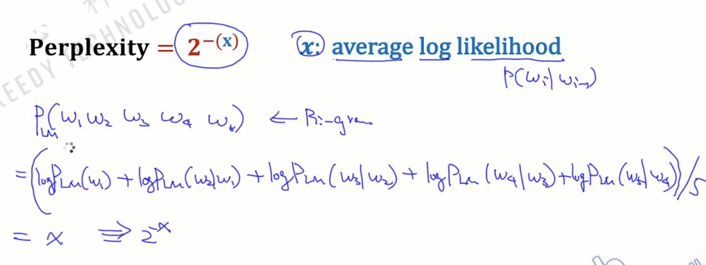
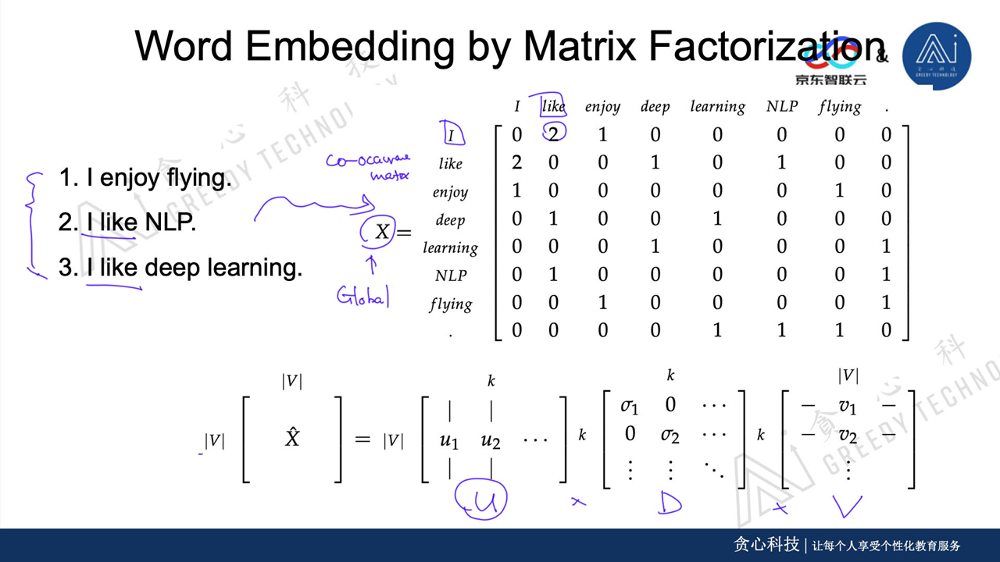

[TOC] 

语言模型该怎么计算p(...)

- p(He is studying AI)=p(He)p(is)p(studying)p(AI) ——Unigram
- p(He is studying AI)=p(He)p(is | He)p(studying | is)p(AI | studying) ——Bigram
- p(He is studying AI)=p(He)p(is | He)p(studying | He is)p(AI | is studying)——Trigram

深度学习不局限于联合概率的计算，能考虑更多的维度，这种叫Markov假设

## 场景

- 机器翻译

- 文本摘要

  - 自动摘要

- 聊天机器人（小项目）

  *知识图谱的问答系统

  - 闲聊型 （seq2seq）
  - 任务导向型 （意图识别）

- 信息抽取（最重要的领域）（有项目）

  涉及

  - 问题转三元组
  - NER（命名实体识别）KG
  - 事件检测
  - 知识图谱

## 关键技术

自然语言处理四个维度

- Semantic（语义）

  情感分析等

- Syntax（句法）

  ie.(句法分析，依存分析)

- Morphology（单词）

  ie.(分词，POS（词性标注），NER)

  以上属于单词层面的技术，从下到上由点及面：

  Word Segmentation分词，Part of Speech词性，Named Entity Recognition命名实体识别，

  Parsing句法分析:CYK算法，DependencyParsing依存分析，RelationExaction关系抽取

  主流公开的NLP问题：[What are the major open problems in natural language processing.](https://www.quora.com/What-are-the-major-open-problems-in-natural-language-understanding)

- Phonetics（声音）

## 简介NLP的基础任务

- ### 分词

- ### 词性标注

  - 句子中的每个单词被分类成一种词性
  - 词性标注的过程依赖当前单词以及它的上下文信息
  - 词性标注问题也被叫做序列标注问题
  - 很多时候可以作为上游任务的特征

- ### NER

- ### 句法分析(Syntatic Analysis)

- ### 语义分析(Semantic Analysis)

## 文本处理的流程

**原始文本$\rightarrow$分词$\rightarrow$清洗$\rightarrow$标准化$\rightarrow$特征提取$\rightarrow$建模**

- 清洗：包括无用的标签、特殊符号、数字、停用词(对理解产生不了影响的词)
- 标准化：英文用的多，分为Stemming、Lemmazation
- 特征提取：tf-idf、word2ec
- 建模：。。。

### 分词

分词算法：

- 前向最大匹配

    1. 根据词典库指定初步最大长度

    2. 在一个句子里，从头开始找到max_length个字的段落

    3. for in range(max_length)

        ​	查词典库看是否匹配，匹配到了就不再细分了

        ​	max_length-=1

- 后向最大匹配

    步骤与前向最大匹配相反

缺点：x

- 贪心算法只能找到局部最优

- 效率低，依赖max_length
- 不能细分得到更好的结果

- 歧义，不能考虑语义

#### 考虑语言模型

分词后结果应用语言模型看说的是不是人话的概率，挑最好结果

- [unigram model]( https://blog.csdn.net/pipisorry/article/details/42560693 )

    1. 生成所有可能的分割$s_1,s_2,...$；

    2. 通过LanguageModel（这里讲UnigramModel）找到最好的分词结果：

        找到分词后单词在词库里的概率$P(s_1),P(s_2),...$，之后句子的计算概率：

        $P(s_1)\times P(s_{...})$这种概率相乘的方式会导致Underflow现象，所以把这个式子取对数，转变成加和的形式，然后再把它求平均值，解决词很多概率相乘结果会变小的问题。

        $logP(s)=\frac {log\sum_{i=1}^{m} P(s_i)} m$


- Viterb

    将上述步骤合并，减少时间复杂度，回头整理

### 语言模型

#### Noisy Channel Model

$p(text|source)=p(source|text)p(text)$

理解：$p(source|test)$：翻译，可以理解为词典；$p(test)$：语言模型

#### 语言模型

语言模型：判断语法上是否通顺，计算句子符合语言模型的概率。

##### ChainRule for Language Model

联合概率表达为：$p(A,B)=p(A|B)p(B)=p(B|A)p(A)$ 

$\therefore$要表达句子的联合概率有：

$p(今天,放假,我们,都,休息)=p(今天)p(放假|今天)p(我们|今天放假)p(都|今天放假我们)p(休息|今天放假我们都)$

##### 缺点：

参数空间过大，概率值会很稀疏，依赖语料库，结果没有语言意义

##### **马尔科夫假设（Markov Assumption）**

> Markov Assumption：下一个词的出现仅依赖于它前面的一个或几个词。

$1st\quad order:p(w_1,w_2,w_3,...,w_n)=p(w_1)\prod _{i=2} ^n (w_i|w_{i-1})$ 

$2st\quad order:p(w_1,w_2,w_3,...,w_n)=p(w_1|w_2)\prod _{i=3} ^n (w_i|w_{i-2},w_{i-1})$

$...$

##### [N-gram]( https://blog.csdn.net/han_xiaoyang/article/details/50646667#commentBox )

$Unigram=   p(w_1,w_2,w_3,...,w_n)=p(w_1)p(w_2)p(w_3)p(w_...)p(w_n)$

$Bigram= p(w_1,w_2,w_3,...,w_n)=1st Order$

$Trigram= p(w_1,w_2,w_3,...,w_n)=2stOrder$

$N>2$时叫，HigherOrderLM

评估语言模型，Estimating

通过语言模型评估句子，需要平滑项


评估模型：perplexity；而且在不同模型里有不同的评估方法，但是通过这种方法，对于再语料库没有出现的词，对句子会有不正确的判断，所以需要平滑项。

##### Perplexity

Perplexity=2^-(x) x:average log likelihood



Perplexity越小，说明语言模型越好。

##### 平滑方法，Smoothing

- add-one smoothing(laplace smoothing)

  朴素贝叶斯也是用ls平滑的

  $P_{MLE}(w_i|w_{i-1})=\frac {c(w_{i-1},w_i)} {c(w_{i-1})}$，极大似然估计，通过词频计算概率，c代表语料库中某情况出现的

  $P_{Add1}(w_i|w_{i-1})=\frac {c(w_{i-1},w_i)+1} {c(w_{i-1})+V}$，$V$：词典的大小，加V确保了$P(w_i|w_{i-1})$总概率=1，也是归一化

- add-k smoothing

  $P_{Addk}(w_i|w_{i-1})=\frac {c(w_{i-1},w_i)+k} {c(w_i)+kV}$，$k$：未知数，所以目标变成了设定目标函数优化$k$，使得$k$最小。

- interpolation smoothing

  为了比较公平的比较，需要考虑，N-gram出现的频次。

  $p(w_n|w_{n-1},w_{n-2})=\lambda_1 p(w_n|w_{n-1},w_{n-2})+\lambda_2p(w_n|w_{n-1})+\lambda_3p(w_n)$

  $\lambda_1+\lambda_2+\lambda_3=1$ 。

- goot-turning smoothing

  - 没有出现过的单词

    $P_{MLE}=0$

    $P_{GT}=\frac {N_1} N$，其中$N$代表单词总数，$N_1$代表出现一次的单词。

  - 出现过的单词

    $P_{MLE}=\frac c N$

    $P_{GT}=\frac {(c+1)N_{c+1}} {N_c\times N}$，其中，$c$代表出现的次数，$N_{c+1}$代表出现c+1次的单词。

  这样做解决了未出现在词库的单词带来的最终概率等于0的问题，但是严重依赖下一种($N_{i++1}$)概率。

##### Generating Sentence by LM

可以采用Bigram的方法，从一个词出发考虑能与其相连的概率最大的下个词-》一个句子 

##### 语言模型在拼写纠错的应用，Spell Correction

算法:

- 编辑距离

    通常有三个操作，add,delete,replace，看候选单词三个操作的操作成本，成本越小词越相似。通过词频、上下文关联等标准过滤返回可能的纠错单词。（DP算法）

    上述方法**时间复杂度高:O(n)**

    可以更改为：用户输入单词$\rightarrow$生成编辑距离为1,2的字符串$\rightarrow$过滤$\rightarrow$返回

- 过滤

    概念：给定一个字符串w，我们要找出最有可能成为正确的字符串c，也就是

    $
    \hat c = argmac_{c\in candidates}p(c|w)
   $
   $
   \quad = argmac_{c\in candidates}\frac {p(w|c) \times p(c)}  {p(w)}
   $
   因为$p(w)$可以看作为常数，有：
   $
   \quad = argmac_{c\in candidates} p(w|c) \times p(c)
   $

   $p(w|c)$:给定正确的字符串,有多大概率写成了w形式?可以通过数据库统计

   $p(c)$:给定正确的字符串,在词库里出现的概率多高?

###### $p(w|c)$实现：

- 针对单词错误的实现：

  - 用正确单词c，统计写错成各种形式W有多大概率
  - 用语言模型，预测目标单词w的正确单词候选集C和句子在语言模型中的概率

- 针对语法错误的实现：

  主要用语言模型，看句子是否是通顺的。

#### 分词——LM

- 前向最大匹配

  一种贪心算法，不考虑语义

- 考虑语义的方法

  

  分割数很多的话，效率很低，所以：

##### vertib 

 

#### 停用词

将**停用词**，**出现频率较低的词**过滤掉.但也要考虑应用场景,比如情感分析,有些词就不必过滤。

#### 标准化（英文）

通常用在英文场景中。

- 词干提取，stemming

  

- 词形还原，lemmatization

  英语中，good, better, best是三个词，但是better和best可以通过good得到，在一些应用领域可以将better和best转换为good。通过词形还原后，形成的结果通常是一些基本的单词。

使用词形还原和词干提取的目的通常是为了减少词语因为时态，单复数和变形等对于处理精度的影响。

使用词形还原与词干提取预处理后的语料通常可以减少单词因时态，单复数，变形等造成噪音干扰，但是却并不是一定需要进行这样的处理，有的应用中即便是通过这样的处理对于精度提升几乎没有效果，反而还增加了系统的复杂度。


### 文本表示的方法

> bow(bag of words)，包括one-hot encoding和tf-idf。

#### one-hot encoding:

首先要有词表，类似于这样:

```python
['an', 'apple', 'many']
```

比如 this's a apple.有，这个形式也可以看作**向量**:

```python
boolean vector:(0,1,0)
count vector:(0,1,0)
```

独热编码在文本处理上属于：Bag of words 词袋模型。

#### [tf-idf]( http://www.360baidu.cn/seo/tf-idf.html )

$tfidf(w)=tf(d,w)\times idf(w)$

- $词频：tf(d,w)$ $=\frac {c(w)}{c(d)}$：词$w$在某文档中出现的次数/文档$d$总词数（一种归一化，以防止它偏向长的文件）；**term frequency**。

> 但是, 需要注意, 一些通用的词语对于主题并没有太大的作用, 反倒是一些出现频率较少的词才能够表达文章的主题, 所以单纯使用是TF不合适的。权重的设计必须满足：**一个词预测主题的能力越强，权重越大，反之，权重越小**。所有统计的文章中，一些词只是在其中很少几篇文章中出现，那么这样的词对文章的主题的作用很大，这些词的权重应该设计的较大。IDF就是在完成这样的工作.

- $逆文档频率：idf(w)=log\frac N {N(w)+1}$：$N$：文档总数，$N(w)$：词w出现在多少个文档；**inverse document frequency**，表示单词的重要性；$N(w)+1$为了分母不为零。   

> IDF的主要思想是：如果包含词条w的文档越少, IDF越大，则说明词条具有很好的类别区分能力。某一特定词语的IDF，可以由总文件数目除以包含该词语之文件的数目，再将得到的商取对数得到。

我们可以用tf-idf，替换boolean vector和count vector。

tf-idf主要用于文章中关键词的提取工作，也可用于查找相似文章、对文章进行摘要提取、特征选择（重要特征的提取）工作。

#### 文本相似度

- 欧氏距离：$d(\boldsymbol s_1,\boldsymbol s_2)=|\boldsymbol s_1-\boldsymbol s_2|$

    缺点：没有考虑方向

- 余弦相似度：$d（\boldsymbol s_1,\boldsymbol s_2）=\boldsymbol  s_1 · \boldsymbol  s_2/(|\boldsymbol  s_1|\times|\boldsymbol  s_2|)$，$（内积/范数）$

    $$\frac {x_1·y_1+ x_2·y_2+ x_3·y_3}  {\sqrt {x_1^2+ x_2^2+ x_3^2}+\sqrt {y_1^2+y_2^2+y_3^2}} $$。
    
    > 余弦值的范围在[-1,1]之间，值越趋近于1，代表两个向量的方向越接近；越趋近于-1，他们的方向越相反；接近于0，表示两个向量近乎于[正交](https://baike.baidu.com/item/正交/36310)。
    
    但是以上根据词频构建的向量，并**不能表示出句子中表达重要含义的单词**。
    
     

#### 主题模型

LSA(SVD)，pLSA，LDA

词与文档之间还有一层隐含关系，我们称之为topic。词->topic->文档

LSA(SVD)：降维，词到主题的矩阵，中间对角线矩阵，主题到文档的矩阵。也会把文档中的噪音去除掉。

#### 词向量

通过上述方法，我们可以发现，

- 利用字典+词频做One-hot的方法是属于一种词袋模型，假设词与词之间相互独立，也不考虑词语词之间的顺序，这是不符合文本常识的，比如词和词语义相近，但是不是同一个词的时候，即所谓的**语义鸿沟**。

- 而且随则词典增多，向量大小会无限扩展，其中很多0，单词的向量会离散、稀疏，产生所谓**维度爆炸**的现象。

##### 分布式的表示方法介绍：

###### word2vec(2013)-Tomas Mikolov

特点：向量大小自定义，稀疏性弱；

例：理论上100维分布式表达方法可以表达$+\infty$个单词，每个维度都用实数表示；而100维的one-hot只能表示100个单词。


假定我们定义了一个中心词，将它的前后位置的词作为NN这轮迭代的输入信息，假定上一个词作为上下文，输入格式为$1\times V$维的input vector，$W$为$V\times N$的权重矩阵，那么hidden vector的shape就是$1\times N$,再经过$W'$的权重向量，再经过softmax激活函数，得到一个大小为$V$的output vector，交叉熵为损失函数。

##### 训练词向量的思想：

1. 自定义维度：
2. 输入:字符串，包括1Billon单词这种规模
3. 训练：skip-gram、glove、cbow、rnn/lstm、matrix factiorization...
4. 判断相关性：通过上述、欧氏距离、余弦相似度、lstm/rnn等

###### cbow


cbow，也是词袋模型的思想，将所有词看成是无序平等的，不考虑距离，和词的关系，只要词在用户选中的窗口之内我就算进来。

###### skip-gram


为了将连乘转换为求和，简化数学运算，将损失函数改为对数形式；并做最小化和归一化处理。更改训练目标为：> $$skip-gram的平均对数概率= \frac 1 T\sum_{t=1}^{T} \sum_{-c\leq j\leq c,j\neq 0}logP(w_{t+j}|w_t)$$

其中$P(w_o|w_i)=\frac {{{v'}_{w_o}}^T v_{w_i}}{\sum_{w=1}^{W}exp({v'_w}^Tv_{w_i})}$，两个词越相似分子越大

$v'_w$和$v_w$表示词w的输入向量和输出向量。

上述的softmax函数并不实用，因为$\nabla logP(w_o|w_i)$的计算成本与词汇表的大小成正比，联通词库有百万的词。

- 模型的训练


###### cbow

$P(w_c \mid w_{o_1}, \ldots, w_{o_{2m}})=\frac{\text{exp}\left(\frac{1}{2m}\boldsymbol{u}_c^\top (\boldsymbol{v}_{o_1} + \ldots + \boldsymbol{v}_{o_{2m}}) \right)}{ \sum_{i \in \mathcal{V}} \text{exp}\left(\frac{1}{2m}\boldsymbol{u}_i^\top (\boldsymbol{v}_{o_1} + \ldots + \boldsymbol{v}_{o_{2m}}) \right)}$ 

解决时间复杂度高：

- negative sampling

  

- hierarchical softmax

  为了避免要计算所有词的softmax概率，word2vec采用了霍夫曼树来代替从隐藏层到输出softmax层的映射。和之前的神经网络语言模型相比，霍夫曼树的所有内部节点就类似之前神经网络隐藏层的神经元,其中，根节点的词向量对应投影后的词向量，而所有叶子节点就类似于之前神经网络softmax输出层的神经元，叶子节点的个数就是词汇表的大小。在霍夫曼树中，隐藏层到输出层的softmax映射不是一下子完成的，而是沿着霍夫曼树一步步完成的。
  
  
  
  


###### Fasttext

skip-gram的问题：OOV(out of vocabulary)


###### Word Embedding by Matrix Factorization



###### Glove


结合了考虑全局的MF和考虑局部的skip-gram。

###### Gaussian Embedding


诸如skip-gram,CBOW等embedding，用于刻画相似性的都是向量点积，cosine,或者欧式距离，都是对称的。其次，embedding的学习没有注意到不确定性，对于高频词学习较好，但是低频词学习较差。我们用概率分布表示单词，加入可信度$\sum$，用KL散度衡量两个单词的相似性。

###### Contexualized Embedding

现在的Embedding没有考虑一词多义的情况，项目2涉及，考虑上下文的Embedding


##### 各种词向量的特点

- One-hot

  维度灾难、语义鸿沟

- 矩阵分解 (LSA)

  ​	利用全局语料特征，但SVD求解计算复杂度大；

- 分布式表示 (distributed representation) 
  - 基于分布式假设——**相同上下文语境的词有似含义**
  - 基于NNLM/RNNLM的词向量：词向量为副产物，存在效率不高等问题；
  - 静态的word2vec、fastText：优化效率高，但是基于局部语料；
  - glove：基于全局预料，结合了LSA和word2vec的优点；
  - 动态的elmo、GPT、bert：动态特征，可以解决一词多义的问题。

##### 词向量的训练：

###### word2vec是如何工作的：


1.输入层：上下文单词的onehot.

2.所有onehot分别乘以共享的输入权重矩阵W. 

3.所得的向量相加求平均作为隐层向量, size为1*N.

4.乘以输出权重矩阵W’ 

5.得到向量 {1*V} 激活函数处理得到V-dim概率分布，概率最大的index所指示的单词为预测出的中间词（target word）

6.与true label的onehot做比较，误差越小越好

###### ELMo、GPT、BERT

- 特征提取器：elmo采用LSTM进行提取，GPT和bert则采用Transformer进行提取。很多任务表明Transformer特征提取能力强于LSTM，elmo采用1层静态向量+2层LSTM，多层提取能力有限，而GPT和bert中的Transformer可采用多层，并行计算能力强

- 单/双向语言模型：
  - GPT采用单向语言模型，ELMo和BERT采用双向语言模型
  - GPT和BERT都采用Transformer，Transformer是Encoder-Decoder结构，GPT的单向语言模型采用Decoder结构，Decoder的部分见到的都是不完整的句子；BERT的双向语言模型则采用Encoder部分，能够看到完整句子

# 两种Learning的方法

## 专家系统

符号主义，涉及到离散数学知识；

**专家系统=推理引擎+知识**

特点：

- 处理不确定性

- 知识的表示

    知识图谱等表示形式

- 可解释性

- 可以做知识推理，通过已有规则生成新规则

缺点：

- 规则数量庞大
- 需要大量的domain knowledge，和专家指导
- 迁移学习的能力差
- 学习能力差
- 人的思维是有限的

## 基于概率的系统

连接主义

机器学习的分类：监督、无监督

模型的分类：生成模型、判别模型

生成模型：记住特点来生成

判别模型：记住区别来判断

| Supervized Learning |  Unsupervized Learning  
---|---|---
 Generative Model     | NaiveBayes | HMM,LDA,GMM 
Discriminative Model | LR、CRF  |                       

### Naive Bayes

先验概率：总样本中，正样本和负样本的占比。

然后了解所有字样本在各类别中的占比，来考虑新数据的分类。

条件独立：

$p(x,y|z)=p(x|z)\times p(y|z)$

### 评估标准

- 准确率和召回率

    准确率：$p(precision)=\frac {TP} {TP+FP}$

    召回率：$p(recall)=\frac {TP} {TP+FN}$

- F1 

    p和r不直观，所以提出了f1等评估标准3

    $f1-measure=\frac {2\times precision \times recall} {precision+recall}$

## LR

略

**TODO：证明LR是线性分类器？**

目标函数：模型的实例化=定义模型的目标函数+优化算法(GD,SGD,Adagrad,Adam)

简化\hat y表达式，取-log求argmin的w,b，转化成优化算法，这里用Gradient Decent。

- GD

    回头整理

当数据线性可分的时候，需要正则化项，对特征参数$w$做出惩罚。

模型复杂度：简单环境用简单模型。复杂用复杂。减少过拟合现象，可以从四个角度考虑：

- 模型选择
- 参数个数
- 参数空间选择？
- 模型拟合过少的样本

[正则化和MLE/MAP]( https://www.jianshu.com/p/4bad38fe07e6 )：

- L0

- L1:$\lambda||w||_1$，特点会使参数变得sparse，使得部分特征去掉，适用于，某些特征不可用的场景。

- L2:$+\lambda||w||_2^2$，$\lambda$步长，超参数,$w$模型的参数。1

- Nuclear Norm

    想让模型准确率提高——l2，l1可以实现特征参数的稀疏性

    l1和l2可以一起使用=>ElasticNet

参数搜索策略：

- 随即搜索：
- 遗传算法：
- 贝叶斯优化：

MLE/MAP：

样本量多的时候，map->mlez

### Lasso 

加入了L1，变成了Lasso/岭回归。有了稀疏性，所以拥有了特征选择的效果。

为什么更期望稀疏

- 特征维度太高，计算量也变得高
- 在稀疏性条件下，计算量只依赖非0项的个数
- 提高可解释性

特征选择技术：

- 对特征进行Exhaustive search，从多种特征组合，时间复杂度高。

- Greedy Approaches

    - Forward
    - Backward

- Lasso，正则的方法选择特征

    加入L1,L2正则项

    - Coordinate Descent

        