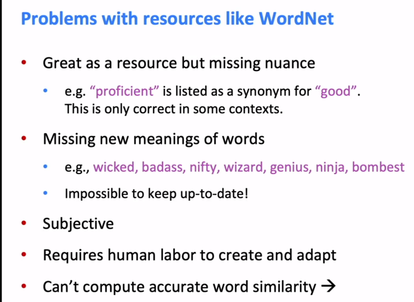
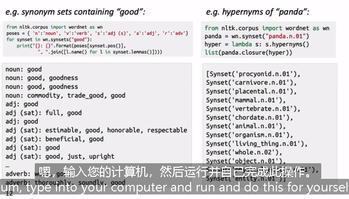
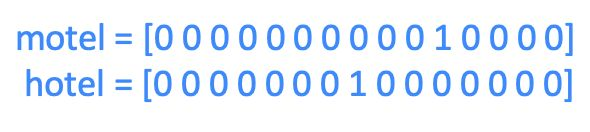
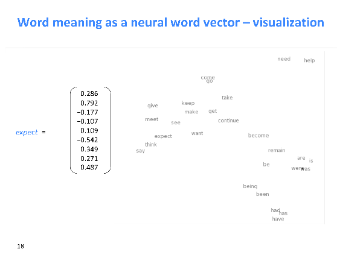
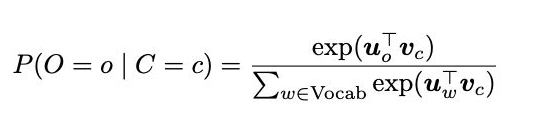
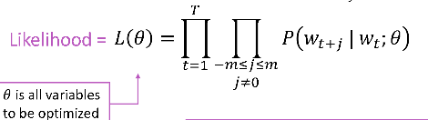
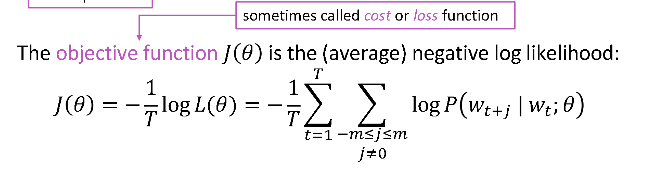
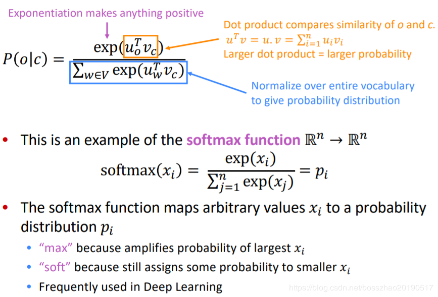
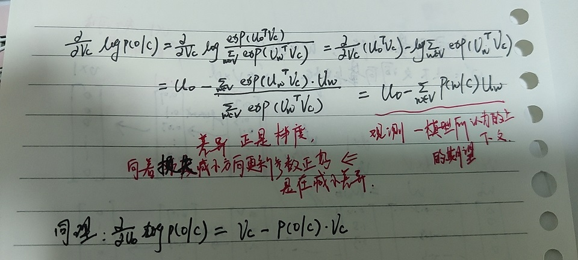

统计nlp方法，一个最基本的问题就是如何表示单词的含义；

## 1.how do we represent the meaning of a word?

### 1.1 wordnet

建立所有同义词synonym和下义词hypernym(即“is a"的关系）的词库，一个单词的含义就由它的同义词集合和下义词集合来定义。

这一表示方法有很多问题；这一表示方法有很多问题，比如一个单词只在某些语境下和另一个词为同义词而其他语境下不是，词汇的新的含义很难包含进入词库，定义比较主观且需要较多人力整理，而且也很难量化两个词的相似程度。

- ppt中wordnet的问题

  - 缺乏细微之处：同义词只在某些情况下正确
  - 词缺乏新含义
  - 偏主观
  - 需要人力去更新修改
  - 不能计算word的相似度

  

- wordnet的使用



```python
poses = {'n':'noun','v':'verb','s':'adj(s)', 'a':'adj', 'r':'adv'}
for synset in wn.synsets('good'):
    print('{}:{}'.format(poses[synset.pos()], ','.join([l.name() for l in synset.lemmas()])))
```

- synsets()查看一个单词的同义词集合，synonym sets

- pos()查看单词的词性，可以为（n|v|s|a|r），分别表示（名词|动词|形容词|副词）

- ()查看单词的上位词

- 一个 synset 被一个三元组描述：（单词.词性.序号）。

  如 ’dog.n.01’ 指：dog 的第一个名词意思；’chase.v.01’ 指：chase 的第一个动词意思。

### 1.2 representing words by their context

一个简单的方法是我们用one-hot的向量来表示单词，即该单词对应所在元素为1，向量中其他元素均为0。

而向量的维度就等于词库中的单词数目。

一个显然的问题是由于所有向量都是互相正交的，我们无法有效的表示两个向量间的相似度，并且向量维度过大。

### 1.3 distributional semantics

we use the context of w to build up a representation of a word $w$.这就是分布语义学的思想，用上下文表示单词，这是现代统计nlp的one of best ideas.，它提供了学习单词含义的好方法。

- 100维词向量的二维投影

  

  这种二维投影虽然会损失信息，扭曲原空间的内容，但是从这个向量空间中我们可看出向量空间中表示出的单词的相似性。

## 2. word2vec : overview

### 2.1   word vectors

我们将每个单词构建一个密集的向量，这样它与出现在相似上下文中的单词向量相似。

idea:

- 有大量的文本；
- 固定词汇表中的每个单词都由一个向量表示；
- 浏览文本中的每个位置t，其中有一个中心词c和上下文（“外部”）单词o；
- 使用c和o的词向量的相似性来计算o给定c的概率（反之亦然）；
- 不断的调整词向量，最大化概率。

下图表示，w为into的计算图示：


在word2vec中，条件概率写作context word与center word的点乘形式再对其做softmax运算：



而整体的似然率就可以写成这些条件概率的联乘积形式：



而我们的目标函数或者损失函数就可以写作如下形式：



有了目标函数以及每个条件概率的表现形式，我们就可以利用梯度下降算法来逐步求得使目标函数最小的word vector的$\theta$，这也就意味着我们将擅长再另一个单词的上下文中预测单词：



- 橙色部分计算单词之间的相似点，蓝色部分对整体词库正则化给出概率分布
- 分子越大，相似度越高

  - 两种算法：

    - **Skip-grams**：基于 中心词预测上下文词

      - 给定中心词c，上下文o出现的概率可以用$u_{o}$和 $v_{c}$ 的余弦相似性表示，并作归一化处理。
    - **CBOW算法** ：连续词袋算法，上下文词预测中心词

####  **Skip-grams**

   - 目标函数：所有位置的预测结果的乘积

     对每一个位置t=1...T，根据中心词$w_{t}$预测在窗口大小为m的上下文词（$\theta $表示所有需要优化的变量）
     $$ 似然函数=L(\theta )=\prod_{t=1}^{T}\prod_{-m\leq j\leq m,j\neq 0}  p(w_{t+j}|w_{t};\theta) $$
     目标函数$J(\theta)$是似然函数的负对数:最小化目标函数即最大化预测准确率。
      $$ J(\theta )=- \frac{1}{T}log L(\theta ) =- \frac{1}{T} \prod_{t=1}^{T}\prod_{-m\leq j\leq m,j\neq 0}  log p(w_{t+j}|w_{t};\theta) $$


- 计算 $ p(w_{t+j}|w_{t};\theta)$:
  - 每一个词**w 用两个向量**表示 ：
    - 当词w作为中心词，用$v_{w}$表示
    - 当词w作为上下文词，用$u_{w}$表示
  - 对于中心词c 和上下文词o,(o是某个具体的上下文词，U是上下文词向量，V是所词向量)：
    $$p(o|c)=\frac{exp(u_{o}^{T}v_{c})}{\sum_{w\subseteq V}exp(u_{w}^{T}v_{c})} $$
  - 点积：$u^{T}v$
    - 点积可以衡量两个向量相似度，两个向量越相似，其点积越大。
  - 计算$p(w_{t+j}|w_{t})$ 的过程
    
  - 板书
    

  - 对于每个词都有2个词嵌入u和v，可以仅使用v，或者将u和v相加，或者拼接在一起构成一个双倍的词嵌入


- 训练模型与最优化：leran W 和 W'

  - 目标函数：
    $$ J(\theta )=- \frac{1}{T}log L(\theta ) =- \frac{1}{T} \prod_{t=1}^{T}\prod_{-m\leq j\leq m,j\neq 0}  log p(w_{t+j}|w_{t};\theta) $$
    where:
     $$p(o|c)=\frac{exp(u_{o}^{T}v_{c})}{\sum_{w\subseteq V}exp(u_{w}^{T}v_{c})}$$
  - 优化算法：梯度下降。
    - 对于当前的$\theta$，计算$J(\theta)$的梯度。对u,v求偏导。
      
    - 将$\theta$沿负梯度的方向更新梯度
      $$  \theta_j^{new}=\theta_j^{old}-\alpha \frac \alpha{\alpha\  \theta_j^{old}}J(\theta)
      $$
    - 不断重复上述过程，直到收敛 
   - 缺点：需要对文本中所有的窗口进行优化，每次更新需要很长时间。
   - **随机梯度下降**：加速迭代优化。
     - 对窗口进行采样
     - 用采样的窗口进行更新
     - 算法：重复以下过程
       窗口=采样窗口（语料）
       梯度=计算梯度（J,$\theta$,窗口）
       $\theta$ = $\theta$-$\alpha$*梯度

- 负采样机制：加速训练的方法

  - 在最优化过程中，最耗时的是计算softmax归一化因子
  - 负采样思想：针对一个正样本（中心词c+上下文o）和多对负样本（中心词c+一个随机词）训练一个二元逻辑回归，损失函数也相应的发生了改变。
  - 损失函数：
    $$J(O,V_{c},U) = -log(\sigma(U_{O}^{T}V_{c})) - \sum_{k=1}^{K}log(\sigma(-U_{k}^{T}V_{c}))  $$
  - 算法：
    - 选取k个负样本(根据词出现的概率)
    - 最大化真实出现在窗口中的次的概率，最小化选取的负样本的概率
      $$ p(w)=U(w)^{3/4}/Z $$
        - 词出现频率分布的3/4次方
        - 3/4次方使得出现频率较低的次能**更频繁的被采样到**

   

<!-- #endregion -->

#### **CBOW算法**

连续词袋算法，上下文词预测中心词，与Skip-grams计算过程类似


#### GloVe：综合两者优势

基于全局词频统计的词表征

- task02 

```python
#### 练习 
```
