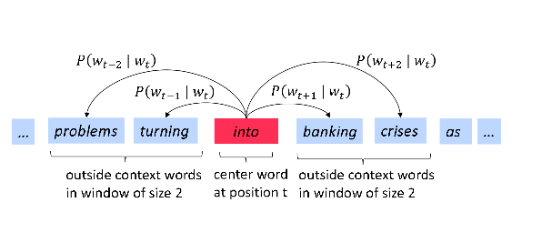
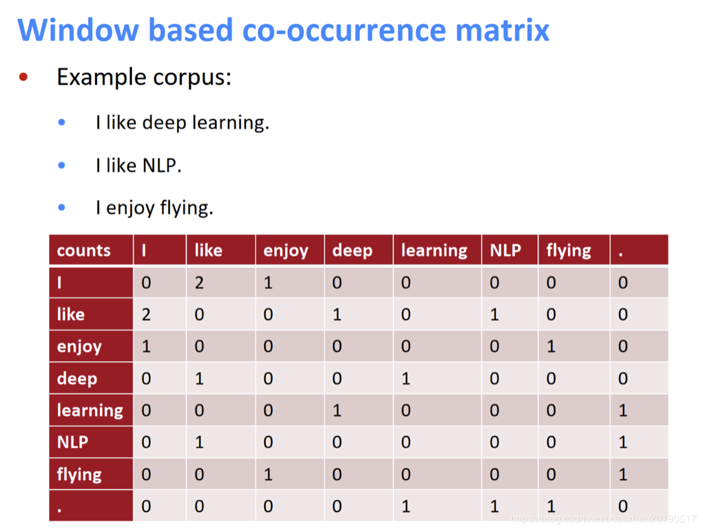

### 1.word2vec主要思想 

- 遍历语料库中的每个单词
- 通过词向量预测上下文单词
- 在每个窗口计算损失，根据SGD更新词向量
  
  
    **它会准确的给出在上下文中出现的单词的高概率估计；在上下文不会出现的单词，则得到低概率的估计**。
  
    **用一个简单的概率分布，来预测背景中所有的上下文单词的情况**

### 2.1 SGD
- $J(\theta)$是关于语料中所有窗口的函数，计算量十分大
- 解决方法：**随机梯度下降**
    - 对窗口进行采样
    - 基于采样窗口计算梯度更新参数
- 优点:
    - 减少噪声、减少过拟合
    - 计算快
- 缺点：
    - 每次更新只更新 矩阵中的少数列，计算的梯度非常稀疏

### 2.2 负采样

- 词表Vocab数量非常大，很难计算出来

  $$p(o|c)=\frac{exp(u_{o}^{T}v_{c})}{\sum_{w\subseteq V}exp(u_{w}^{T}v_{c})}$$

- 负采样机制：

  - 这是一种采样子集 简化运算的方法。
  - 具体做法是，对每个正例（中央词语及上下文中的一个词语） 采样几个负例（中央词语和其他随机词语），训练二分类lr。
  - 目标函数($\sigma$ 为sigmoid函数)：
    $$ J(\theta)= \frac{1}{T}\sum_{t=1}^{T} J_{t}(\theta) $$
    $$J_{t}(\theta) = log\sigma(U_{o}^{T}V_{c}) + \sum_{i=1}^{K}E_{j\sim P(w)}[log\sigma(-u_{j}^{T}v_{c})] $$
   - 算法：
     - 选取k个负样本(根据词出现的概率)
     - 最大化真实出现在窗口中的词的概率，最小化选取的负样本的概率
     unigram分布：$$ p(w)=U(w)^{3/4}/Z $$
     - 分母Z用于归一化，以使所有的词被选取的概率和等于一，通过这种方式，减少你采样中非常常见的单词，使频率较低的单词（稀有词）被更频繁地采样
       - 词出现频率分布的3/4次方使得出现频率较低的次能更频繁的被采样到

### 3. 基于统计的词向量

词向量目的：希望通过低维稠密向量来表示词的含义

对于like这个单词，I,deep,NLP的维度分别：2,1,1

#### 不足：

- 词梳理很多时，矩阵很大，维度很高，需要的存储空间也很大
- 当词的数目是在不断增长，则词向量的维度也在不断增长
- 矩阵很稀疏，即词向量很稀疏，会遇到稀疏计算的问题

### 4. Glove

GloVe目标是综合基于统计和基于预测的两种方法的优点。

word2vec 将窗口视作训练单位，每个窗口或者几个窗口都要进行一次参数更新。要知道，很多词串出现的频次是很高的。能不能历一语料，迅速得到结果呢？ 早在 word2vec 之前，就已经出现了很多得到词向量的方法，这些方法是基于统计共现矩阵的方法。如果在窗口级别上统计词性和语义共现，可以得到相似的词。如果在文档级别上统计，则会得到相似的文档（LSA）。

流程：输入语料库–> 统计共现矩阵–> 训练词向量–>输出词向量

- 简单使用共现矩阵的局限性：
  - 当出现新词的时候，以前的旧向量连维度都得改变
  - 高维度（词表大小）
  - 高稀疏性

#### 4.1低维向量：奇异值分解

解决共现矩阵高维问题
但是如何降维？通过svd。

改进：

- 限制高频词的频次，或者干脆停用词
- 根据与中央词的距离衰减词频权重
- 用皮尔逊相关系数代替词频