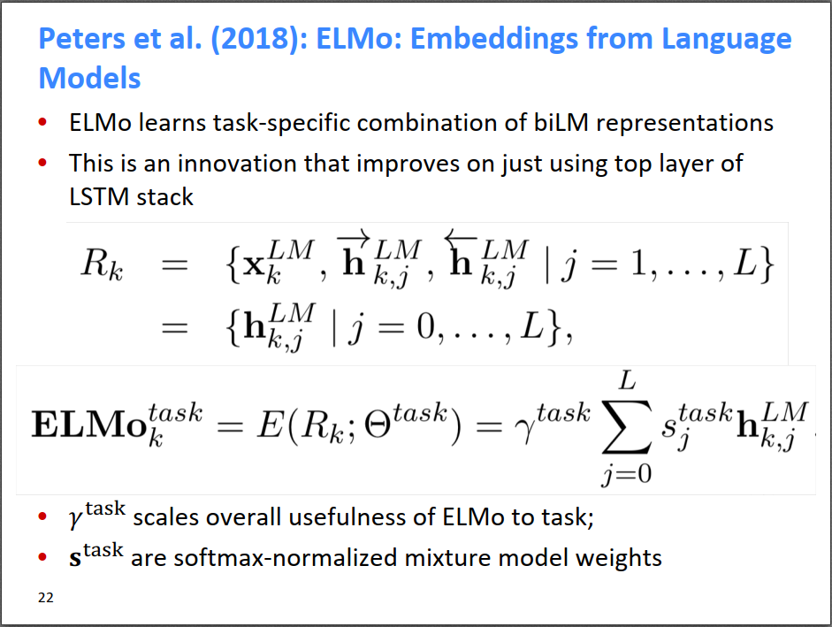
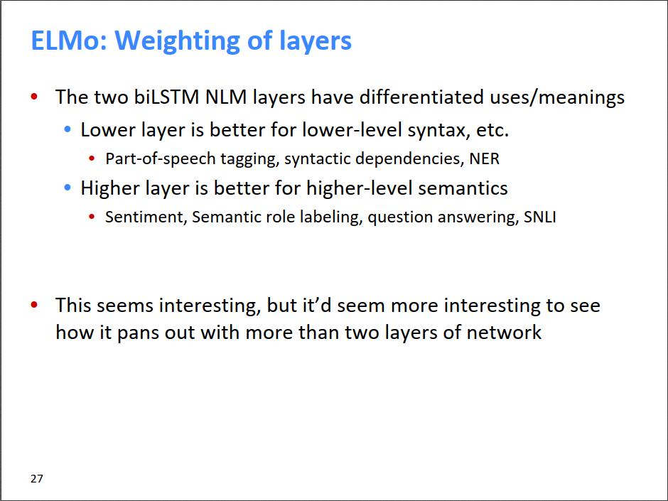

# Subword Models

今天介绍一下subword（子词）模型。之前介绍的NLP模型都是基于word的，对于英文来说是一个个单词，对于中文来说是一个个词语（需要分词）。不过，最近几年，subword模型多起来了，这就是我们今天要介绍的内容。

对于英文来说，文字的粒度从细到粗依次是character, subword, word，character和word都很好理解，subword相当于英文中的词根、前缀、后缀等，如unfortunately中的un、ly、fortun(e)等就是subword，它们都是有含义的。对于中文来说，只有两层，character和subword是同一层，表示单个的字，而word表示词语。

之前介绍的基于word的模型，存在out of vocabulary（OOV，未登录词）的问题。以英文为例，现存的英文单词数量太多了，随便加个前缀、后缀，变个时态什么的都变成新的单词了，所以英文单词的词典数量特别大，而且有很多低频稀疏词。很多模型在训练时都会去掉低频词，只保留高频词。那么这就存在一个问题，如果预测时遇到未登录词，则模型不认识，出现OOV的问题。

为了解决这个问题，一开始想到的是采用character级别的模型，即对26个字母训练word2vec，每个词由其字母的embedding拼接或者求平均得到。但是character级别的模型效果相比于word级别的模型效果差不多，并没有显著优势。而且如果用RNN来训练character级别的模型也有它的问题，就是训练起来非常慢。特别是对英文来说，原来的一个word，现在变成了七八个character，时间步长增加了很多，训练和预测都更久了，而且梯度消失（爆炸）的问题也会更严重。

后来，人们就想用subword模型作为character和word的折中模型。subword模型主要有两种，它们都能解决未登录词（OOV）的问题，如下图所示。第一种是模型结构和word模型完全一样，只不过把word换成了subword。第二种则是word和character模型的杂交模型。

对于第一种模型，关键问题是怎样得到subword。前面提到character的粒度太细，虽然能解决OOV问题，但效果并不是太好；word模型的word数量太多，存在大量稀疏word，删掉它们又会导致OOV问题，所以打算用subword模型。那么，怎样提取一个单词的subword呢？前面提到，unfortunately中的un、ly、fortun(e)等就是subword，但是对每个词都这样提取subword的话，费时费力不说，也不够智能。

有人就想出了用BPE算法来提取高频subword。BPE，全称是byte pair encoder，是上世纪提出的一种压缩算法，其核心思想是不断用字母表中不存在的char来代替最高频的char pair。举个例子，对于字符串aaabdaaabac，其字符串中最开始只出现了a/b/c/d这四个char；统计所有char pair，最高频的是aa，用不在字母表中的另一个字符Z代替aa，则原字符串变成了ZabdZabac，字母表变成了a/b/c/d/Z；如此不断进行下去，直到字母表大小达到一定的阈值，或者所有连续的char pair的频数都等于1了。关于BPE算法的进一步介绍请看这里：https://zhuanlan.zhihu.com/p/38130825。

第一种模型就是用BPE算法来得到高频subword的。比如下图的例子，语料集D中出现了5个low，2个lower等等。最开始，字母表V中是语料集中出现的所有单个字母的集合{l,o,…,d}。然后，发现e s这个char pair出现次数最多，将其作为一个subword加入到V中，同时将D中的es合并看作一个新的char。接着统计发现es t这个char pair（此时es已经是一个char了）出现次数最多，将其作为一个subword加入到V中，如此进行下去。发现没有，我们自动从D中提取了est这个subword，而est就是最高级的后缀。也就是说BPE算法自动提取到了英文的前缀、后缀等subword信息，完全避免了之前费时费力地从unfortunately中手工提取un、ly、fortun(e)的过程。这种方法也能解决未登录词问题，但是粒度又不至于太细。一方面是因为最开始的时候D中原始出现的单个字母都在V中，另一方面，由V中字母组成的未出现词也能由subword构成，比如下图中虽然less没有出现在D中，但可以由l es s这3个subword组成，而这3个subword是在最终的V中的。

得到高频subword作为V之后，后续在进行NLP任务时，encoder的时候查一下V，把char pair替换为新字符；decoder的时候查一下V，把新字符替换回原来的char pair。

最近比较流行的BERT，字典中既有相对比较常见的词，对于不太常见的词则用subwords/wordpieces来表示。

第二种被称为杂交模型的方法就相对简单了。这种方法是Manning老师提出来的，它就是在D中有这个word时就用word embedding，没有的时候就用char embedding来学习word embedding，非常简单。

fasttext就是skipgram+n-gram，一个词的embedding=组成这个词的n-gram的embedding的加权求和，所以fasttext也能解决OOV问题。

