# Contextual Word Embeddings

传统词向量，比如word2vec，它在训练阶段学习到一个词的向量表示之后，在下游的各种NLP任务中，这个词向量不再变动了。也就是说传统词向量的特点是，对一个词只学习一个词向量，且在具体任务中固定不变。传统词向量有两个主要的不足：

1. 难以表达一词多义。一个词在不同的上下文语境中可能表示不同的含义，比如“苹果”在“苹果真好吃”和“苹果手机很好用”这两个句子中表示不同的含义，但word2vec学习到的“苹果”词向量只有一个，也就是说下游任务对于这两个句子用的是同一个词向量。虽然word2vec的词向量可能同时包含了这两个含义，但它把这两个含义糅合到一个向量中了，导致在“苹果真好吃”中可能引入了“苹果手机”的干扰因素，在“苹果手机很好用”中引入了“吃的苹果”的干扰因素。总之就是，word2vec学习到的词向量粒度较粗，向量固定不变，无法根据具体的上下文语境进行改变。

2. 难以表达不同的语法或语义信息。一个词，即使是同一个意思，在语法或语义上也可能充当不同的角色，比如“活动”这个词，既可以做名词、也可以做动词，既可以做主语、也可以做谓语等。但word2vec对一个词只给出一个词向量，无论这个词在句子中充当什么角色，词向量都是一样的。虽然word2vec训练时可能已经学到了一个词的不同语法或语义特征，但它把这些信息糅合到一个向量中了，也就是粒度较粗的问题。

其实上述两点暴露出来的word2vec的不足，本质上是同样的两个原因：1. 词向量是静态的，无法根据上下文进行调整；2. 词向量表示只有一个向量，糅合了太多信息，粒度较粗。

下图中的word type表示一个相同的词，比如“苹果”；word token表示同一个word type在不同上下文的具体实例，比如“苹果真好吃”和“苹果手机很好用”中的“苹果”就是两个不同的word token。word type和word token有点类似于类和实例的关系。

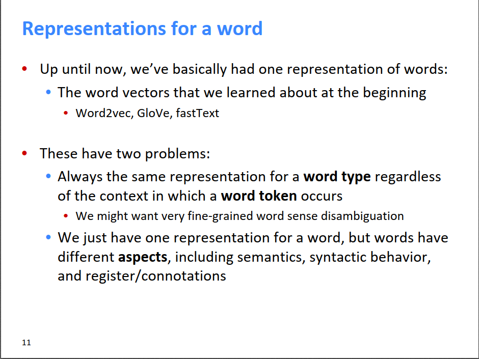

------

2018年艾伦人工智能研究所提出了ELMo: Embeddings from Language Models，即从语言模型中学习词向量的方法，它的原文标题为Deep contextualized word representations（https://www.aclweb.org/anthology/N18-1202.pdf），即深度的上下文词向量表示。ELMo很好地解决了上述传统词向量的两个不足，ELMo对一个词的表示由多个向量组成，并且每个向量的权重在具体的上下文中动态更新，由此不但粒度更细，而且能根据上下文动态调整一个词的最终词向量。使用ELMo词向量，作者在很多NLP任务上刷新了SOTA，在当年引起了很大的轰动。

ELMo有三个特点：

1. 学习的是word token的词向量，根据上面的定义，word token与具体的上下文有关，不再是静态的word type的词向量；

2. 使用很长的上下文进行学习，而不像word2vec一样使用较小的滑动窗口，所以ELMo能学到长距离词的依赖关系；

3. 使用双向的语言模型进行学习，并使用网络的所有隐藏层作为这个词的特征表示。

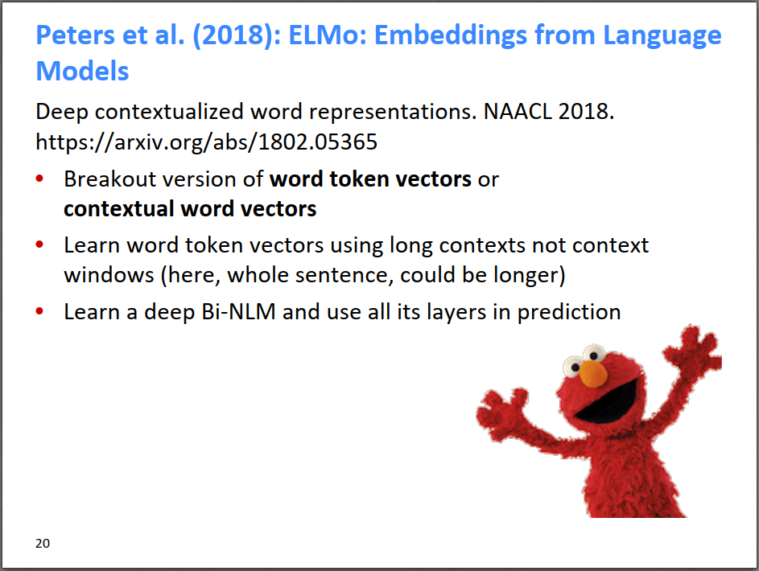

下面介绍ELMo具体的训练过程，以下截图来自[台湾大学李宏毅老师的教学视频](https://www.youtube.com/watch?v=UYPa347-DdE&list=PLJV_el3uVTsOK_ZK5L0Iv_EQoL1JefRL4&index=61)。

首先，既然word2vec使用滑动窗口只能学习到局部特征，那么ELMo就用RNN来建模长距离的依赖关系。如下图所示，ELMo使用双向语言模型bi-LM学习每个词的特征。我们知道，语言模型是给定一个句子前缀，预测下一个可能出现的词，也就是说常规的语言模型是只知道t时刻前的信息，不知道t时刻之后的信息，即通常都是单向的。而ELMo则使用了bi-LM，比如下图我们要学习“退了”这个词的特征，在前向网络中，模型学到了在给定上文的情况下，“退了”的隐藏层特征；在反向网络中，模型学到了在给定下文的情况下，“退了”的隐藏层特征。最后，ELMo把两个方向的隐藏层特征拼起来，作为bi-LM学到的“退了”这个词的特征表示。

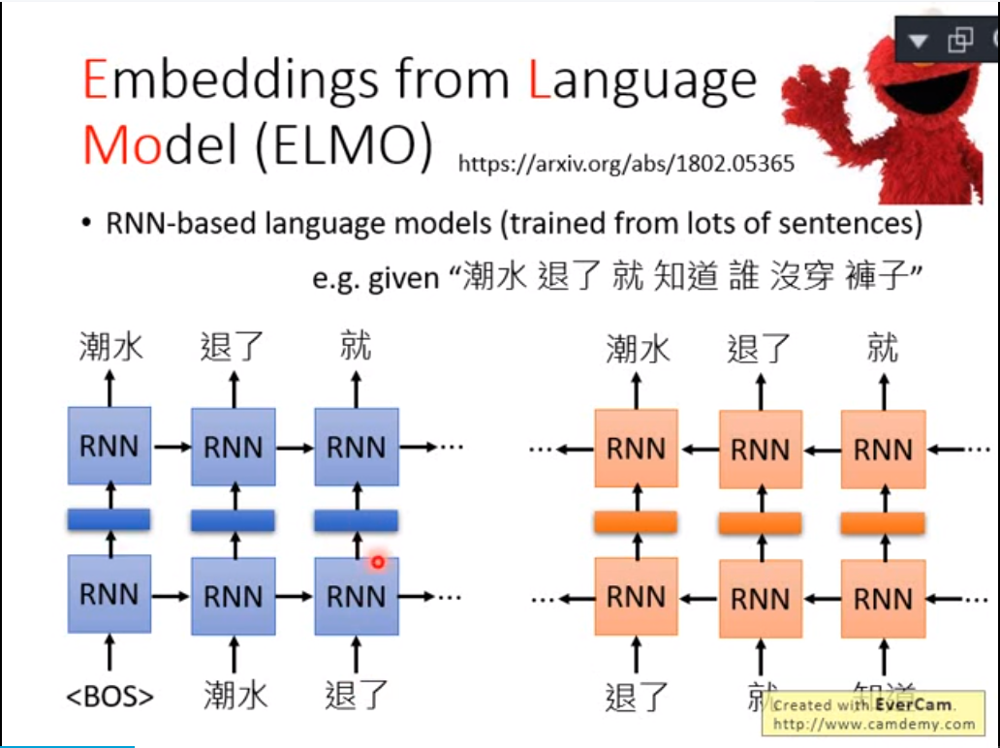

为了学到更多的特征，ELMo对双向RNN进行堆叠，每增加一层就能多学习到2个特征表示（一正一反，下图把这两个向量拼接起来作为一个整体向量h）。

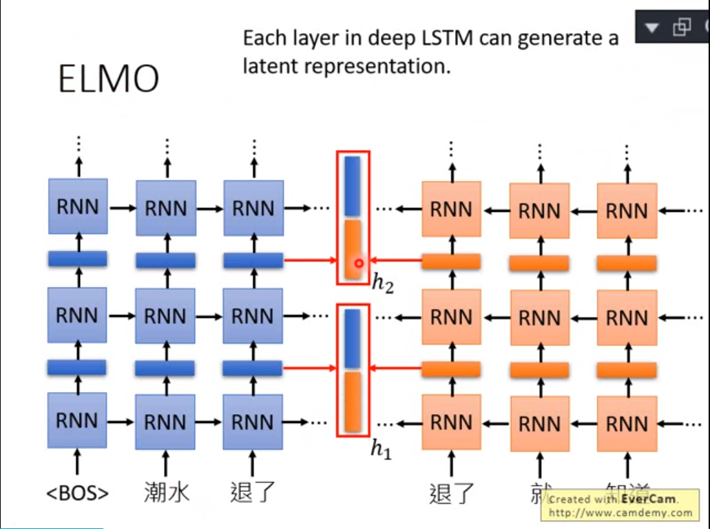

ELMo文中只使用了两层的双向LSTM抽取特征，所以对一个词能抽取到4个特征表示，即下图中的h1和h2（每个h包含一正一反特征向量组合）。

在使用ELMo词向量时，每个词的最终词向量是所有隐藏层特征向量h的加权求和，系数是α。这个系数是根据词在不同的上下文中学习得来的。ELMo文章分析发现，不同的NLP任务学到的系数不尽相同，比如在Coref和SQuAD任务中，第一层的系数更大。有可能ELMo在第一层学到的是词的句法特征，第二次学到的是更高级的语义特征。有点类似于CNN中在浅层学到点、线、转角，在高层学到轮廓等高级特征。

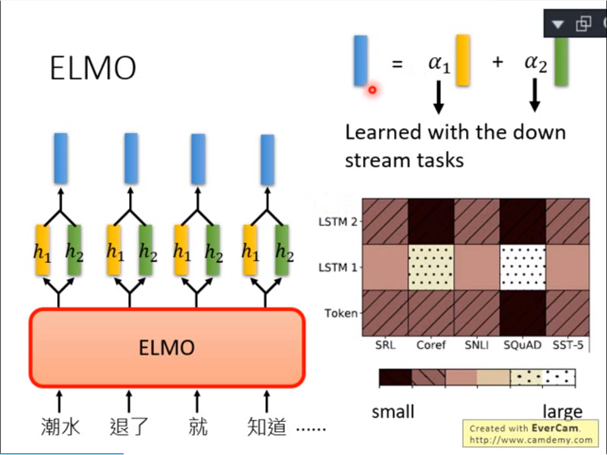

ELMo的形式化表示如下图所示。假设堆叠的bi-LSTM有L层，则每一层都能学到前向特征→hk,jLM和反向特征←hk,jLM，这两个组合起来就是hk,jLM（也就是上图的hi）。下图的ELMo还有个xkLM，它是bi-LM的词向量输入，这相当于词最原始的输入向量，ELMo使用char-CNN抽取一个词的原始输入向量，和上一课提到的Subword model类似，这里不展开。下图j=0时的特征就是xkLM 。

所以，对于词k，ELMo得到的完整词向量是Rk，它其实是这个词的一系列特征向量的组合，它还不是这个词最终的词向量，因为最终的词向量要在具体的NLP任务中根据上下文来定。词k在某个任务task中的词向量ELMoktask如下图所示，它等于对所有层的特征向量的加权求和，权重sjtask（即上图的α）根据当前任务动态学习得到。最终还会有一个参数γtask，控制ELMo词向量对任务的贡献程度。

[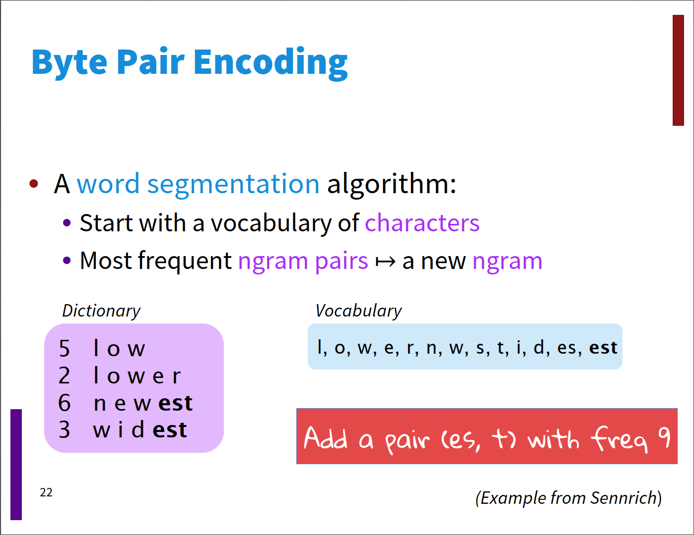](https://github.com/01joy/stanford-cs224n-winter-2019/raw/master/2.19/img/p22.png)

不同层抽取的特征不一样，ELMo只使用了两层bi-LSTM，如果堆叠更多层的话，估计能学到更多有意思的特征。

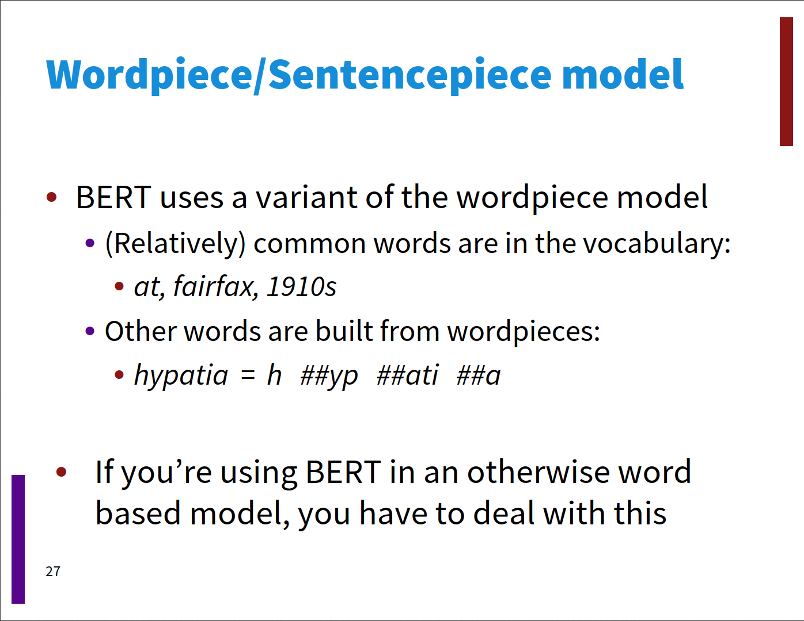

ELMo词向量的使用方法。在下游的NLP任务中，既可以把ELMo词向量作为输入层特征，也可以将其拼接到隐藏层，反正都需要学习参数sjtask和γtask。

性能方面，ELMo刷新了很多NLP任务的SOTA，大概能提高3个百分点。

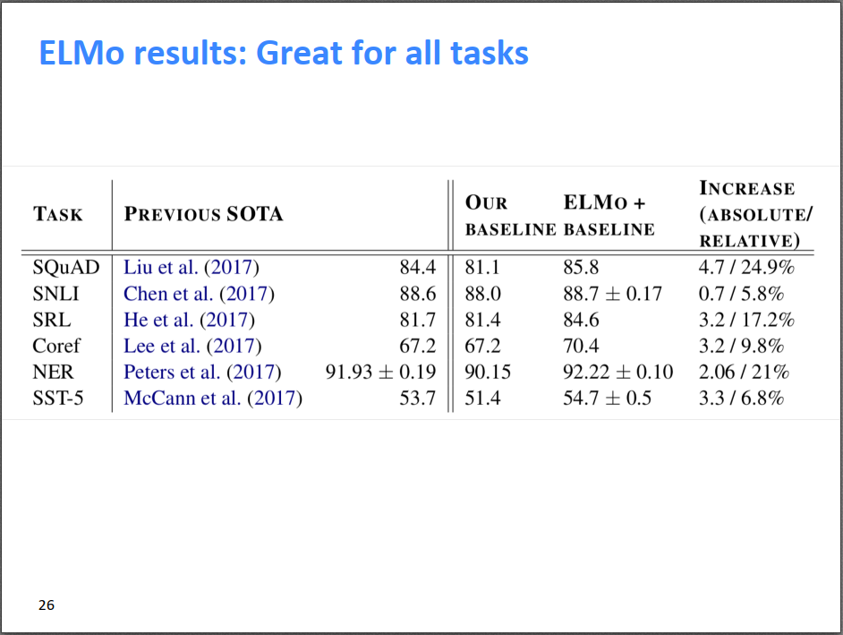

个人理解word2vec和ELMo的本质区别。其实两者在训练阶段都考虑了上下文，只不过word2vec使用的是滑动窗口，只能学习局部特征，而ELMo使用RNN，能学到长距离特征。word2vec学到embedding之后固定成一个向量了，在下游NLP任务中不再变动；而ELMo训练完之后得到这个词的多个特征向量（词的隐含特征表示，粒度更细），且在下游NLP任务中会根据上下文动态组合这些特征向量，得到在这一上下文中的词向量表示（针对性更强）。

其实，仔细想想的话，这个本质区别也没有那么大，虽然word2vec训练到的词向量只有一个，且固定了，但词向量的维度如果够大的话，可以用不同维度来表示一词多义呀。而且用到下游NLP任务时，词向量不同维度的权重也可以不一样啊，不就相当于ELMo的不同sjtask吗？虽然如此，可能还是不如ELMo的多个隐藏层向量，一方面是经过隐藏层的特征抽取，另一方面是毕竟ELMo出来的特征向量有2L+1个，仅维度上就比word2vec多很多，效果好是理所应当的。

ELMo的作者在2017年发过TagLM的工作，和ELMo类似，被称为Pre-ELMo，感兴趣的可以阅读原文（https://arxiv.org/abs/1705.00108）。ELMo是把语言模型的隐藏层抽取出来作为词的特征向量，2017年的CoVe词向量是把机器翻译过程中的隐藏层提取出来作为词的特征向量，但效果没ELMo好，感兴趣的可以阅读原文（https://arxiv.org/abs/1708.00107）。

同样在2018年，OpenAI和GoogleAI借助Transformer模型，提出了更加强大的上下文词向量学习方法GPT和BERT。Transformer是为了解决RNN无法并行化的问题，提出Attention is all you need（https://arxiv.org/abs/1706.03762）。以前我们提到[Attention用来提升RNN的性能](https://bitjoy.net/2019/08/02/cs224n（1-31）translation-seq2seq-attention/)，Transformer更加激进，直接不要RNN，只留下Attention，然后堆叠网络深度，使得其可以和CNN一样并行化，使用GPU之后可以大大加速训练过程。下节课将详细介绍Transformer的内容，这里我们只需要知道Transformer是一个强大的seq2seq（Encoder-Decoder）模型。

BERT就是借助Transformer学习上下文词向量的方法，它的全称是BERT (Bidirectional Encoder Representations from Transformers): Pre-training of Deep Bidirectional Transformers for Language Understanding。

BERT借助Transformer，ELMo借助bi-LSTM，两者最大的区别是ELMo只能看到单向的上下文信息，而BERT能同时看到双向的上下文信息。ELMo的不足是：虽然它concat了双向LSTM的隐藏层特征向量，但ELMo的正向和反向的网络是完全独立的，也就是说在训练正向网络时，词t看不到t+1往后的词，在训练反向网络时，词t看不到t-1往前的词。BERT由于采用Transformer的网络，它内部的attention能同时看到正向和反向的词，所以BERT是真正的双向，而ELMo的bi-LSTM并不能同时看到正向和反向的上下文。

BERT综合了两种训练方法。第一种是Masked语言模型，很类似于word2vec的CBOW模型，即挖掉一个句子中15%的词，做完形填空。这个场景正好可以用Transformer的Attention，因为完形填空的时候，我们既能看到上文，也能看到下文。感觉又回到了word2vec的CBOW模型，只不过把滑动窗口改成了Attention，能看到的上下文更多了，而且可以保留多个中间层特征作为上下文词向量。另一种方法是，给定两个句子，预测一个句子是否是另一个句子的下文（很奇怪为什么会想到这种分类任务）。

下图的[MASK]即为挖掉的词。

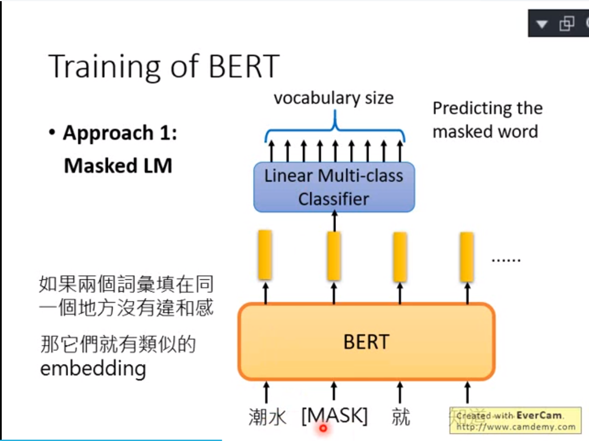

下图中的[SEP]是两个句子的分割位置，[CLS]是输出后个句子是否是前个句子的下一个句子的位置。

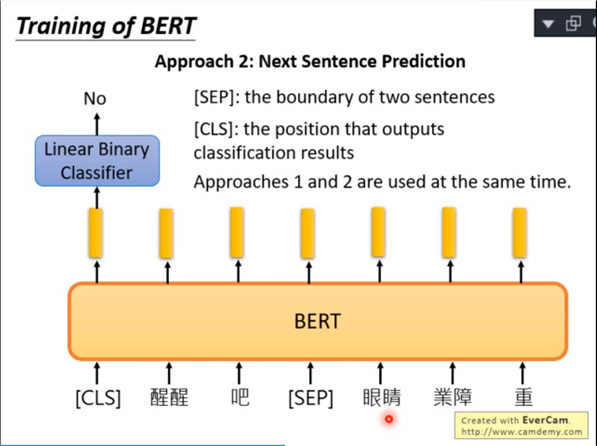

最后的BERT综合了上述两种训练方法，下图来自：http://jalammar.github.io/illustrated-bert/。

BERT使用方法，在Transformer顶层进行fine tune。

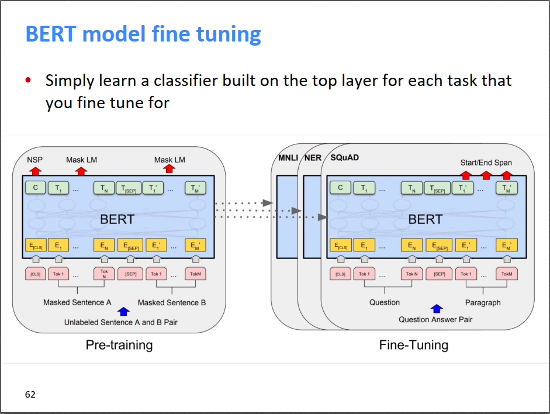

BERT出来后又刷新了一波SOTA，超过了ELMo。

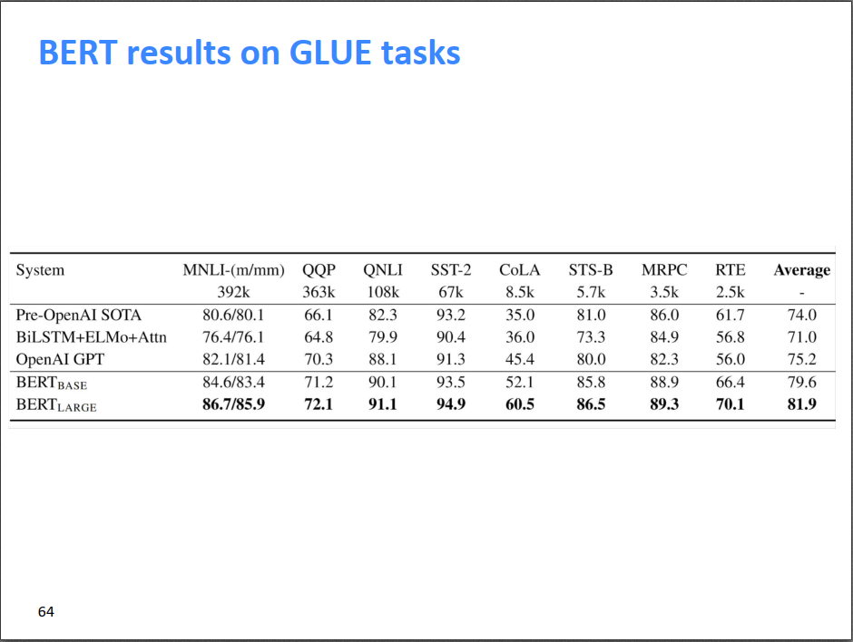

参考资料：

各种词向量模型介绍：https://www.jiqizhixin.com/articles/2018-12-10-8

ELMo介绍：https://zhuanlan.zhihu.com/p/63115885

BERT介绍：http://jalammar.github.io/illustrated-bert/