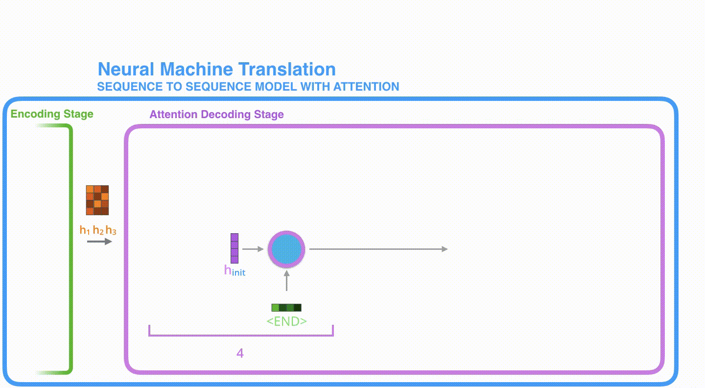
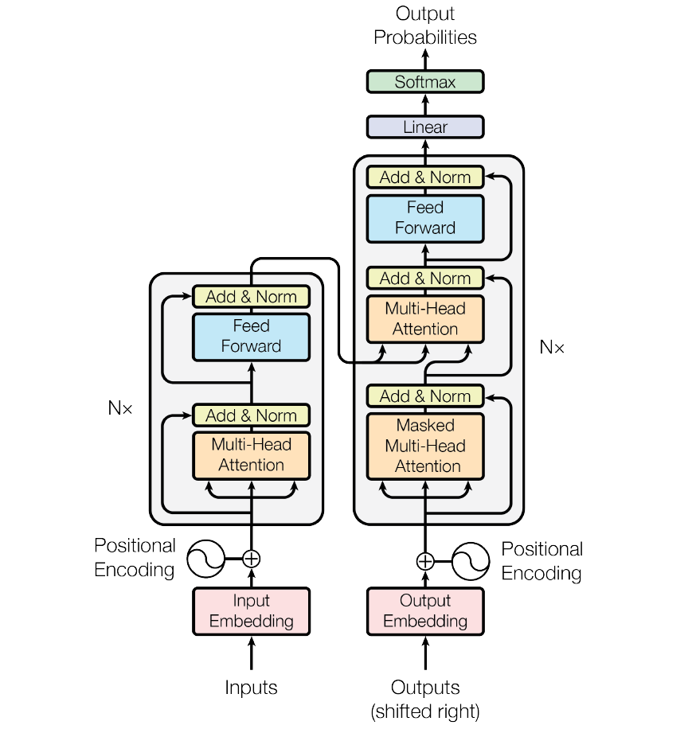

## Attention

机器翻译是序列转换模型的一个核心问题，其输入和输出都是长度可变的序列。为了处理这种类型的输入和输出，我们可以设计一个包含两个主要组件的结构。第一个组件是一个 *编码器*（encoder）：它接受一个长度可变的序列作为输入，并将其转换为具有固定形状的编码状态。第二个组件是 *解码器*（decoder）：它将固定形状的编码状态映射到长度可变的序列。这被称为 *编码器-解码器*（encoder-decoder）结构。如图：

但是，即使并非所有输入context都对解码某个词元都有用，但在每个解码步骤中仍使用编码整个输入序列的相同context。

在为给定文本序列生成手写的挑战中，格雷夫斯设计了一种可微注意力模型，将文本字符与更长的笔迹对齐，其中对齐方式仅向一个方向移动 [[Graves, 2013\]](https://zh-v2.d2l.ai/chapter_references/zreferences.html#graves-2013)。受学习对齐想法的启发，Bahdanau 等人提出了一个没有严格的单向对齐限制 [[Bahdanau et al., 2014\]](https://zh-v2.d2l.ai/chapter_references/zreferences.html#bahdanau-cho-bengio-2014) 的可微注意力模型。在预测词元时，**如果不是所有输入词元都相关，模型将仅对齐（或参与）输入序列中与当前预测相关的部分**。这是通过将上下文变量视为注意力集中的输出来实现的。

让我们继续从高层次来理解注意力模型。一个注意力模型不同于经典的序列到序列（seq2seq）模型，主要体现在 2 个方面：

1. 首先，编码器会把更多的数据传递给解码器。编码器把所有时间步的 hidden state（隐藏层状态）传递给解码器，而不是只传递最后一个 hidden state（隐藏层状态）:

2. 注意力模型的解码器在产生输出之前，做了一个额外的处理。为了把注意力集中在与该时间步相关的输入部分。解码器做了如下的处理：

   1. 查看所有接收到的编码器的 hidden state（隐藏层状态）。其中，编码器中每个 hidden state（隐藏层状态）都对应到输入句子中一个单词。
   2. 给每个 hidden state（隐藏层状态）一个分数（我们先忽略这个分数的计算过程）。
   3. 将每个 hidden state（隐藏层状态）乘以经过 softmax 的对应的分数，从而，高分对应的  hidden state（隐藏层状态）会被放大，而低分对应的  hidden state（隐藏层状态）会被缩小。

现在，让我们把所有内容都融合到下面的图中，来看看注意力模型的整个过程：

1. 注意力模型的解码器 RNN 的输入包括：一个embedding 向量，和一个初始化好的解码器 hidden state（隐藏层状态）。
2. RNN 处理上述的 2 个输入，产生一个输出和一个新的 hidden state（隐藏层状态 h4 向量），其中输出会被忽略。
3. 注意力的步骤：我们使用编码器的 hidden state（隐藏层状态）和 h4 向量来计算这个时间步的上下文向量（C4）。
4. 我们把 h4 和 C4 拼接起来，得到一个向量。
5. 我们把这个向量输入一个前馈神经网络（这个网络是和整个模型一起训练的）。
6. 前馈神经网络的输出表示这个时间步输出的单词。
7. 在下一个时间步重复1-6步骤。
   

## Transformer 

### 宏观理解Transformer

一个Transformer的Encoder和Decoder，宏观上将最重要的就是如下图所示的结构。

- encoder: 输入编码器的文本数据，首先会经过一个 Self Attention 层，这个层处理一个词的时候，不仅会使用这个词本身的信息，也会使用句子中其他词的信息（你可以类比为：当我们翻译一个词的时候，不仅会只关注当前的词，也会关注这个词的上下文的其他词的信息）。本文后面将会详细介绍 Self Attention 的内部结构。

接下来，Self Attention 层的输出会经过前馈神经网络。

- 同理，解码器也具有这两层，但是这两层中间还插入了一个 Encoder-Decoder Attention 层，这个层能帮助解码器聚焦于输入句子的相关部分（类似于 seq2seq 模型 中的 Attention）。

### 从细节细节理解Transformer

#### Transformer 的输入

和通常的 NLP 任务一样，我们首先会使用词嵌入算法（embedding algorithm），将每个词转换为一个词向量。实际中向量一般是 256 或者 512 维。为了简化起见，这里将每个词的转换为一个 4 维的词向量。

那么整个输入的句子是一个向量列表，其中有 3 个词向量。在实际中，每个句子的长度不一样，我们会取一个适当的值，作为向量列表的长度。如果一个句子达不到这个长度，那么就填充全为 0 的词向量；如果句子超出这个长度，则做截断。**句子长度是一个超参数，通常是训练集中的句子的最大长度**，你可以尝试不同长度的效果。

#### Encoder(编码器)

输入向量的大小通过Encoder的各个层，且唯独大小不变。

#### Self-Attention整体的理解

以例子切入：

> The animal didn't cross the street because it was too tired

句子中的it指代的是animal，self-attention机制可以让it和animal关联起来。

同理，当模型处理句子中的每个词时，*Self Attentio*n机制使得模型不仅能够关注这个位置的词，而且能够关注句子中其他位置的词，作为辅助线索，进而可以更好地编码当前位置的词。

### Self-Attention 的细节

#### 计算Query 向量，Key 向量，Value 向量

这个Q,K,V，我们经常能在各种文章中看到。

下面我们先看下**如何使用向量来计算 Self Attention**，**然后再看下如何使用矩阵来实现 Self Attention。**（**矩阵运算的方式，使得 Self Attention 的计算能够并行化**，这也是 Self Attention 最终的实现方式）。

1. 计算 Self Attention 的第 1 步是：对输入编码器的每个词向量，都创建 3 个向量，分别是：Query 向量，Key 向量，Value 向量。**这 3 个向量是词向量分别和 3 个矩阵相乘得到的**，*而这个**矩阵**是我们要学习的参数。*

   

如图所示，Q,K,V就是由$W^Q$,$W^K$,$W^V$与词向量相乘的结果，其实Q,K,V只是三个向量，我们赋予他们以不同的名称来让我们更好的理解Self-Attention的计算过程和逻辑含义。下面介绍attention是如何算出来的，以及Q,K,V分别扮演了什么角色。

#### 计算 Attention Score（注意力分数）

上文说到第1步是计算 Query，Key，Value 的矩阵。

- 第 2 步，是计算 Attention Score（注意力分数）。计算第n个分数（点积）：$q_{n-1}·k_{n}$，当n=1时，计算$q_1·k_1$。

- 第 3 步就是把每个分数除以 $\sqrt(d_{key})$ （$d_{key}$是 Key 向量的长度）。你也可以除以其他数，除以一个数是为了在反向传播时，求取梯度更加稳定。

- 第 4 步，接着把这些分数经过一个 Softmax 层，Softmax可以将分数归一化，这样使得分数都是正数并且加起来等于 1。

这些分数决定了在编码当前位置（这里的例子是第一个位置）的词时，对所有位置的词分别有多少的注意力。

- 第 5 步，得到每个位置的分数后，将每个分数分别与每个 Value 向量相乘。这种做法背后的直觉理解就是：对于分数高的位置，相乘后的值就越大，我们把更多的注意力放到了它们身上；对于分数低的位置，相乘后的值就越小，这些位置的词可能是相关性不大的，这样我们就忽略了这些位置的词。
- 第 6 步是把上一步得到的向量相加，就得到了 Self Attention 层在这个位置（这里的例子是第一个位置）的输出。

上面这张图，包含了 Self Attention 的全过程，最终得到的当前位置（这里的例子是第一个位置）的向量会输入到前馈神经网络。但这样每次只能计算一个位置的输出向量，在实际的代码实现中，Self Attention 的计算过程是使用矩阵来实现的，这样可以加速计算，一次就得到所有位置的输出向量。

但是自注意力也有它的问题：

1. 在计算自注意力时，没有考虑输入的位置信息，因此无法对序列型的输入进行建模
2. 输入向量$\vec X_i$需要负责Q,K,V三种角色，不容易学习。
3. 只考虑两个输入序列单元的联系，无法建模多输入
4. 无法同时关注多输入；
5. 计算结果可能互斥。

#### 使用矩阵计算 Self-Attention

由于我们使用了矩阵来计算计算Q,K,V，我们可以把上面的第 2 步到第 6 步压缩为一步，直接得到 Self Attention 的输出。

### 多头注意力机制（multi-head attention）

一组注意力称为一个 attention head，这种机制从如下两个方面增强了 attention 层的能力：

- 它扩展了模型关注不同位置的能力。在上面的例子中，第一个位置的输出 z1 包含了句子中其他每个位置的很小一部分信息，但 z1 可能主要是由第一个位置的信息决定的。当我们翻译句子：`The animal didn’t cross the street because it was too tired`时，我们想让机器知道其中的it指代的是什么。这时，多头注意力机制会有帮助。

- 多头注意力机制赋予 attention 层多个“**子表示空间**”。下面我们会看到，多头注意力机制会有多组$W^Q, W^K W^V$ 的权重矩阵（在 Transformer 的论文中，使用了 8 组注意力（attention heads）。因此，接下来我也是用 8 组注意力头 （attention heads））。每一组注意力的权重矩阵都是随机初始化的。经过训练之后，每一组注意力$W^Q, W^K W^V$ 可以看作是把输入的向量映射到一个”子表示空间“。

  

所以我们有八组权重，自然有八个Z矩阵，我们要做的是整合矩阵：

多头注意力的内容整合在一起：

### 使用位置编码来表示序列的顺序

上面提到自注意力模型没有考虑输入位置信息。为了解决这个问题，Transformer 模型对每个输入的向量都添加了一个向量。这些向量遵循模型学习到的特定模式，有助于确定每个单词的位置，或者句子中不同单词之间的距离。这种做法背后的直觉是：将这些表示位置的向量添加到词向量中，得到了新的向量，这些新向量映射到 Q/K/V，然后计算点积得到 attention 时，可以提供有意义的信息。

### 残差连接

编码器结构中有一个需要注意的细节是：编码器的每个子层（Self Attention 层和 FFNN）都有一个残差连接和层标准化（layer-normalization）。

将 Self-Attention 层的层标准化（layer-normalization）和向量都进行可视化，如图所示：

在解码器的子层里面也有层标准化（layer-normalization）。假设一个 Transformer 是由 2 层编码器和两层解码器组成的，如下图所示：

上面说了，编码器一般有多层，第一个编码器的输入是一个序列，最后一个编码器输出是一组注意力向量 K 和 V。这些注意力向量将会输入到每个解码器的Encoder-Decoder Attention层，这有助于解码器把注意力集中中输入序列的合适位置。

在完成了编码（encoding）阶段之后，我们开始解码（decoding）阶段。解码（decoding ）阶段的每一个时间步都输出一个翻译后的单词（这里的例子是英语翻译），解码器当前时间步的输出又重新输入和编码器的输出共同作为下一个时间步解码器的输入。

接下来会重复这个过程，直到输出一个结束符，Transformer 就完成了所有的输出。Decoder 就像 Encoder 那样，从下往上一层一层地输出结果。正对如编码器的输入所做的处理，我们把解码器的输入向量，也加上位置编码向量，来指示每个词的位置。

解码器中的 Self Attention 层，和编码器中的 Self Attention 层不太一样：在解码器里，Self Attention 层只允许关注到输出序列中早于当前位置之前的单词。具体做法是：在 Self Attention 分数经过 Softmax 层之前，屏蔽当前位置之后的那些位置。

Encoder-Decoder Attention层的原理和多头注意力（multiheaded Self Attention）机制类似，不同之处是：Encoder-Decoder Attention层是使用前一层的输出来构造 Query 矩阵，而 Key 矩阵和 Value 矩阵来自于编码器最终的输出。

### 最后的线性层和 Softmax 层

Decoder 最终的输出是一个向量，其中每个元素是浮点数。我们怎么把这个向量转换为单词呢？这是由 Softmax 层后面的线性层来完成的。

线性层就是一个普通的全连接神经网络，可以把解码器输出的向量，映射到一个更长的向量，这个向量称为 logits 向量。

现在假设我们的模型有 10000 个英语单词（模型的输出词汇表），这些单词是从训练集中学到的。因此 logits 向量有 10000 个数字，每个数表示一个单词的分数。我们就是这样去理解线性层的输出。

然后，Softmax 层会把这些分数转换为概率（把所有的分数转换为正数，并且加起来等于 1）。然后选择最高概率的那个数字对应的词，就是这个时间步的输出单词。

在上图中，最下面的向量，就是编码器的输出，这个向量输入到线性层和 Softmax 层，最终得到输出的词。

