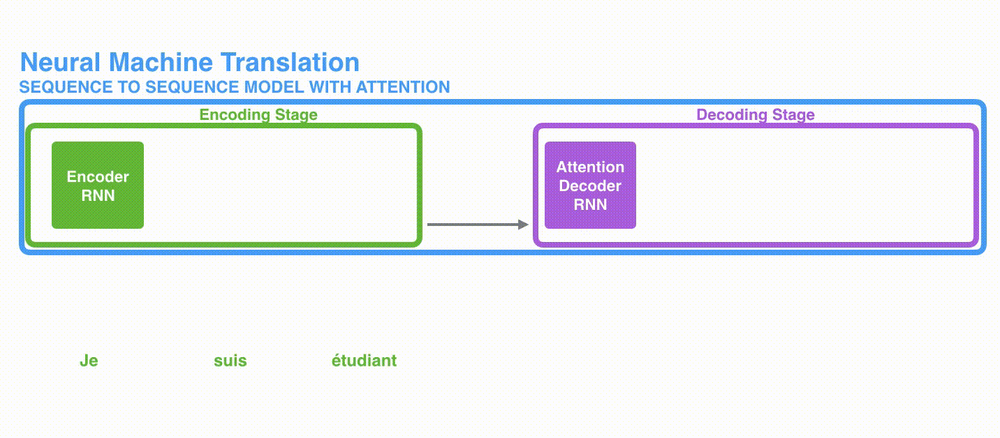

## seq2seq

先从Seq2seq说起，编码器会处理输入序列的每个元素，并转化为context。当我们处理好整个序列后编码器把上下文发送给解码器，解码器逐项生成元素。

在transformer出现之前，一直是以RNN或LSTM为主。你可以在编写seq2seq模型的时候设置上下文向量的长度。这个长度是基于编码器 RNN 的隐藏层神经元的数量。

根据设计，RNN 在每个时间步接受 2 个输入：

- 输入序列中的一个元素（在解码器的例子中，输入是指句子中的一个单词，最终被转化成一个向量(embedding)）
- 一个  hidden state（隐藏层状态，也对应一个向量）

图：一个编解码器的工作流程

## Attention

为了解决Seq2seq模型记忆长序列能力不足的问题，在 Bahdanau等2014发布的[Neural Machine Translation by Jointly Learning to Align and Translate](https://arxiv.org/abs/1409.0473) 和 Luong等2015年发布的[Effective Approaches to Attention-based Neural Machine Translation
](https://arxiv.org/abs/1508.04025)两篇论文中，提出了一种解决方法。这 2 篇论文提出并改进了一种叫做注意力**attetion**的技术，它极大地**提高了机器翻译的质**量。注意力使得模型可以根据需要，关注到输入序列的相关部分。

一个注意力模型不同于经典的序列到序列（seq2seq）模型，主要体现在 2 个方面：

- 首先，编码器会把更多的数据传递给解码器。编码器把所有时间步的 hidden state（隐藏层状态）传递给解码器，而不是只传递最后一个 hidden state（隐藏层状态）:

- 第二，注意力模型的解码器在产生输出之前，做了一个额外的处理。为了把注意力集中在与该时间步相关的输入部分。解码器做了如下的处理：

  1. 查看所有接收到的编码器的 hidden state（隐藏层状态）。其中，编码器中每个 hidden state（隐藏层状态）都对应到输入句子中一个单词。
  2. 给每个 hidden state（隐藏层状态）一个分数（我们先忽略这个分数的计算过程）。
  3. 将每个 hidden state（隐藏层状态）乘以经过 softmax 的对应的分数，从而，高分对应的  hidden state（隐藏层状态）会被放大，而低分对应的  hidden state（隐层状态）会被缩小。

  

动态图：attention decoder

这个加权平均的步骤是在解码器的每个时间步做的。
现在，让我们把所有内容都融合到下面的图中，来看看注意力模型的整个过程：

1. 注意力模型的解码器 RNN 的输入包括：一个embedding 向量，和一个初始化好的解码器 hidden state（隐藏层状态）。
2. RNN 处理上述的 2 个输入，产生一个输出和一个新的 hidden state（隐藏层状态 h4 向量），其中输出会被忽略。
3. 注意力的步骤：我们使用编码器的 hidden state（隐藏层状态）和 h4 向量来计算这个时间步的上下文向量（C4）。
4. 我们把 h4 和 C4 拼接起来，得到一个向量。
5. 我们把这个向量输入一个前馈神经网络（这个网络是和整个模型一起训练的）。
6. 前馈神经网络的输出表示这个时间步输出的单词。
7. 在下一个时间步重复1-6步骤。

图：attention过程

数学表示：

$$attn_s=attn(\bold {q_s^T} \cdot\bold {k_{t-1}})$$

$$a_s=softmax(\bold {attn})_s$$

$\bold {attn}=[attn_1,...attn_L]$，$L$是源序列的长度。

$\bold {q_s^T}$表示s时刻源序列的状态，$\bold {k_{t-1}}$表示目标序列前一时刻的状态。整个源序列经过attn计算后得到的每个时刻的注意力分数经过softmax归一化后，得到的注意力权重$a_s$。

$attn$公式可以有多种。

