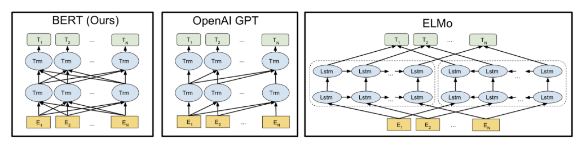
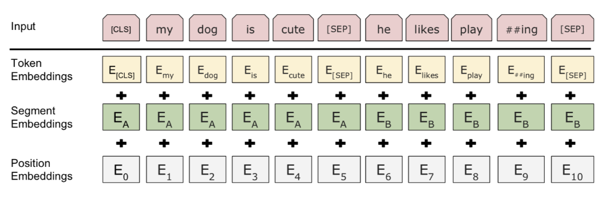
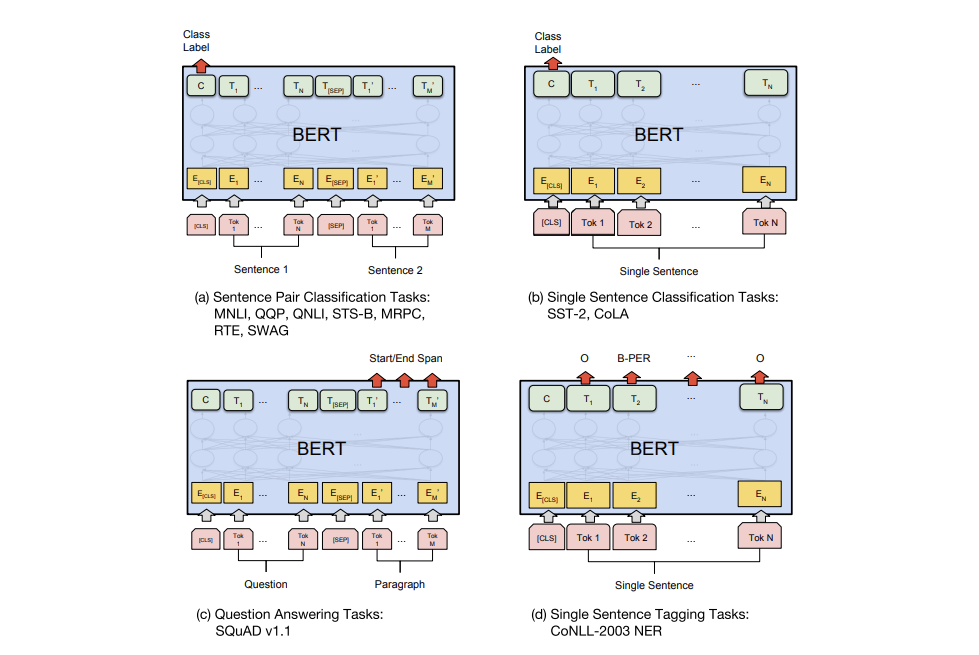

## BERT

**「Transformer 双向编码器表示（Bidirectional Encoder Representations from Transformers，BERT）」** 算是 GPT 的直系后代：在免费语料上训练一个大规模语言模型，然后针对特定任务微调而不需要单独定制网络架构。

相较于 GPT，BERT 最大的区别和改善之处在于双向训练，模型会学着预测左右两边的上下文，按论文中消融研究结果所述：

> “模型双向性是最重要的新贡献没有之一”

### 预训练任务

BERT 的模型架构为多层双向 Transformer 编码器。

Transformer 编码器架构

为了促进双向预测和句子级理解，相较于在基础语言任务上训练（给定场景下预测下一个标识），BERT 要同时完成两项任务。

#### 任务 1：遮罩语言模型（Mask language model，MLM）

> 维基百科：“完形填空（填充缺失测验）是一项练习，测试或评估，由一部分语句构成，其中特定项、字词或符号会被删除（填空文本），与试者的任务是替换缺失语言项……该练习首先由 W.L. Taylor 在 1953 年提出”

毫无疑问，从前后语境中而不单只是从后文中学到的表示能更好的领会个中深意，无论是在语义还是语法上。BERT 通过**遮罩语言模型**任务来实现这一点：

1. 每个句子随机挡住 15% 的内容。因为如果我们只用特殊占位符 `[MASK]` 换掉被遮标识，微调的时候特定标识就再也看不到了。所以 BERT 用了几个启发式技巧：

2. - a）80% 的概率用 `[MASK]` 替换选定词
   - b）10% 的概率用随机词替换
   - c）10% 的概率保持不变

3. 模型只预测缺失词，但它不知道哪个词被替换了，或者要预测哪个词。输出大小只有输入的 15%

#### 任务 2：下一句预测

许多下游任务涉及到对句子间关系的理解（QA，NLI），BERT 额外加了一个辅助任务，训练一个**二分类器（binary classifier）**判断一句话是不是另一句的下文：

1. 对语句对（A,B）采样：

2. - a）50% 的情况 B 是 A 的下文
   - b）50% 的情况不是

3. 模型对两句话进行处理并输出一个二值标签，指明 B 是否就是 A 后的下一句话

上述两个辅助任务的训练数据可以轻易从任意单语语料中获取，所以训练规模不受限制。训练损失是累计平均遮罩 LM 概率，和累计平均下文预测概率。

BERT，OpenAI GPT 和 ELMo 模型架构对比

### 输入嵌入

输入嵌入是三部分的和：

1. **字段标识嵌入（WordPiece tokenization embeddings）**：字段模型原本是针对日语或德语的分词问题提出的。相较于使用自然分隔的英文单词，它们可以进一步分成更小的子词单元便于处理罕见词或未知词。感兴趣的话可以看看分词优化方式的论文[论文1][13][论文2][14]。
2. **片段嵌入（segment embedding）**：如果输入有两句话，分别有句子 A 和句子 B 的嵌入向量，并用特殊标识 `[SEP]` 隔开；如果输入只有一句话就只用句子 A 的嵌入向量
3. **位置嵌入（position embeddings）**：位置 embedding 需要学习而非硬编码

BERT 输入表示

注意第一个标识必须是 `[CLS]`——之后下游任务预测中会用到的占位符。

### 下游任务使用 BERT

BERT 的微调只需要添加很少的参数，就像 OpenAI GPT。

对于分类任务，取首个标识 `[CLS]` 的最终隐态 ，将它和一个小权重矩阵相乘，

对像 SQuAD 这样的 QA 任务，我们要针对问题预测给定段落的文本跨度。BERT 对每个标识要预测两个概率分布，分别对应描述作为文本范围的开端和末尾的几率。微调时新训练的只有两个小矩阵 和 ，而 和 对应两个概率分布。

总体来讲微调下游任务时加上的内容很少——一两个权重矩阵，负责将 Transform 隐态转换成可解释形式。其他情况的实施细节可以看论文了解。

微调过的 BERT 模型对不同下游任务的训练目标

可以列张表比较下 OpenAI GPT 和 BERT 间的差别。

|          | **OpenAI GPT**                   | **BERT**                                                    |
| :------- | :------------------------------- | :---------------------------------------------------------- |
| 特殊字符 | 只在微调时引入`[SEP]` 和 `[CLS]` | 预训练阶段就学习 `[SEP]` 、 `[CLS]` 和句子 A/B 的 embedding |
| 训练过程 | 1M 步, batch size 32k 个词       | 1M 步, batch size 128k 个词                                 |
| 微调     | 所有任务 lr = 5e-5               | 看任务定 lr                                                 |

## GPT-2

GPT-2 有 15 亿参数，比原 GPT 大了 10 多倍，在受测的 8 个语言模型数据集上拿了 7 个 SOTA，采用 **零尝试迁移配置（zero-shot transfer setting）**不需要任何任务微调。

预训练数据集包括 80 亿 Web 页面，页面是从 Reddit上爬下来的合格外链。在`小数据集`和评估**长程依赖（long-term dependency）**的数据集上 GPT-2 进步明显。

#### 零尝试迁移

*GPT-2 的预训练就纯是语言建模。所有下游语言任务都被规制成对条件概率的预测，不存在对任务的微调。*

- 文本生成就是直接用 LM

- 机器翻译任务，比如英语到汉语，通过 LM 条件化完成。末端加上“英文=中文”和“待翻英文=”两部分

- - 要预测的条件概率可能像这样：`P(?| I like green apples. = 我喜欢绿苹果。A cat meows at him. = 一只猫对他喵喵叫。It is raining cats and dogs. =)`

- QA 任务也转成是和翻译类似的形式，给上下文里加上成对的问答

- 摘要任务是在上下文中给文章末尾加上 `TL;DR:`

#### 字节序列 BPE

和原 GPT 一样，GPT-2 也对 UTF-8 字节序列采用了 **BPE**。每个字节可以用 8 比特表示 256 种不同的含义，UTF-8 最多可以使用 4 字节来表示一个字符，最高支持$2^{31}$种字符。所以用字节序列表示，我们只需要一个大小为 256 的词汇表，而不需要操心预训练、标识化等内容。尽管有这些好处，当前字节级 LM 仍与 SOTA 字词级 LM 间有着不可忽视的性能差距。

BPE 不断贪婪地合并共现字节对，为防止常用词出现多个版本表示（由 `dog` 到`dog.`，`dog!`，`dog?`）**GPT-2 不许 BPE 跨类别合并字符**（`dog` 不会与 `.`，`!`，`?`这些标点合并）。这一技巧有效增加了最终字节段的质量。

通过字节序列表示，GPT-2 可以对任意 Unicode 字符串给出一个概率，而不需要任何预训练步骤。

#### 模型改进

相较于 GPT，除了更多的 transformer 层和参数，GPT-2 只做了很少的架构调整：

- 层归一化(layer-normalization)移到子块输入上
- 在最后的自注意块之后加了个层归一化
- 改良初始化，使其成为模型深度的一个函数
- 残差层的权重一开始要缩小至$\frac 1{\sqrt N}$，$N$是残差层数量
- 用更大的词汇表和上下文