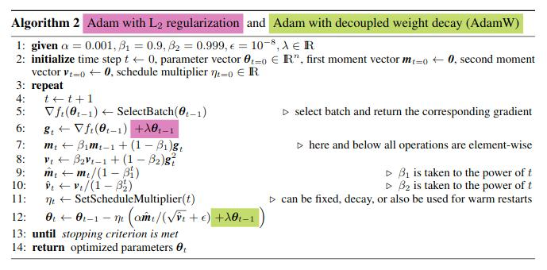
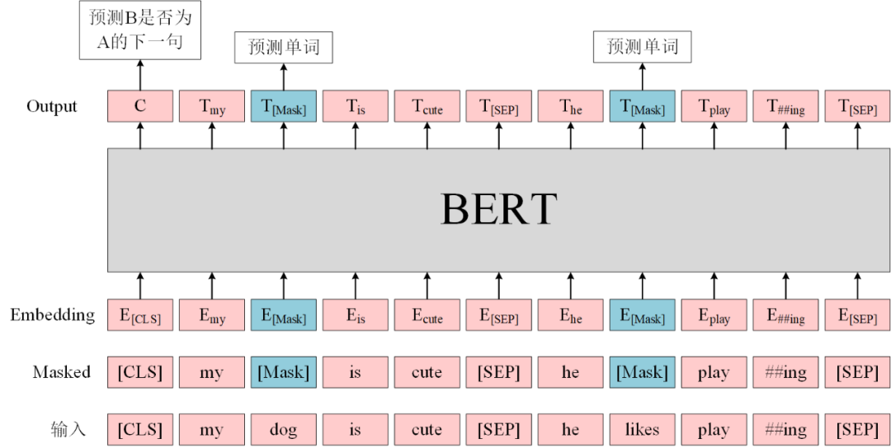
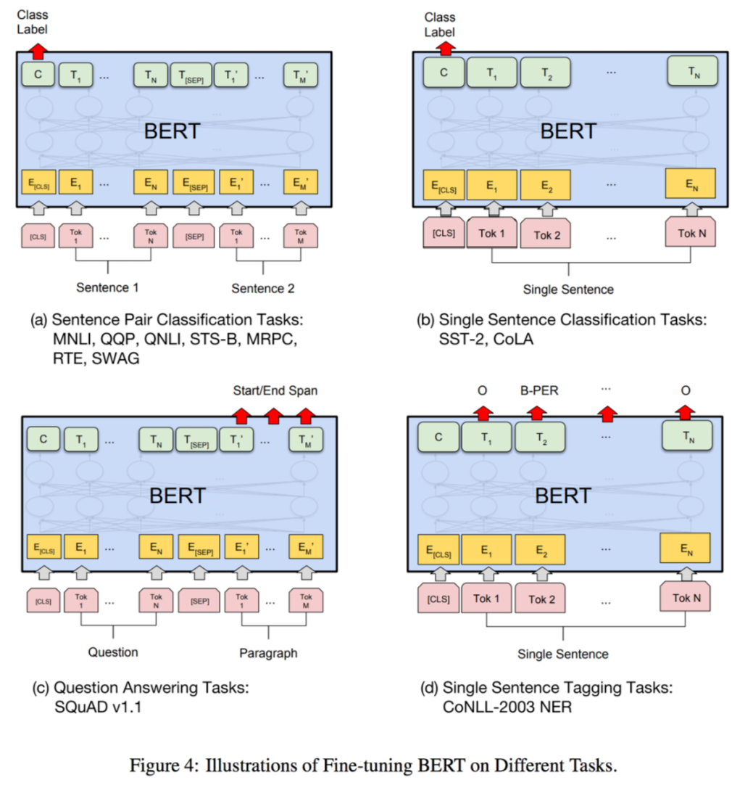

## BERT训练和优化

> 这部分主要还是在调试代码，这部分还有点晕，大部分复制的代码，之后补充一些笔记。

### 1.Pre-Training

预训练阶段，除了众所周知的 15%、80% mask 比例，有一个值得注意的地方就是参数共享。
不止 BERT，所有 huggingface 实现的 PLM 的 word embedding 和 masked language model 的预测权重在初始化过程中都是共享的：

```
class PreTrainedModel(nn.Module, ModuleUtilsMixin, GenerationMixin):
    # ...
    def tie_weights(self):
        """
        Tie the weights between the input embeddings and the output embeddings.

        If the :obj:`torchscript` flag is set in the configuration, can't handle parameter sharing so we are cloning
        the weights instead.
        """
        output_embeddings = self.get_output_embeddings()
        if output_embeddings is not None and self.config.tie_word_embeddings:
            self._tie_or_clone_weights(output_embeddings, self.get_input_embeddings())

        if self.config.is_encoder_decoder and self.config.tie_encoder_decoder:
            if hasattr(self, self.base_model_prefix):
                self = getattr(self, self.base_model_prefix)
            self._tie_encoder_decoder_weights(self.encoder, self.decoder, self.base_model_prefix)
    # ...
```

至于为什么，应该是因为 word_embedding 和 prediction 权重太大了，以 bert-base 为例，其尺寸为(30522, 768)，降低训练难度。


***

### 2.Fine-Tuning

微调也就是下游任务阶段，也有两个值得注意的地方。

#### 2.1 AdamW

首先介绍一下 BERT 的优化器：AdamW（AdamWeightDecayOptimizer）。

这一优化器来自 ICLR 2017 的 Best Paper：《Fixing Weight Decay Regularization in Adam》中提出的一种用于修复 Adam 的权重衰减错误的新方法。论文指出，L2 正则化和权重衰减在大部分情况下并不等价，只在 SGD 优化的情况下是等价的；而大多数框架中对于 Adam+L2 正则使用的是权重衰减的方式，两者不能混为一谈。

AdamW 是在 Adam+L2 正则化的基础上进行改进的算法，与一般的 Adam+L2 的区别如下：

 图：AdamW

关于 AdamW 的分析可以参考：

- AdamW and Super-convergence is now the fastest way to train neural nets [1]
- paperplanet：都 9102 年了，别再用 Adam + L2 regularization了 [2]

通常，我们会选择模型的 weight 部分参与 decay 过程，而另一部分（包括 LayerNorm 的 weight）不参与（代码最初来源应该是 Huggingface 的示例）
补充：关于这么做的理由，我暂时没有找到合理的解答，但是找到了一些相关的[讨论](https://forums.fast.ai/t/is-weight-decay-applied-to-the-bias-term/73212/4forums.fast.ai)

```
# model: a Bert-based-model object
    # learning_rate: default 2e-5 for text classification
    param_optimizer = list(model.named_parameters())
    no_decay = ['bias', 'LayerNorm.bias', 'LayerNorm.weight']
    optimizer_grouped_parameters = [
        {'params': [p for n, p in param_optimizer if not any(
            nd in n for nd in no_decay)], 'weight_decay': 0.01},
        {'params': [p for n, p in param_optimizer if any(
            nd in n for nd in no_decay)], 'weight_decay': 0.0}
    ]
    optimizer = AdamW(optimizer_grouped_parameters,
                      lr=learning_rate)
    # ...
```

#### 2.2 Warmup

BERT 的训练中另一个特点在于 Warmup，其含义为：

在训练初期使用较小的学习率（从 0 开始），在一定步数（比如 1000 步）内逐渐提高到正常大小（比如上面的 2e-5），避免模型过早进入局部最优而过拟合；

- 在训练后期再慢慢将学习率降低到 0，避免后期训练还出现较大的参数变化。
- 在 Huggingface 的实现中，可以使用多种 warmup 策略：

```
TYPE_TO_SCHEDULER_FUNCTION = {
    SchedulerType.LINEAR: get_linear_schedule_with_warmup,
    SchedulerType.COSINE: get_cosine_schedule_with_warmup,
    SchedulerType.COSINE_WITH_RESTARTS: get_cosine_with_hard_restarts_schedule_with_warmup,
    SchedulerType.POLYNOMIAL: get_polynomial_decay_schedule_with_warmup,
    SchedulerType.CONSTANT: get_constant_schedule,
    SchedulerType.CONSTANT_WITH_WARMUP: get_constant_schedule_with_warmup,
}
```

具体而言：

- CONSTANT：保持固定学习率不变；
- CONSTANT_WITH_WARMUP：在每一个 step 中线性调整学习率；
- LINEAR：上文提到的两段式调整；
- COSINE：和两段式调整类似，只不过采用的是三角函数式的曲线调整；
- COSINE_WITH_RESTARTS：训练中将上面 COSINE 的调整重复 n 次；
- POLYNOMIAL：按指数曲线进行两段式调整。
  具体使用参考transformers/optimization.py：
  最常用的还是get_linear_scheduler_with_warmup即线性两段式调整学习率的方案。

```
def get_scheduler(
    name: Union[str, SchedulerType],
    optimizer: Optimizer,
    num_warmup_steps: Optional[int] = None,
    num_training_steps: Optional[int] = None,
): ...

```

以上即为关于 transformers 库（4.4.2 版本）中 BERT 应用的相关代码的具体实现分析，欢迎与读者共同交流探讨。

## BERT的下游任务

### 1.BertForPreTraining

众所周知，BERT 预训练任务包括两个：

- Masked Language Model（MLM）：在句子中随机用`[MASK]`替换一部分单词，然后将句子传入 BERT 中编码每一个单词的信息，最终用`[MASK]`的编码信息预测该位置的正确单词，这一任务旨在训练模型根据上下文理解单词的意思；
- Next Sentence Prediction（NSP）：将句子对 A 和 B 输入 BERT，使用`[CLS]`的编码信息进行预测 B 是否 A 的下一句，这一任务旨在训练模型理解预测句子间的关系。


 图Bert预训练

而对应到代码中，这一融合两个任务的模型就是BertForPreTraining，其中包含两个组件：

```
class BertForPreTraining(BertPreTrainedModel):
    def __init__(self, config):
        super().__init__(config)

        self.bert = BertModel(config)
        self.cls = BertPreTrainingHeads(config)

        self.init_weights()
    # ...
```

这里的BertModel在上一章节中已经详细介绍了（注意，这里设置的是默认`add_pooling_layer=True`，即会提取`[CLS]`对应的输出用于 NSP 任务），而`BertPreTrainingHeads`则是负责两个任务的预测模块：

```
class BertPreTrainingHeads(nn.Module):
    def __init__(self, config):
        super().__init__()
        self.predictions = BertLMPredictionHead(config)
        self.seq_relationship = nn.Linear(config.hidden_size, 2)

    def forward(self, sequence_output, pooled_output):
        prediction_scores = self.predictions(sequence_output)
        seq_relationship_score = self.seq_relationship(pooled_output)
        return prediction_scores, seq_relationship_score 
```

又是一层封装：`BertPreTrainingHeads`包裹了`BertLMPredictionHead` 和一个代表 NSP 任务的线性层。这里不把 NSP 对应的任务也封装一个`BertXXXPredictionHead`。

**其实是有封装这个类的，不过它叫做BertOnlyNSPHead，在这里用不上**

继续下探`BertPreTrainingHeads`：

```
class BertLMPredictionHead(nn.Module):
    def __init__(self, config):
        super().__init__()
        self.transform = BertPredictionHeadTransform(config)

        # The output weights are the same as the input embeddings, but there is
        # an output-only bias for each token.
        self.decoder = nn.Linear(config.hidden_size, config.vocab_size, bias=False)

        self.bias = nn.Parameter(torch.zeros(config.vocab_size))

        # Need a link between the two variables so that the bias is correctly resized with `resize_token_embeddings`
        self.decoder.bias = self.bias

    def forward(self, hidden_states):
        hidden_states = self.transform(hidden_states)
        hidden_states = self.decoder(hidden_states)
        return hidden_states
```

这个类用于预测`[MASK]`位置的输出在每个词作为类别的分类输出，注意到：

- 该类重新初始化了一个全 0 向量作为预测权重的 bias；
- 该类的输出形状为[batch_size, seq_length, vocab_size]，即预测每个句子每个词是什么类别的概率值（注意这里没有做 softmax）；
- 又一个封装的类：BertPredictionHeadTransform，用来完成一些线性变换：

```
class BertPredictionHeadTransform(nn.Module):
    def __init__(self, config):
        super().__init__()
        self.dense = nn.Linear(config.hidden_size, config.hidden_size)
        if isinstance(config.hidden_act, str):
            self.transform_act_fn = ACT2FN[config.hidden_act]
        else:
            self.transform_act_fn = config.hidden_act
        self.LayerNorm = nn.LayerNorm(config.hidden_size, eps=config.layer_norm_eps)

    def forward(self, hidden_states):
        hidden_states = self.dense(hidden_states)
        hidden_states = self.transform_act_fn(hidden_states)
        hidden_states = self.LayerNorm(hidden_states)
        return hidden_states
```

回到`BertForPreTraining`，继续看两块 `loss` 是怎么处理的。它的前向传播和BertModel的有所不同，多了`labels`和`next_sentence_label` 两个输入：

- labels：形状为[batch_size, seq_length] ，代表 MLM 任务的标签，注意这里对于原本未被遮盖的词设置为 -100，被遮盖词才会有它们对应的 id，和任务设置是反过来的。

  - 例如，原始句子是I want to [MASK] an apple，这里我把单词eat给遮住了输入模型，对应的label设置为[-100, -100, -100, 【eat对应的id】, -100, -100]；
  - 为什么要设置为 -100 而不是其他数？因为torch.nn.CrossEntropyLoss默认的ignore_index=-100，也就是说对于标签为 100 的类别输入不会计算 loss。

- next_sentence_label：这一个输入很简单，就是 0 和 1 的二分类标签。

```
# ...
    def forward(
        self,
        input_ids=None,
        attention_mask=None,
        token_type_ids=None,
        position_ids=None,
        head_mask=None,
        inputs_embeds=None,
        labels=None,
        next_sentence_label=None,
        output_attentions=None,
        output_hidden_states=None,
        return_dict=None,
    ): ...
```

接下来两部分 loss 的组合：

```
 # ...
        total_loss = None
        if labels is not None and next_sentence_label is not None:
            loss_fct = CrossEntropyLoss()
            masked_lm_loss = loss_fct(prediction_scores.view(-1, self.config.vocab_size), labels.view(-1))
            next_sentence_loss = loss_fct(seq_relationship_score.view(-1, 2), next_sentence_label.view(-1))
            total_loss = masked_lm_loss + next_sentence_loss
        # ...
```

直接相加，就是这么单纯的策略。
当然，这份代码里面也包含了对于只想对单个目标进行预训练的 BERT 模型（具体细节不作展开）：

- BertForMaskedLM：只进行 MLM 任务的预训练；
  - 基于BertOnlyMLMHead，而后者也是对BertLMPredictionHead的另一层封装；
- BertLMHeadModel：这个和上一个的区别在于，这一模型是作为 decoder 运行的版本；
  - 同样基于BertOnlyMLMHead；
- BertForNextSentencePrediction：只进行 NSP 任务的预训练。
  - 基于BertOnlyNSPHead，内容就是一个线性层。


```python
_CHECKPOINT_FOR_DOC = "bert-base-uncased"
_CONFIG_FOR_DOC = "BertConfig"
_TOKENIZER_FOR_DOC = "BertTokenizer"
from transformers.models.bert.modeling_bert import *
from transformers.models.bert.configuration_bert import *
class BertForPreTraining(BertPreTrainedModel):
    def __init__(self, config):
        super().__init__(config)

        self.bert = BertModel(config)
        self.cls = BertPreTrainingHeads(config)

        self.init_weights()

    def get_output_embeddings(self):
        return self.cls.predictions.decoder

    def set_output_embeddings(self, new_embeddings):
        self.cls.predictions.decoder = new_embeddings

    @add_start_docstrings_to_model_forward(BERT_INPUTS_DOCSTRING.format("batch_size, sequence_length"))
    @replace_return_docstrings(output_type=BertForPreTrainingOutput, config_class=_CONFIG_FOR_DOC)
    def forward(
        self,
        input_ids=None,
        attention_mask=None,
        token_type_ids=None,
        position_ids=None,
        head_mask=None,
        inputs_embeds=None,
        labels=None,
        next_sentence_label=None,
        output_attentions=None,
        output_hidden_states=None,
        return_dict=None,
    ):
        r"""
        labels (:obj:`torch.LongTensor` of shape ``(batch_size, sequence_length)``, `optional`):
            Labels for computing the masked language modeling loss. Indices should be in ``[-100, 0, ...,
            config.vocab_size]`` (see ``input_ids`` docstring) Tokens with indices set to ``-100`` are ignored
            (masked), the loss is only computed for the tokens with labels in ``[0, ..., config.vocab_size]``
        next_sentence_label (``torch.LongTensor`` of shape ``(batch_size,)``, `optional`):
            Labels for computing the next sequence prediction (classification) loss. Input should be a sequence pair
            (see :obj:`input_ids` docstring) Indices should be in ``[0, 1]``:
            - 0 indicates sequence B is a continuation of sequence A,
            - 1 indicates sequence B is a random sequence.
        kwargs (:obj:`Dict[str, any]`, optional, defaults to `{}`):
            Used to hide legacy arguments that have been deprecated.
        Returns:
        Example::
from transformers import BertTokenizer, BertForPreTraining
import torch
tokenizer = BertTokenizer.from_pretrained('bert-base-uncased')
model = BertForPreTraining.from_pretrained('bert-base-uncased')
inputs = tokenizer("Hello, my dog is cute", return_tensors="pt")
outputs = model(**inputs)
prediction_logits = outputs.prediction_logits
seq_relationship_logits = outputs.seq_relationship_logits
        """
        return_dict = return_dict if return_dict is not None else self.config.use_return_dict

        outputs = self.bert(
            input_ids,
            attention_mask=attention_mask,
            token_type_ids=token_type_ids,
            position_ids=position_ids,
            head_mask=head_mask,
            inputs_embeds=inputs_embeds,
            output_attentions=output_attentions,
            output_hidden_states=output_hidden_states,
            return_dict=return_dict,
        )

        sequence_output, pooled_output = outputs[:2]
        prediction_scores, seq_relationship_score = self.cls(sequence_output, pooled_output)

        total_loss = None
        if labels is not None and next_sentence_label is not None:
            loss_fct = CrossEntropyLoss()
            masked_lm_loss = loss_fct(prediction_scores.view(-1, self.config.vocab_size), labels.view(-1))
            next_sentence_loss = loss_fct(seq_relationship_score.view(-1, 2), next_sentence_label.view(-1))
            total_loss = masked_lm_loss + next_sentence_loss

        if not return_dict:
            output = (prediction_scores, seq_relationship_score) + outputs[2:]
            return ((total_loss,) + output) if total_loss is not None else output

        return BertForPreTrainingOutput(
            loss=total_loss,
            prediction_logits=prediction_scores,
            seq_relationship_logits=seq_relationship_score,
            hidden_states=outputs.hidden_states,
            attentions=outputs.attentions,
        )

from transformers import BertTokenizer, BertForPreTraining
import torch
tokenizer = BertTokenizer.from_pretrained('bert-base-uncased')
model = BertForPreTraining.from_pretrained('bert-base-uncased')
inputs = tokenizer("Hello, my dog is cute", return_tensors="pt")
outputs = model(**inputs)
prediction_logits = outputs.prediction_logits
seq_relationship_logits = outputs.seq_relationship_logits
```

    Some weights of BertForPreTraining were not initialized from the model checkpoint at bert-base-uncased and are newly initialized: ['cls.predictions.decoder.bias']
    You should probably TRAIN this model on a down-stream task to be able to use it for predictions and inference.


```python
@add_start_docstrings(
    """Bert Model with a `language modeling` head on top for CLM fine-tuning. """, BERT_START_DOCSTRING
)
class BertLMHeadModel(BertPreTrainedModel):

    _keys_to_ignore_on_load_unexpected = [r"pooler"]
    _keys_to_ignore_on_load_missing = [r"position_ids", r"predictions.decoder.bias"]

    def __init__(self, config):
        super().__init__(config)

        if not config.is_decoder:
            logger.warning("If you want to use `BertLMHeadModel` as a standalone, add `is_decoder=True.`")

        self.bert = BertModel(config, add_pooling_layer=False)
        self.cls = BertOnlyMLMHead(config)

        self.init_weights()

    def get_output_embeddings(self):
        return self.cls.predictions.decoder

    def set_output_embeddings(self, new_embeddings):
        self.cls.predictions.decoder = new_embeddings

    @add_start_docstrings_to_model_forward(BERT_INPUTS_DOCSTRING.format("batch_size, sequence_length"))
    @replace_return_docstrings(output_type=CausalLMOutputWithCrossAttentions, config_class=_CONFIG_FOR_DOC)
    def forward(
        self,
        input_ids=None,
        attention_mask=None,
        token_type_ids=None,
        position_ids=None,
        head_mask=None,
        inputs_embeds=None,
        encoder_hidden_states=None,
        encoder_attention_mask=None,
        labels=None,
        past_key_values=None,
        use_cache=None,
        output_attentions=None,
        output_hidden_states=None,
        return_dict=None,
    ):
        r"""
        encoder_hidden_states  (:obj:`torch.FloatTensor` of shape :obj:`(batch_size, sequence_length, hidden_size)`, `optional`):
            Sequence of hidden-states at the output of the last layer of the encoder. Used in the cross-attention if
            the model is configured as a decoder.
        encoder_attention_mask (:obj:`torch.FloatTensor` of shape :obj:`(batch_size, sequence_length)`, `optional`):
            Mask to avoid performing attention on the padding token indices of the encoder input. This mask is used in
            the cross-attention if the model is configured as a decoder. Mask values selected in ``[0, 1]``:
            - 1 for tokens that are **not masked**,
            - 0 for tokens that are **masked**.
        labels (:obj:`torch.LongTensor` of shape :obj:`(batch_size, sequence_length)`, `optional`):
            Labels for computing the left-to-right language modeling loss (next word prediction). Indices should be in
            ``[-100, 0, ..., config.vocab_size]`` (see ``input_ids`` docstring) Tokens with indices set to ``-100`` are
            ignored (masked), the loss is only computed for the tokens with labels n ``[0, ..., config.vocab_size]``
        past_key_values (:obj:`tuple(tuple(torch.FloatTensor))` of length :obj:`config.n_layers` with each tuple having 4 tensors of shape :obj:`(batch_size, num_heads, sequence_length - 1, embed_size_per_head)`):
            Contains precomputed key and value hidden states of the attention blocks. Can be used to speed up decoding.
            If :obj:`past_key_values` are used, the user can optionally input only the last :obj:`decoder_input_ids`
            (those that don't have their past key value states given to this model) of shape :obj:`(batch_size, 1)`
            instead of all :obj:`decoder_input_ids` of shape :obj:`(batch_size, sequence_length)`.
        use_cache (:obj:`bool`, `optional`):
            If set to :obj:`True`, :obj:`past_key_values` key value states are returned and can be used to speed up
            decoding (see :obj:`past_key_values`).
        Returns:
        Example::
            from transformers import BertTokenizer, BertLMHeadModel, BertConfig
            import torch
            tokenizer = BertTokenizer.from_pretrained('bert-base-cased')
            config = BertConfig.from_pretrained("bert-base-cased")
            config.is_decoder = True
            model = BertLMHeadModel.from_pretrained('bert-base-cased', config=config)
            inputs = tokenizer("Hello, my dog is cute", return_tensors="pt")
            outputs = model(**inputs)
            prediction_logits = outputs.logits
        """
        return_dict = return_dict if return_dict is not None else self.config.use_return_dict
        if labels is not None:
            use_cache = False

        outputs = self.bert(
            input_ids,
            attention_mask=attention_mask,
            token_type_ids=token_type_ids,
            position_ids=position_ids,
            head_mask=head_mask,
            inputs_embeds=inputs_embeds,
            encoder_hidden_states=encoder_hidden_states,
            encoder_attention_mask=encoder_attention_mask,
            past_key_values=past_key_values,
            use_cache=use_cache,
            output_attentions=output_attentions,
            output_hidden_states=output_hidden_states,
            return_dict=return_dict,
        )

        sequence_output = outputs[0]
        prediction_scores = self.cls(sequence_output)

        lm_loss = None
        if labels is not None:
            # we are doing next-token prediction; shift prediction scores and input ids by one
            shifted_prediction_scores = prediction_scores[:, :-1, :].contiguous()
            labels = labels[:, 1:].contiguous()
            loss_fct = CrossEntropyLoss()
            lm_loss = loss_fct(shifted_prediction_scores.view(-1, self.config.vocab_size), labels.view(-1))

        if not return_dict:
            output = (prediction_scores,) + outputs[2:]
            return ((lm_loss,) + output) if lm_loss is not None else output

        return CausalLMOutputWithCrossAttentions(
            loss=lm_loss,
            logits=prediction_scores,
            past_key_values=outputs.past_key_values,
            hidden_states=outputs.hidden_states,
            attentions=outputs.attentions,
            cross_attentions=outputs.cross_attentions,
        )

    def prepare_inputs_for_generation(self, input_ids, past=None, attention_mask=None, **model_kwargs):
        input_shape = input_ids.shape
        # if model is used as a decoder in encoder-decoder model, the decoder attention mask is created on the fly
        if attention_mask is None:
            attention_mask = input_ids.new_ones(input_shape)

        # cut decoder_input_ids if past is used
        if past is not None:
            input_ids = input_ids[:, -1:]

        return {"input_ids": input_ids, "attention_mask": attention_mask, "past_key_values": past}

    def _reorder_cache(self, past, beam_idx):
        reordered_past = ()
        for layer_past in past:
            reordered_past += (tuple(past_state.index_select(0, beam_idx) for past_state in layer_past),)
        return reordered_past

from transformers import BertTokenizer, BertLMHeadModel, BertConfig
import torch
tokenizer = BertTokenizer.from_pretrained('bert-base-uncased')
config = BertConfig.from_pretrained("bert-base-uncased")
config.is_decoder = True
model = BertLMHeadModel.from_pretrained('bert-base-uncased', config=config)
inputs = tokenizer("Hello, my dog is cute", return_tensors="pt")
outputs = model(**inputs)
prediction_logits = outputs.logits
```

    Some weights of the model checkpoint at bert-base-uncased were not used when initializing BertLMHeadModel: ['cls.seq_relationship.weight', 'cls.seq_relationship.bias']
    - This IS expected if you are initializing BertLMHeadModel from the checkpoint of a model trained on another task or with another architecture (e.g. initializing a BertForSequenceClassification model from a BertForPreTraining model).
    - This IS NOT expected if you are initializing BertLMHeadModel from the checkpoint of a model that you expect to be exactly identical (initializing a BertForSequenceClassification model from a BertForSequenceClassification model).


```python
class BertForNextSentencePrediction(BertPreTrainedModel):
    def __init__(self, config):
        super().__init__(config)

        self.bert = BertModel(config)
        self.cls = BertOnlyNSPHead(config)

        self.init_weights()

    @add_start_docstrings_to_model_forward(BERT_INPUTS_DOCSTRING.format("batch_size, sequence_length"))
    @replace_return_docstrings(output_type=NextSentencePredictorOutput, config_class=_CONFIG_FOR_DOC)
    def forward(
        self,
        input_ids=None,
        attention_mask=None,
        token_type_ids=None,
        position_ids=None,
        head_mask=None,
        inputs_embeds=None,
        labels=None,
        output_attentions=None,
        output_hidden_states=None,
        return_dict=None,
        **kwargs,
    ):
        r"""
        labels (:obj:`torch.LongTensor` of shape :obj:`(batch_size,)`, `optional`):
            Labels for computing the next sequence prediction (classification) loss. Input should be a sequence pair
            (see ``input_ids`` docstring). Indices should be in ``[0, 1]``:
            - 0 indicates sequence B is a continuation of sequence A,
            - 1 indicates sequence B is a random sequence.
        Returns:
        Example::
from transformers import BertTokenizer, BertForNextSentencePrediction
import torch
tokenizer = BertTokenizer.from_pretrained('bert-base-uncased')
model = BertForNextSentencePrediction.from_pretrained('bert-base-uncased')
prompt = "In Italy, pizza served in formal settings, such as at a restaurant, is presented unsliced."
next_sentence = "The sky is blue due to the shorter wavelength of blue light."
encoding = tokenizer(prompt, next_sentence, return_tensors='pt')
outputs = model(**encoding, labels=torch.LongTensor([1]))
logits = outputs.logits
assert logits[0, 0] < logits[0, 1] # next sentence was random
        """

        if "next_sentence_label" in kwargs:
            warnings.warn(
                "The `next_sentence_label` argument is deprecated and will be removed in a future version, use `labels` instead.",
                FutureWarning,
            )
            labels = kwargs.pop("next_sentence_label")

        return_dict = return_dict if return_dict is not None else self.config.use_return_dict

        outputs = self.bert(
            input_ids,
            attention_mask=attention_mask,
            token_type_ids=token_type_ids,
            position_ids=position_ids,
            head_mask=head_mask,
            inputs_embeds=inputs_embeds,
            output_attentions=output_attentions,
            output_hidden_states=output_hidden_states,
            return_dict=return_dict,
        )

        pooled_output = outputs[1]

        seq_relationship_scores = self.cls(pooled_output)

        next_sentence_loss = None
        if labels is not None:
            loss_fct = CrossEntropyLoss()
            next_sentence_loss = loss_fct(seq_relationship_scores.view(-1, 2), labels.view(-1))

        if not return_dict:
            output = (seq_relationship_scores,) + outputs[2:]
            return ((next_sentence_loss,) + output) if next_sentence_loss is not None else output

        return NextSentencePredictorOutput(
            loss=next_sentence_loss,
            logits=seq_relationship_scores,
            hidden_states=outputs.hidden_states,
            attentions=outputs.attentions,
        )
from transformers import BertTokenizer, BertForNextSentencePrediction
import torch
tokenizer = BertTokenizer.from_pretrained('bert-base-uncased')
model = BertForNextSentencePrediction.from_pretrained('bert-base-uncased')
prompt = "In Italy, pizza served in formal settings, such as at a restaurant, is presented unsliced."
next_sentence = "The sky is blue due to the shorter wavelength of blue light."
encoding = tokenizer(prompt, next_sentence, return_tensors='pt')
outputs = model(**encoding, labels=torch.LongTensor([1]))
logits = outputs.logits
assert logits[0, 0] < logits[0, 1] # next sentence was random
```

    Downloading: 100%|██████████| 440M/440M [00:30<00:00, 14.5MB/s]
    Some weights of the model checkpoint at bert-base-uncased were not used when initializing BertForNextSentencePrediction: ['cls.predictions.bias', 'cls.predictions.transform.dense.weight', 'cls.predictions.transform.dense.bias', 'cls.predictions.decoder.weight', 'cls.predictions.transform.LayerNorm.weight', 'cls.predictions.transform.LayerNorm.bias']
    - This IS expected if you are initializing BertForNextSentencePrediction from the checkpoint of a model trained on another task or with another architecture (e.g. initializing a BertForSequenceClassification model from a BertForPreTraining model).
    - This IS NOT expected if you are initializing BertForNextSentencePrediction from the checkpoint of a model that you expect to be exactly identical (initializing a BertForSequenceClassification model from a BertForSequenceClassification model).


接下来介绍的是各种 Fine-tune 模型，基本都是分类任务：

 图：Bert：finetune

### 2.BertForSequenceClassification

这一模型用于句子分类（也可以是回归）任务，比如 GLUE benchmark 的各个任务。

- 句子分类的输入为句子（对），输出为单个分类标签。

结构上很简单，就是`BertModel`（有 pooling）过一个 dropout 后接一个线性层输出分类：

```
class BertForSequenceClassification(BertPreTrainedModel):
    def __init__(self, config):
        super().__init__(config)
        self.num_labels = config.num_labels

        self.bert = BertModel(config)
        self.dropout = nn.Dropout(config.hidden_dropout_prob)
        self.classifier = nn.Linear(config.hidden_size, config.num_labels)

        self.init_weights()
        # ...
```

在前向传播时，和上面预训练模型一样需要传入labels输入。

- 如果初始化的num_labels=1，那么就默认为回归任务，使用 MSELoss；

- 否则认为是分类任务。


```python
@add_start_docstrings(
    """
    Bert Model transformer with a sequence classification/regression head on top (a linear layer on top of the pooled
    output) e.g. for GLUE tasks.
    """,
    BERT_START_DOCSTRING,
)
class BertForSequenceClassification(BertPreTrainedModel):
    def __init__(self, config):
        super().__init__(config)
        self.num_labels = config.num_labels
        self.config = config

        self.bert = BertModel(config)
        classifier_dropout = (
            config.classifier_dropout if config.classifier_dropout is not None else config.hidden_dropout_prob
        )
        self.dropout = nn.Dropout(classifier_dropout)
        self.classifier = nn.Linear(config.hidden_size, config.num_labels)

        self.init_weights()

    @add_start_docstrings_to_model_forward(BERT_INPUTS_DOCSTRING.format("batch_size, sequence_length"))
    @add_code_sample_docstrings(
        tokenizer_class=_TOKENIZER_FOR_DOC,
        checkpoint=_CHECKPOINT_FOR_DOC,
        output_type=SequenceClassifierOutput,
        config_class=_CONFIG_FOR_DOC,
    )
    def forward(
        self,
        input_ids=None,
        attention_mask=None,
        token_type_ids=None,
        position_ids=None,
        head_mask=None,
        inputs_embeds=None,
        labels=None,
        output_attentions=None,
        output_hidden_states=None,
        return_dict=None,
    ):
        r"""
        labels (:obj:`torch.LongTensor` of shape :obj:`(batch_size,)`, `optional`):
            Labels for computing the sequence classification/regression loss. Indices should be in :obj:`[0, ...,
            config.num_labels - 1]`. If :obj:`config.num_labels == 1` a regression loss is computed (Mean-Square loss),
            If :obj:`config.num_labels > 1` a classification loss is computed (Cross-Entropy).
        """
        return_dict = return_dict if return_dict is not None else self.config.use_return_dict

        outputs = self.bert(
            input_ids,
            attention_mask=attention_mask,
            token_type_ids=token_type_ids,
            position_ids=position_ids,
            head_mask=head_mask,
            inputs_embeds=inputs_embeds,
            output_attentions=output_attentions,
            output_hidden_states=output_hidden_states,
            return_dict=return_dict,
        )

        pooled_output = outputs[1]

        pooled_output = self.dropout(pooled_output)
        logits = self.classifier(pooled_output)

        loss = None
        if labels is not None:
            if self.config.problem_type is None:
                if self.num_labels == 1:
                    self.config.problem_type = "regression"
                elif self.num_labels > 1 and (labels.dtype == torch.long or labels.dtype == torch.int):
                    self.config.problem_type = "single_label_classification"
                else:
                    self.config.problem_type = "multi_label_classification"

            if self.config.problem_type == "regression":
                loss_fct = MSELoss()
                if self.num_labels == 1:
                    loss = loss_fct(logits.squeeze(), labels.squeeze())
                else:
                    loss = loss_fct(logits, labels)
            elif self.config.problem_type == "single_label_classification":
                loss_fct = CrossEntropyLoss()
                loss = loss_fct(logits.view(-1, self.num_labels), labels.view(-1))
            elif self.config.problem_type == "multi_label_classification":
                loss_fct = BCEWithLogitsLoss()
                loss = loss_fct(logits, labels)
        if not return_dict:
            output = (logits,) + outputs[2:]
            return ((loss,) + output) if loss is not None else output

        return SequenceClassifierOutput(
            loss=loss,
            logits=logits,
            hidden_states=outputs.hidden_states,
            attentions=outputs.attentions,
        )
```


```python
from transformers.models.bert.tokenization_bert import BertTokenizer
from transformers.models.bert.modeling_bert import BertForSequenceClassification
tokenizer = BertTokenizer.from_pretrained("bert-base-cased-finetuned-mrpc")
model = BertForSequenceClassification.from_pretrained("bert-base-cased-finetuned-mrpc")

classes = ["not paraphrase", "is paraphrase"]

sequence_0 = "The company HuggingFace is based in New York City"
sequence_1 = "Apples are especially bad for your health"
sequence_2 = "HuggingFace's headquarters are situated in Manhattan"

# The tokekenizer will automatically add any model specific separators (i.e. <CLS> and <SEP>) and tokens to the sequence, as well as compute the attention masks.
paraphrase = tokenizer(sequence_0, sequence_2, return_tensors="pt")
not_paraphrase = tokenizer(sequence_0, sequence_1, return_tensors="pt")

paraphrase_classification_logits = model(**paraphrase).logits
not_paraphrase_classification_logits = model(**not_paraphrase).logits

paraphrase_results = torch.softmax(paraphrase_classification_logits, dim=1).tolist()[0]
not_paraphrase_results = torch.softmax(not_paraphrase_classification_logits, dim=1).tolist()[0]

# Should be paraphrase
for i in range(len(classes)):
    print(f"{classes[i]}: {int(round(paraphrase_results[i] * 100))}%")

# Should not be paraphrase
for i in range(len(classes)):
    print(f"{classes[i]}: {int(round(not_paraphrase_results[i] * 100))}%")
```

    Downloading: 100%|██████████| 213k/213k [00:00<00:00, 596kB/s]
    Downloading: 100%|██████████| 29.0/29.0 [00:00<00:00, 12.4kB/s]
    Downloading: 100%|██████████| 436k/436k [00:00<00:00, 808kB/s]
    Downloading: 100%|██████████| 433/433 [00:00<00:00, 166kB/s]
    Downloading: 100%|██████████| 433M/433M [00:29<00:00, 14.5MB/s]


    not paraphrase: 10%
    is paraphrase: 90%
    not paraphrase: 94%
    is paraphrase: 6%


***

### 3.BertForMultipleChoice

这一模型用于多项选择，如 RocStories/SWAG 任务。

- 多项选择任务的输入为一组分次输入的句子，输出为选择某一句子的单个标签。
  结构上与句子分类相似，只不过线性层输出维度为 1，即每次需要将每个样本的多个句子的输出拼接起来作为每个样本的预测分数。
- 实际上，具体操作时是把每个 batch 的多个句子一同放入的，所以一次处理的输入为[batch_size, num_choices]数量的句子，因此相同 batch 大小时，比句子分类等任务需要更多的显存，在训练时需要小心。

***

### 4.BertForTokenClassification

这一模型用于序列标注（词分类），如 NER 任务。

- 序列标注任务的输入为单个句子文本，输出为每个 token 对应的类别标签。
  由于需要用到每个 token对应的输出而不只是某几个，所以这里的BertModel不用加入 pooling 层；
- 同时，这里将`_keys_to_ignore_on_load_unexpected`这一个类参数设置为`[r"pooler"]`，也就是在加载模型时对于出现不需要的权重不发生报错。


```python
class BertForMultipleChoice(BertPreTrainedModel):
    def __init__(self, config):
        super().__init__(config)

        self.bert = BertModel(config)
        self.dropout = nn.Dropout(config.hidden_dropout_prob)
        self.classifier = nn.Linear(config.hidden_size, 1)

        self.init_weights()

    @add_start_docstrings_to_model_forward(BERT_INPUTS_DOCSTRING.format("batch_size, num_choices, sequence_length"))
    @add_code_sample_docstrings(
        tokenizer_class=_TOKENIZER_FOR_DOC,
        checkpoint=_CHECKPOINT_FOR_DOC,
        output_type=MultipleChoiceModelOutput,
        config_class=_CONFIG_FOR_DOC,
    )
    def forward(
        self,
        input_ids=None,
        attention_mask=None,
        token_type_ids=None,
        position_ids=None,
        head_mask=None,
        inputs_embeds=None,
        labels=None,
        output_attentions=None,
        output_hidden_states=None,
        return_dict=None,
    ):
        r"""
        labels (:obj:`torch.LongTensor` of shape :obj:`(batch_size,)`, `optional`):
            Labels for computing the multiple choice classification loss. Indices should be in ``[0, ...,
            num_choices-1]`` where :obj:`num_choices` is the size of the second dimension of the input tensors. (See
            :obj:`input_ids` above)
        """
        return_dict = return_dict if return_dict is not None else self.config.use_return_dict
        num_choices = input_ids.shape[1] if input_ids is not None else inputs_embeds.shape[1]

        input_ids = input_ids.view(-1, input_ids.size(-1)) if input_ids is not None else None
        attention_mask = attention_mask.view(-1, attention_mask.size(-1)) if attention_mask is not None else None
        token_type_ids = token_type_ids.view(-1, token_type_ids.size(-1)) if token_type_ids is not None else None
        position_ids = position_ids.view(-1, position_ids.size(-1)) if position_ids is not None else None
        inputs_embeds = (
            inputs_embeds.view(-1, inputs_embeds.size(-2), inputs_embeds.size(-1))
            if inputs_embeds is not None
            else None
        )

        outputs = self.bert(
            input_ids,
            attention_mask=attention_mask,
            token_type_ids=token_type_ids,
            position_ids=position_ids,
            head_mask=head_mask,
            inputs_embeds=inputs_embeds,
            output_attentions=output_attentions,
            output_hidden_states=output_hidden_states,
            return_dict=return_dict,
        )

        pooled_output = outputs[1]

        pooled_output = self.dropout(pooled_output)
        logits = self.classifier(pooled_output)
        reshaped_logits = logits.view(-1, num_choices)

        loss = None
        if labels is not None:
            loss_fct = CrossEntropyLoss()
            loss = loss_fct(reshaped_logits, labels)

        if not return_dict:
            output = (reshaped_logits,) + outputs[2:]
            return ((loss,) + output) if loss is not None else output

        return MultipleChoiceModelOutput(
            loss=loss,
            logits=reshaped_logits,
            hidden_states=outputs.hidden_states,
            attentions=outputs.attentions,
        )

```


```python
@add_start_docstrings(
    """
    Bert Model with a token classification head on top (a linear layer on top of the hidden-states output) e.g. for
    Named-Entity-Recognition (NER) tasks.
    """,
    BERT_START_DOCSTRING,
)
class BertForTokenClassification(BertPreTrainedModel):

    _keys_to_ignore_on_load_unexpected = [r"pooler"]

    def __init__(self, config):
        super().__init__(config)
        self.num_labels = config.num_labels

        self.bert = BertModel(config, add_pooling_layer=False)
        classifier_dropout = (
            config.classifier_dropout if config.classifier_dropout is not None else config.hidden_dropout_prob
        )
        self.dropout = nn.Dropout(classifier_dropout)
        self.classifier = nn.Linear(config.hidden_size, config.num_labels)

        self.init_weights()

    @add_start_docstrings_to_model_forward(BERT_INPUTS_DOCSTRING.format("batch_size, sequence_length"))
    @add_code_sample_docstrings(
        tokenizer_class=_TOKENIZER_FOR_DOC,
        checkpoint=_CHECKPOINT_FOR_DOC,
        output_type=TokenClassifierOutput,
        config_class=_CONFIG_FOR_DOC,
    )
    def forward(
        self,
        input_ids=None,
        attention_mask=None,
        token_type_ids=None,
        position_ids=None,
        head_mask=None,
        inputs_embeds=None,
        labels=None,
        output_attentions=None,
        output_hidden_states=None,
        return_dict=None,
    ):
        r"""
        labels (:obj:`torch.LongTensor` of shape :obj:`(batch_size, sequence_length)`, `optional`):
            Labels for computing the token classification loss. Indices should be in ``[0, ..., config.num_labels -
            1]``.
        """
        return_dict = return_dict if return_dict is not None else self.config.use_return_dict

        outputs = self.bert(
            input_ids,
            attention_mask=attention_mask,
            token_type_ids=token_type_ids,
            position_ids=position_ids,
            head_mask=head_mask,
            inputs_embeds=inputs_embeds,
            output_attentions=output_attentions,
            output_hidden_states=output_hidden_states,
            return_dict=return_dict,
        )

        sequence_output = outputs[0]

        sequence_output = self.dropout(sequence_output)
        logits = self.classifier(sequence_output)

        loss = None
        if labels is not None:
            loss_fct = CrossEntropyLoss()
            # Only keep active parts of the loss
            if attention_mask is not None:
                active_loss = attention_mask.view(-1) == 1
                active_logits = logits.view(-1, self.num_labels)
                active_labels = torch.where(
                    active_loss, labels.view(-1), torch.tensor(loss_fct.ignore_index).type_as(labels)
                )
                loss = loss_fct(active_logits, active_labels)
            else:
                loss = loss_fct(logits.view(-1, self.num_labels), labels.view(-1))

        if not return_dict:
            output = (logits,) + outputs[2:]
            return ((loss,) + output) if loss is not None else output

        return TokenClassifierOutput(
            loss=loss,
            logits=logits,
            hidden_states=outputs.hidden_states,
            attentions=outputs.attentions,
        )

```


```python
from transformers import BertForTokenClassification, BertTokenizer
import torch

model = BertForTokenClassification.from_pretrained("dbmdz/bert-large-cased-finetuned-conll03-english")
tokenizer = BertTokenizer.from_pretrained("bert-base-cased")

label_list = [
"O",       # Outside of a named entity
"B-MISC",  # Beginning of a miscellaneous entity right after another miscellaneous entity
"I-MISC",  # Miscellaneous entity
"B-PER",   # Beginning of a person's name right after another person's name
"I-PER",   # Person's name
"B-ORG",   # Beginning of an organisation right after another organisation
"I-ORG",   # Organisation
"B-LOC",   # Beginning of a location right after another location
"I-LOC"    # Location
]

sequence = "Hugging Face Inc. is a company based in New York City. Its headquarters are in DUMBO, therefore very close to the Manhattan Bridge."

# Bit of a hack to get the tokens with the special tokens
tokens = tokenizer.tokenize(tokenizer.decode(tokenizer.encode(sequence)))
inputs = tokenizer.encode(sequence, return_tensors="pt")

outputs = model(inputs).logits
predictions = torch.argmax(outputs, dim=2)
```

    Downloading: 100%|██████████| 998/998 [00:00<00:00, 382kB/s]
    Downloading: 100%|██████████| 1.33G/1.33G [01:30<00:00, 14.7MB/s]


```python
for token, prediction in zip(tokens, predictions[0].numpy()):
    print((token, model.config.id2label[prediction]))
```

    ('[CLS]', 'O')
    ('Hu', 'I-ORG')
    ('##gging', 'I-ORG')
    ('Face', 'I-ORG')
    ('Inc', 'I-ORG')
    ('.', 'O')
    ('is', 'O')
    ('a', 'O')
    ('company', 'O')
    ('based', 'O')
    ('in', 'O')
    ('New', 'I-LOC')
    ('York', 'I-LOC')
    ('City', 'I-LOC')
    ('.', 'O')
    ('Its', 'O')
    ('headquarters', 'O')
    ('are', 'O')
    ('in', 'O')
    ('D', 'I-LOC')
    ('##UM', 'I-LOC')
    ('##BO', 'I-LOC')
    (',', 'O')
    ('therefore', 'O')
    ('very', 'O')
    ('close', 'O')
    ('to', 'O')
    ('the', 'O')
    ('Manhattan', 'I-LOC')
    ('Bridge', 'I-LOC')
    ('.', 'O')
    ('[SEP]', 'O')


***

### 5.BertForQuestionAnswering

这一模型用于解决问答任务，例如 SQuAD 任务。

- 问答任务的输入为问题 +（对于 BERT 只能是一个）回答组成的句子对，输出为起始位置和结束位置用于标出回答中的具体文本。
  这里需要两个输出，即对起始位置的预测和对结束位置的预测，两个输出的长度都和句子长度一样，从其中挑出最大的预测值对应的下标作为预测的位置。
- 对超出句子长度的非法 label，会将其压缩（torch.clamp_）到合理范围。

以上就是关于 BERT 源码的介绍，下面介绍一些关于 BERT 模型实用的训练细节。


```python
@add_start_docstrings(
    """
    Bert Model with a span classification head on top for extractive question-answering tasks like SQuAD (a linear
    layers on top of the hidden-states output to compute `span start logits` and `span end logits`).
    """,
    BERT_START_DOCSTRING,
)
class BertForQuestionAnswering(BertPreTrainedModel):

    _keys_to_ignore_on_load_unexpected = [r"pooler"]

    def __init__(self, config):
        super().__init__(config)
        self.num_labels = config.num_labels

        self.bert = BertModel(config, add_pooling_layer=False)
        self.qa_outputs = nn.Linear(config.hidden_size, config.num_labels)

        self.init_weights()

    @add_start_docstrings_to_model_forward(BERT_INPUTS_DOCSTRING.format("batch_size, sequence_length"))
    @add_code_sample_docstrings(
        tokenizer_class=_TOKENIZER_FOR_DOC,
        checkpoint=_CHECKPOINT_FOR_DOC,
        output_type=QuestionAnsweringModelOutput,
        config_class=_CONFIG_FOR_DOC,
    )
    def forward(
        self,
        input_ids=None,
        attention_mask=None,
        token_type_ids=None,
        position_ids=None,
        head_mask=None,
        inputs_embeds=None,
        start_positions=None,
        end_positions=None,
        output_attentions=None,
        output_hidden_states=None,
        return_dict=None,
    ):
        r"""
        start_positions (:obj:`torch.LongTensor` of shape :obj:`(batch_size,)`, `optional`):
            Labels for position (index) of the start of the labelled span for computing the token classification loss.
            Positions are clamped to the length of the sequence (:obj:`sequence_length`). Position outside of the
            sequence are not taken into account for computing the loss.
        end_positions (:obj:`torch.LongTensor` of shape :obj:`(batch_size,)`, `optional`):
            Labels for position (index) of the end of the labelled span for computing the token classification loss.
            Positions are clamped to the length of the sequence (:obj:`sequence_length`). Position outside of the
            sequence are not taken into account for computing the loss.
        """
        return_dict = return_dict if return_dict is not None else self.config.use_return_dict

        outputs = self.bert(
            input_ids,
            attention_mask=attention_mask,
            token_type_ids=token_type_ids,
            position_ids=position_ids,
            head_mask=head_mask,
            inputs_embeds=inputs_embeds,
            output_attentions=output_attentions,
            output_hidden_states=output_hidden_states,
            return_dict=return_dict,
        )

        sequence_output = outputs[0]

        logits = self.qa_outputs(sequence_output)
        start_logits, end_logits = logits.split(1, dim=-1)
        start_logits = start_logits.squeeze(-1).contiguous()
        end_logits = end_logits.squeeze(-1).contiguous()

        total_loss = None
        if start_positions is not None and end_positions is not None:
            # If we are on multi-GPU, split add a dimension
            if len(start_positions.size()) > 1:
                start_positions = start_positions.squeeze(-1)
            if len(end_positions.size()) > 1:
                end_positions = end_positions.squeeze(-1)
            # sometimes the start/end positions are outside our model inputs, we ignore these terms
            ignored_index = start_logits.size(1)
            start_positions = start_positions.clamp(0, ignored_index)
            end_positions = end_positions.clamp(0, ignored_index)

            loss_fct = CrossEntropyLoss(ignore_index=ignored_index)
            start_loss = loss_fct(start_logits, start_positions)
            end_loss = loss_fct(end_logits, end_positions)
            total_loss = (start_loss + end_loss) / 2

        if not return_dict:
            output = (start_logits, end_logits) + outputs[2:]
            return ((total_loss,) + output) if total_loss is not None else output

        return QuestionAnsweringModelOutput(
            loss=total_loss,
            start_logits=start_logits,
            end_logits=end_logits,
            hidden_states=outputs.hidden_states,
            attentions=outputs.attentions,
        )

```


```python
from transformers import AutoTokenizer, AutoModelForQuestionAnswering
import torch

tokenizer = AutoTokenizer.from_pretrained("bert-large-uncased-whole-word-masking-finetuned-squad")
model = AutoModelForQuestionAnswering.from_pretrained("bert-large-uncased-whole-word-masking-finetuned-squad")

text = "🤗 Transformers (formerly known as pytorch-transformers and pytorch-pretrained-bert) provides general-purpose architectures (BERT, GPT-2, RoBERTa, XLM, DistilBert, XLNet…) for Natural Language Understanding (NLU) and Natural Language Generation (NLG) with over 32+ pretrained models in 100+ languages and deep interoperability between TensorFlow 2.0 and PyTorch."

questions = [
"How many pretrained models are available in 🤗 Transformers?",
"What does 🤗 Transformers provide?",
"🤗 Transformers provides interoperability between which frameworks?",
]

for question in questions:
    inputs = tokenizer(question, text, add_special_tokens=True, return_tensors="pt")
    input_ids = inputs["input_ids"].tolist()[0]
    outputs = model(**inputs)
    answer_start_scores = outputs.start_logits
    answer_end_scores = outputs.end_logits
    answer_start = torch.argmax(
        answer_start_scores
    )  # Get the most likely beginning of answer with the argmax of the score
    answer_end = torch.argmax(answer_end_scores) + 1  # Get the most likely end of answer with the argmax of the score
    answer = tokenizer.convert_tokens_to_string(tokenizer.convert_ids_to_tokens(input_ids[answer_start:answer_end]))
    print(f"Question: {question}")
    print(f"Answer: {answer}")
```

    Downloading: 100%|██████████| 443/443 [00:00<00:00, 186kB/s]
    Downloading: 100%|██████████| 232k/232k [00:00<00:00, 438kB/s]
    Downloading: 100%|██████████| 466k/466k [00:00<00:00, 845kB/s]
    Downloading: 100%|██████████| 28.0/28.0 [00:00<00:00, 10.5kB/s]
    Downloading: 100%|██████████| 1.34G/1.34G [01:28<00:00, 15.1MB/s]


    Question: How many pretrained models are available in 🤗 Transformers?
    Answer: over 32 +
    Question: What does 🤗 Transformers provide?
    Answer: general - purpose architectures
    Question: 🤗 Transformers provides interoperability between which frameworks?
    Answer: tensorflow 2. 0 and pytorch


***

## 