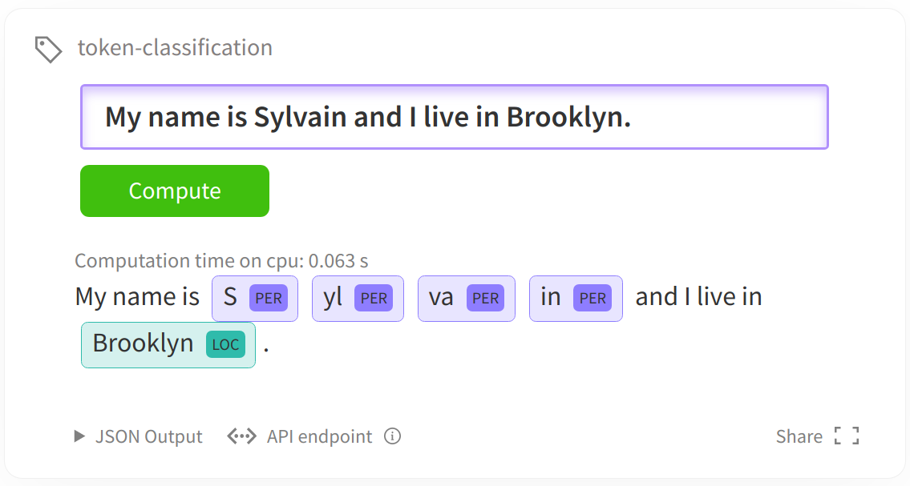

# 序列标注

序列标注，通常也可以看作是token级别的分类问题：对每一个token进行分类。token级别的分类任务通常指的是为为文本中的每一个token预测一个标签结果。下图展示的是一个NER实体名词识别任务。



最常见的token级别分类任务:

- NER (Named-entity recognition 名词-实体识别) 分辨出文本中的名词和实体 (person人名, organization组织机构名, location地点名...).
- POS (Part-of-speech tagging词性标注) 根据语法对token进行词性标注 (noun名词, verb动词, adjective形容词...)
- Chunk (Chunking短语组块) 将同一个短语的tokens组块放在一起。

只要预训练的transformer模型最顶层有一个token分类的神经网络层，可能也需要有fast tokenizer这个功能，参考[这个表](https://huggingface.co/transformers/index.html#bigtable)，本notebook理论上可以使用各种各样的transformer模型

，（[模型面板](https://huggingface.co/models)），解决任何token级别的分类任务。

```python
task = "ner" #需要是"ner", "pos" 或者 "chunk"
model_checkpoint = "distilbert-base-uncased"
batch_size = 16 # 根据gpu现存调整batch_size大小，避免现存溢出。
```

## 加载数据

和上节一样，导入数据和评测方式

```from datasets import load_dataset, load_metric```

```
datasets = load_dataset("conll2003")
```

本notebook中的例子使用的是[CONLL 2003 dataset](https://www.aclweb.org/anthology/W03-0419.pdf)数据集。。如果您使用的是您自定义的json/csv文件数据集，需要查看[数据集文档](https://huggingface.co/docs/datasets/loading_datasets.html#from-local-files)来学习如何加载。自定义数据集可能需要在加载属性名字上做一些调整。

所有的数据标签labels都已经被编码成了整数，可以直接被预训练transformer模型使用。这些整数的编码所对应的实际类别储存在`features`中。

```python
datasets["train"].features[f"ner_tags"]
```

以NER为例，0对应的标签类别是”O“， 1对应的是”B-PER“等等。”O“的意思是没有特别实体（no special entity）。本例包含4种实体类别分别是（PER、ORG、LOC，MISC），每一种实体类别又分别有B-（实体开始的token）前缀和I-（实体中间的token）前缀。

- 'PER' for person
- 'ORG' for organization
- 'LOC' for location
- 'MISC' for miscellaneous

## 预处理数据

1. 预处理的工具叫`Tokenizer`。

   - `Tokenizer`首先对输入进行tokenize，

   - 然后将tokens转化为预模型中需要对应的token ID，

   - 再转化为模型需要的输入格式。

2. 构建模型对应的tokenizer

   为了达到数据预处理的目的，我们使用`AutoTokenizer.from_pretrained`方法实例化我们的tokenizer，这样可以确保：

- 我们得到一个与预训练模型一一对应的tokenizer。
- 使用指定的模型checkpoint对应的tokenizer的时候，我们也下载了模型需要的词表库vocabulary，准确来说是tokens vocabulary。

这个被下载的tokens vocabulary会被缓存起来，从而再次使用的时候不会重新下载。

```python
from transformers import AutoTokenizer
    
tokenizer = AutoTokenizer.from_pretrained(model_checkpoint)
```

注意：以下代码要求tokenizer必须是transformers.PreTrainedTokenizerFast类型，因为我们在预处理的时候需要用到fast tokenizer的一些特殊特性（比如多线程快速tokenizer）。

几乎所有模型对应的tokenizer都有对应的fast tokenizer。我们可以在[模型tokenizer对应表](https://huggingface.co/transformers/index.html#bigtable)里查看所有预训练模型对应的tokenizer所拥有的特点。

```python
import transformers
assert isinstance(tokenizer, transformers.PreTrainedTokenizerFast)
```

在[这里big table of models](https://huggingface.co/transformers/index.html#bigtable)查看模型是否有fast tokenizer。

tokenizer既可以对单个文本进行预处理，也可以对一对文本进行预处理，tokenizer预处理后得到的数据满足预训练模型输入格式

```python
tokenizer("Hello, this is one sentence!")

tokenizer(["Hello", ",", "this", "is", "one", "sentence", "split", "into", "words", "."], is_split_into_words=True)
```

3. 对齐问题

   注意transformer预训练模型在预训练的时候通常使用的是subword，如果我们的文本输入已经被切分成了word，那么这些word还会被我们的tokenizer继续切分。举个例子：

```python
example = datasets["train"][4]
print(example["tokens"])

tokenized_input = tokenizer(example["tokens"], is_split_into_words=True)
tokens = tokenizer.convert_ids_to_tokens(tokenized_input["input_ids"])
print(tokens)
```

单词"Zwingmann" 和 "sheepmeat"继续被切分成了3个subtokens。

由于标注数据通常是在word级别进行标注的，既然word还会被切分成subtokens，那么意味着我们还需要对标注数据进行subtokens的对齐。同时，由于预训练模型输入格式的要求，往往还需要加上一些特殊符号比如： `[CLS]` 和 `[SEP]`。

tokenizer有一个`word_ids`方法可以帮助我们解决这个问题。

```python
print(tokenized_input.word_ids())
```

我们可以看到，word_ids将每一个subtokens位置都对应了一个word的下标。比如第1个位置对应第0个word，然后第2、3个位置对应第1个word。特殊字符对应了None。有了这个list，我们就能将subtokens和words还有标注的labels对齐啦。

```
word_ids = tokenized_input.word_ids()
aligned_labels = [-100 if i is None else example[f"{task}_tags"][i] for i in word_ids]
print(len(aligned_labels), len(tokenized_input["input_ids"]))
```

我们通常将特殊字符的label设置为-100，在模型中-100通常会被忽略掉不计算loss。

我们有两种对齐label的方式：

- 多个subtokens对齐一个word，对齐一个label
- 多个subtokens的第一个subtoken对齐word，对齐一个label，其他subtokens直接赋予-100.

我们提供这两种方式，通过`label_all_tokens = True`切换。

4. 最后我们将所有内容合起来变成我们的预处理函数。`is_split_into_words=True`在上面已经结束啦。

````python
def tokenize_and_align_labels(examples):
    tokenized_inputs = tokenizer(examples["tokens"], truncation=True, is_split_into_words=True)

    labels = []
    for i, label in enumerate(examples[f"{task}_tags"]):
        word_ids = tokenized_inputs.word_ids(batch_index=i)
        previous_word_idx = None
        label_ids = []
        for word_idx in word_ids:
            # Special tokens have a word id that is None. We set the label to -100 so they are automatically
            # ignored in the loss function.
            if word_idx is None:
                label_ids.append(-100)
            # We set the label for the first token of each word.
            elif word_idx != previous_word_idx:
                label_ids.append(label[word_idx])
            # For the other tokens in a word, we set the label to either the current label or -100, depending on
            # the label_all_tokens flag.
            else:
                label_ids.append(label[word_idx] if label_all_tokens else -100)
            previous_word_idx = word_idx

        labels.append(label_ids)

    tokenized_inputs["labels"] = labels
    return tokenized_inputs
````

5. 接下来对数据集datasets里面的所有样本进行预处理，处理的方式是使用map函数，将预处理函数prepare_train_features应用到（map)所有样本上。

```python
tokenized_datasets = datasets.map(tokenize_and_align_labels, batched=True)
```

## 微调预训练模型

```
from transformers import AutoModelForTokenClassification, TrainingArguments, Trainer

model = AutoModelForTokenClassification.from_pretrained(model_checkpoint, num_labels=len(label_list))
```

由于我们微调的任务是token分类任务，而我们加载的是预训练的语言模型，所以会提示我们加载模型的时候扔掉了一些不匹配的神经网络参数（比如：预训练语言模型的神经网络head被扔掉了，同时随机初始化了token分类的神经网络head）。


为了能够得到一个`Trainer`训练工具，我们还需要3个要素，其中最重要的是训练的设定/参数 [`TrainingArguments`](https://huggingface.co/transformers/main_classes/trainer.html#transformers.TrainingArguments)。这个训练设定包含了能够定义训练过程的所有属性。

```
args = TrainingArguments(
    f"test-{task}",
    evaluation_strategy = "epoch",
    learning_rate=2e-5,
    per_device_train_batch_size=batch_size,
    per_device_eval_batch_size=batch_size,
    num_train_epochs=3,
    weight_decay=0.01,
)
```

上面evaluation_strategy = "epoch"参数告诉训练代码：我们每个epcoh会做一次验证评估。

上面batch_size在这个notebook之前定义好了。

最后我们需要一个数据收集器data collator，将我们处理好的输入喂给模型。

```
from transformers import DataCollatorForTokenClassification

data_collator = DataCollatorForTokenClassification(tokenizer)
```


设置好`Trainer`还剩最后一件事情，那就是我们需要定义好评估方法。我们使用[`seqeval`](https://github.com/chakki-works/seqeval) metric来完成评估。将模型预测送入评估之前，我们也会做一些数据后处理：

```
metric = load_metric("seqeval")
```

评估的输入是预测和label的list

```
labels = [label_list[i] for i in example[f"{task}_tags"]]
metric.compute(predictions=[labels], references=[labels])
```

对模型预测结果做一些后处理：
- 选择预测分类最大概率的下标
- 将下标转化为label
- 忽略-100所在地方

下面的函数将上面的步骤合并了起来。

    import numpy as np
    
    def compute_metrics(p):
        predictions, labels = p
        predictions = np.argmax(predictions, axis=2)
    # Remove ignored index (special tokens)
    true_predictions = [
        [label_list[p] for (p, l) in zip(prediction, label) if l != -100]
        for prediction, label in zip(predictions, labels)
    ]
    true_labels = [
        [label_list[l] for (p, l) in zip(prediction, label) if l != -100]
        for prediction, label in zip(predictions, labels)
    ]
    
    results = metric.compute(predictions=true_predictions, references=true_labels)
    return {
        "precision": results["overall_precision"],
        "recall": results["overall_recall"],
        "f1": results["overall_f1"],
        "accuracy": results["overall_accuracy"],
    }

我们计算所有类别总的precision/recall/f1，所以会扔掉单个类别的precision/recall/f1 

将数据/模型/参数传入`Trainer`即可

```
trainer = Trainer(
    model,
    args,
    train_dataset=tokenized_datasets["train"],
    eval_dataset=tokenized_datasets["validation"],
    data_collator=data_collator,
    tokenizer=tokenizer,
    compute_metrics=compute_metrics
)
```

调用`train`方法开始训练

```
trainer.train()
```

我们可以再次使用`evaluate`方法评估，可以评估其他数据集。

```
trainer.evaluate()
```

如果想要得到单个类别的precision/recall/f1，我们直接将结果输入相同的评估函数即可：

```
predictions, labels, _ = trainer.predict(tokenized_datasets["validation"])
predictions = np.argmax(predictions, axis=2)
```


# Remove ignored index (special tokens)
```
true_predictions = [
    [label_list[p] for (p, l) in zip(prediction, label) if l != -100]
    for prediction, label in zip(predictions, labels)
]
true_labels = [
    [label_list[l] for (p, l) in zip(prediction, label) if l != -100]
    for prediction, label in zip(predictions, labels)
]

results = metric.compute(predictions=true_predictions, references=true_labels)
results
```

