[学习任务安排](https://shimo.im/docs/hhxqcVJXqYGpr6ww/read)

# 第1章 绪论

## 1.1 引言

### **机器学习的定义**

人的“经验”对应计算机中的“数据”，让计算机来学习这些经验数据，生成一个算法模型，在面对新的情况中，计算机便能作出有效的判断，这便是机器学习。

机器学习是研究**“学习算法”的学问——即关于在计算机上从数据中产生“模型”的算法**。

## 1.2 基本术语

一般符号上，令$D = \left \{x_1,x_2,...,x_m  \right \}$

表示包含$m$个示例的数据集，每个示例由$d$个属性描述，则每个示例$$ x_i = (x_{i1};x_{i2};...;x_{id})$$，是$d$维样本空间$\chi$中的一个向量，$x_i \in \chi$，其中$x_{ij}$是$x_i$在第$j$个属性上的取值，$d$称为样本$x_i$的维数。

术语略。

根据所预测值, 学习任务分为两大类

1. 监督学习

   1. 分类classification: 预测离散值( 二分类\多分类 )
   2. 回归regression: 预测连续值

   通过对训练集学习, 建立输入空间X, 到输出空间Y的映射f. ( 用f进行预测=测试testing )

2. 无监督学习

   1. 聚类clustering: 自动形成簇cluster( 样本一般不需标记信息 )

机器学习的目标: 泛化能力( 模型适用于新样本 )

## 1.3 假设空间

科学推理的两大手段：

- 归纳：从特殊到一般的“泛化”过程 → 从具体事实出发归结出一般性规律
- 演绎：从一般到特殊的“特化”过程 → 从一般性规律推演出具体状况

### 机器学习的训练过程显然是一个归纳过程。

归纳学习分为：

- 狭义（概念学习）：从训练数据中学得概念，也叫概念学习/概念形成。

  例：概念学习中最基本的是**布尔概念学习**：

  使用布尔表达式：好瓜↔ (色泽 = ？) ^ (根蒂 = ？) ^ (敲声 = ？)

  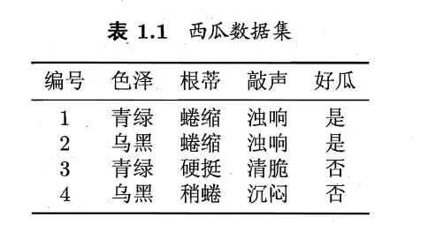

  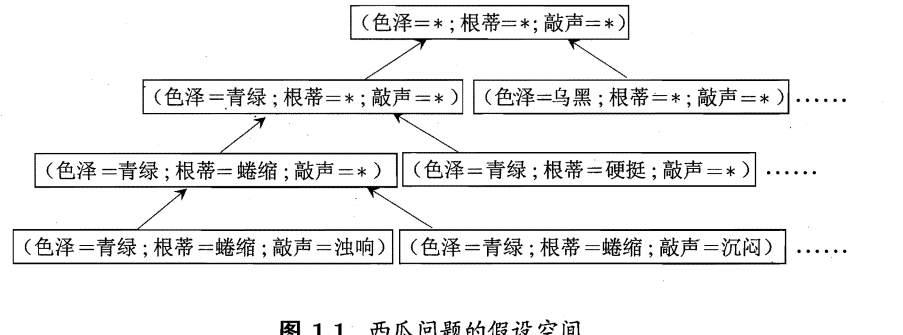
  可以有很多策略对这个假设空间进行搜索，例如自顶向下，从一般到特殊、或是自底向上、从特殊到一般，在搜索过程中不断剔除与正样本不一致的假设，或与反例一样的假设，最后得到与训练集一直的**假设**，这就是我们学得的结果。

  在现实问题中可能有多个假设与训练集一致，即存在一个与训练集一致的假设集合，我们称之为**版本空间**。

  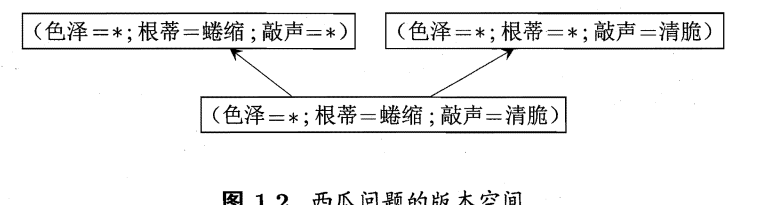
  
- 广义：从样例中学习

## 1.4 归纳偏好

*有多个与训练集一致的假设时, 进行选择*.

**归纳偏好：**在学习过程中对某种类型假设的偏好

为了避免被在训练集上“等效”的假设所迷惑而无法产生确定的学习结果

**引导算法确立”正确的“偏好的一般性的原则：**

奥卡姆剃刀：若有多个假设与观察一致，则选最简单的那个

Nofreelunch定理：要谈论算法的相对优劣，必须要针对具体的学习问题。

# 第二章 模型评估与选择

## **2.1 模型误差与过拟合**

- 错误率：分类错误的样本数占样本总数的比例称为"错误率"。
  精度：精度=1-错误率
- 错误率：学习器中在训练集上的误差称之为"训练误差"或"经验误差"。
  泛化误差：在新样本的误差。
  过拟合：训练样本学习的太好了，泛化能力下降。
  欠拟合：训练样本学习的较差，泛化能力也不高。
  导致过拟合的原因最常见的是学习能力过于强大。
  欠拟合比较容易克服，过拟合很麻烦。

可以得知：在过拟合问题中，训练误差十分小，但测试误差教大；在欠拟合问题中，训练误差和测试误差都比较大。目前，欠拟合问题比较容易克服，例如增加迭代次数等，但过拟合问题还没有十分好的解决方案，**过拟合是机器学习面临的关键障碍**。

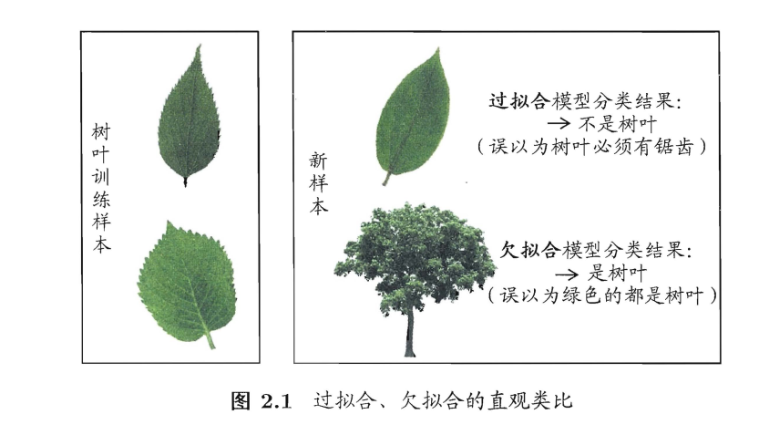

“**模型选择”理想的解决方案：对候选模型的泛化误差进行评估，然后选择泛化误差较小的那个模型**

## **2.2 评估方法**

通常我们采用一个“测试集”来测试学习器对新样本的判别能力，然后以“测试集”上的“测试误差”作为“泛化误差”的近似。显然：我们选取的测试集应尽可能与训练集**互斥—测试样本尽量不在训练集中才行啊、未在训练过程中使用过**，

**训练集与测试集的划分方法**

如上所述：我们希望用一个“测试集”的“测试误差”来作为“泛化误差”的近似，因此我们需要对初始数据集进行有效划分，划分出互斥的“训练集”和“测试集”。下面介绍几种常用的划分方法：

- 2.2.1 **留出法**

  将数据集D划分为两个互斥的集合，一个作为训练集S，一个作为测试集T，满足D=S∪T且S∩T=∅，常见的划分为：大约2/3-4/5的样本用作训练，剩下的用作测试。需要注意的是：训练/测试集的划分要尽可能保持数据分布的一致性，以避免由于分布的差异引入额外的偏差，常见的做法是采取**分层抽样**。同时，由于划分的随机性，单次的留出法结果往往不够稳定，一般要采用**若干次随机划分，重复实验取平均值**的做法。

- 2.2.2 **交叉验证法**

  将数据集D划分为**k个大小相同的互斥子集**，满足D=D1∪D2∪...∪Dk，Di∩Dj=∅（i≠j），同样地尽可能保持数据分布的一致性，即采用分层抽样的方法获得这些子集。交叉验证法的思想是：每次用k-1个子集的并集作为训练集，余下的那个子集作为测试集，这样就有K种训练集/测试集划分的情况，从而可进行k次训练和测试，最终返回k次测试结果的均值。交叉验证法也称“**k折交叉验证**”，k最常用的取值是***10***，下图给出了10折交叉验证的示意图。

  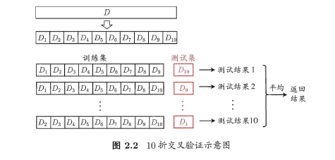

  与留出法类似，将数据集D划分为K个子集的过程具有随机性，因此K折交叉验证通常也要重复p次，称为p次k折交叉验证，常见的是10次10折交叉验证，即进行了100次训练/测试。特殊地当划分的k个子集的每个子集中只有一个样本时，称为“留一法”，显然，留一法的评估结果比较准确，但对计算机的消耗也是巨大的。

- 2.2.3 **自助法**

  我们希望评估的是用整个D训练出的模型。但在留出法和交叉验证法中，由于保留了一部分样本用于测试，因此实际评估的模型所使用的训练集比D小，这必然会引入一些因训练样本规模不同而导致的估计偏差。留一法受训练样本规模变化的影响较小，但计算复杂度又太高了。“自助法”正是解决了这样的问题。

  自助法的基本思想是：给定包含m个样本的数据集D，每次随机从D 中挑选一个样本，将其拷贝放入D'，然后再将该样本放回初始数据集D 中，**使得该样本在下次采样时仍有可能被采到**。重复执行m 次，就可以得到了包含m个样本的数据集D'。可以得知在m次采样中，样本始终不被采到的概率取极限为：

  

  这样，通过自助采样，初始样本集D中大约有36.8%的样本没有出现在D'中，于是可以将D'作为训练集，D-D'作为测试集。自助法在**数据集较小**，难以有效划分训练集/测试集时很有用，但由于自助法产生的数据集（随机抽样）改变了初始数据集的分布，因此引入了估计偏差。在初始数据集足够时，留出法和交叉验证法更加常用。

- 2.2.4 **调参**

  大多数学习算法都有些参数(parameter) 需要设定，参数配置不同，学得模型的性能往往有显著差别，这就是通常所说的"参数调节"或简称"调参" (parameter tuning)。

  学习算法的很多参数是在实数范围内取值，因此，对每种参数取值都训练出模型来是不可行的。常用的做法是：对每个参数选定一个范围和步长λ，这样使得学习的过程变得可行。例如：假定算法有3 个参数，每个参数仅考虑5 个候选值，这样对每一组训练/测试集就有5**5**5= 125 个模型需考察，由此可见：拿下一个参数（即经验值）对于算法人员来说是有多么的happy。

  最后需要注意的是：当选定好模型和调参完成后，我们需要使用初始的数据集D重新训练模型，即让最初划分出来用于评估的测试集也被模型学习，增强模型的学习效果。用上面考试的例子来比喻：就像高中时大家每次考试完，要将考卷的题目消化掉（大多数题目都还是之前没有见过的吧？），这样即使考差了也能开心的玩耍了~

## **2.3 性能度量**

性能度量（performance measure）是衡量模型泛化能力的评价标准，在对比不同模型的能力时，使用不同的性能度量往往会导致不同的评判结果。

### **2.3.1 最常见的性能度量**

- 在回归任务中，即预测连续值的问题，最常用的性能度量是“**均方误差**”（mean squared error）,很多的经典算法都是采用了MSE作为评价函数，想必大家都十分熟悉。

***ps:P(x)可以看做权重\***

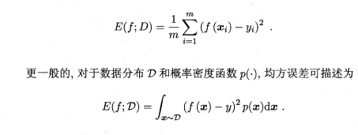

- 在分类任务中，即预测离散值的问题，最常用的是错误率和精度，错误率是分类错误的样本数占样本总数的比例，精度则是分类正确的样本数占样本总数的比例，易知：错误率+精度=1。

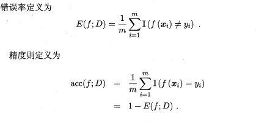

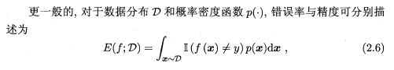

### **2.3.2 查准率/查全率/F1**

- 查准率precision/查全率recall

错误率和精度虽然常用，但不能满足所有的需求，例如：在推荐系统中，我们只关心推送给用户的内容用户是否感兴趣（即查准率precision），或者说所有用户感兴趣的内容我们推送出来了多少（即查全率recall）。因此，使用查准/查全率更适合描述这类问题。对于二分类问题，分类结果混淆矩阵与查准/查全率定义如下：

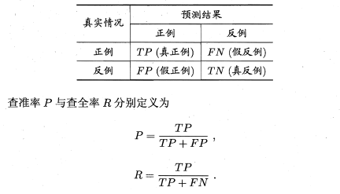

ps：易理解的图

正如天下没有免费的午餐，查准率和查全率是一对矛盾的度量。例如我们想让推送的内容尽可能用户全都感兴趣，那只能推送我们把握高的内容，这样就漏掉了一些用户感兴趣的内容，查全率就低了；如果想让用户感兴趣的内容都被推送，那只有将所有内容都推送上，宁可错杀一千，不可放过一个，这样查准率就很低了。

“P-R曲线”正是描述查准/查全率变化的曲线，P-R曲线定义如下：根据学习器的预测结果（一般为一个实值或概率）对测试样本进行排序，将最可能是“正例”的样本排在前面，最不可能是“正例”的排在后面，按此顺序逐个把样本作为“正例”进行预测，每次计算出当前的P值和R值，如下图所示：

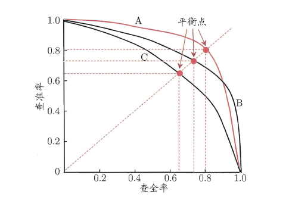

P-R曲线如何评估呢？若一个学习器A的P-R曲线被另一个学习器B的P-R曲线***完全包住，则称：B的性能优于A***。若A和B的曲线发生了交叉，则***谁的曲线下的面积大，谁的性能更优***。但一般来说，曲线下的面积是很难进行估算的，所以衍生出了“平衡点”（Break-Event Point，简称BEP），即当$P=R$时的取值，**平衡点的取值越高，性能更优**。

- **F1 Score**
  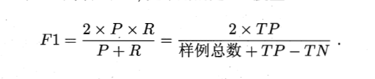
  $F1$的一般形式$F\beta$
  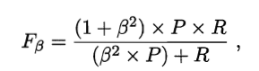
- 二分类混淆矩阵时：
  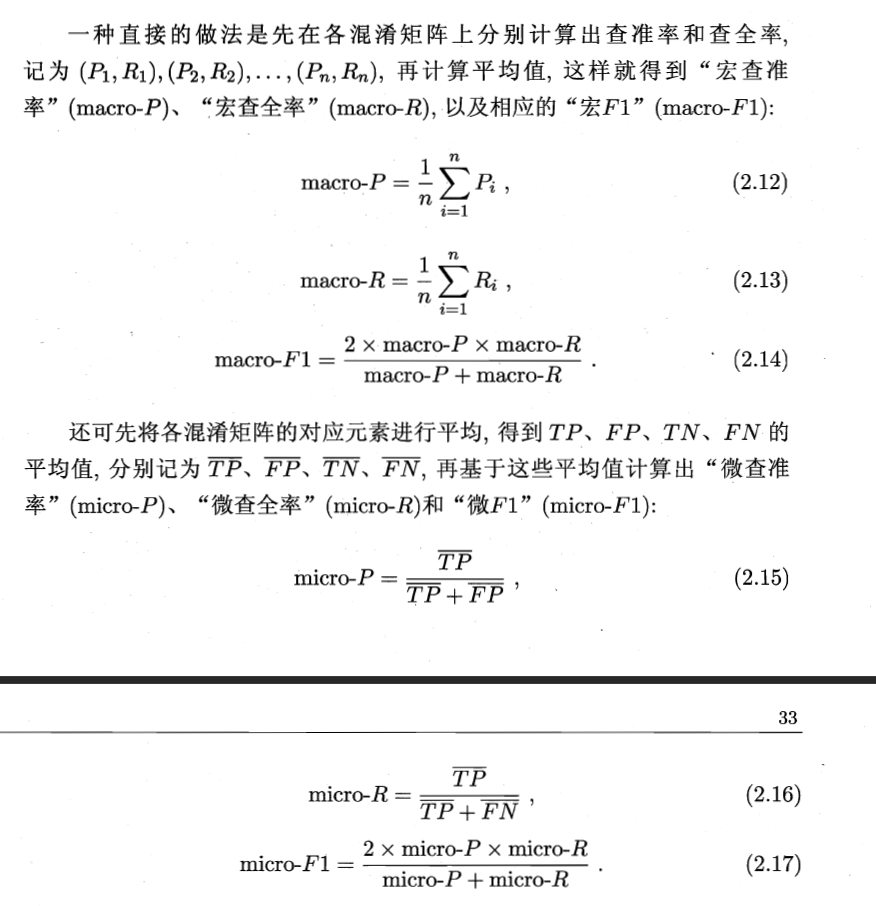

### 2.3.3 ROC与AUC

ROC全称"受试者工作特征"(Receiver Operating Characteristic)
横轴是：“假正例率”–FPR
纵轴是：“真正例率”–TPR
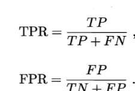
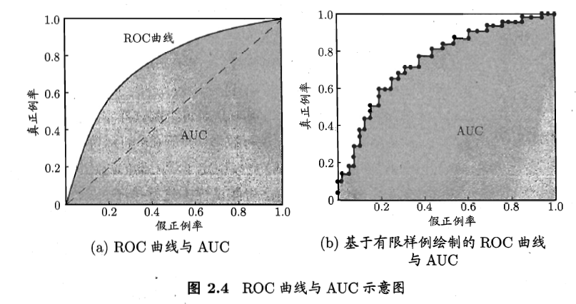
AUC的面积越大越好。ACU面积可估算为：
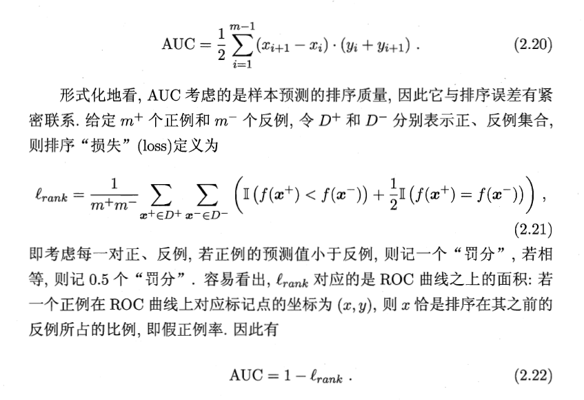

### 2.3.4及以后暂略
