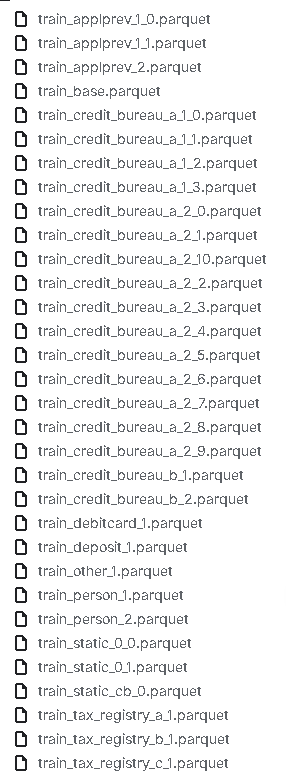

**static_0**
Properties: depth=0, internal data source
Train Files:

- train_static_0_0.csv #某种统计的信息
- train_static_0_1.csv

Test Files:

- test_static_0_0.csv
- test_static_0_1.csv
- test_static_0_2.csv

**static_cb_0**
Properties: depth=0, external data source
Train Files:

- train_static_cb_0.csv

Test Files:

- test_static_cb_0.csv

**applprev_1**
Properties: depth=1, internal data source
Train Files:

- train_applprev_1_0.csv # 背调，前一个数字代表是同一张表，后面的数字代表的是某一张表的不同部分
- train_applprev_1_1.csv

Test Files:

- test_applprev_1_0.csv
- test_applprev_1_1.csv
- test_applprev_1_2.csv

**other_1**
Properties: depth=1, internal data source
Train Files:

- train_other_1.csv

Test Files:

- test_other_1.csv

**tax_registry_a_1**
Properties: depth=1, external data source, Tax registry provider A
Train Files:

- train_tax_registry_a_1.csv # 税务表

Test Files:

- test_tax_registry_a_1.csv

**tax_registry_b_1**
Properties: depth=1, external data source, Tax registry provider B
Train Files:

- train_tax_registry_b_1.csv

Test FIles:

- test_tax_registry_b_1.csv

**tax_registry_c_1**
Properties: depth=1, external data source, Tax registry provider C
Train Files:

- train_tax_registry_c_1.csv

Test Files:

- test_tax_registry_c_1.csv

**credit_bureau_a_1**
Properties: depth=1, external data source, Credit bureau provider A
Train Files:

- train_credit_bureau_a_1_0.csv # 三方信贷机构留下的信贷记录
- train_credit_bureau_a_1_1.csv
- train_credit_bureau_a_1_2.csv
- train_credit_bureau_a_1_3.csv

Test Files:

- test_credit_bureau_a_1_0.csv
- test_credit_bureau_a_1_1.csv
- test_credit_bureau_a_1_2.csv
- test_credit_bureau_a_1_3.csv
- test_credit_bureau_a_1_4.csv

**credit_bureau_b_1**
Properties: depth=1, external data source, Credit bureau provider B
Train Files:

- train_credit_bureau_b_1.csv

Test files:

- test_credit_bureau_b_1.csv

**deposit_1**
Properties: depth=1, internal data source
Train Files:

- train_deposit_1.csv #存款相关

Test Files:

- test_deposit_1.csv

**person_1**
Properties: depth=1, internal data source
Train Files:

- train_person_1.csv 

Test Files:

- test_person_1.csv

**debitcard_1**
Properties: depth=1, internal data source
Train Files:

- train_debitcard_1.csv #借记卡记录

Test Files:

- test_debitcard_1.csv

**applprev_2**
Properties: depth=2, internal data source
Train Files:

- train_applprev_2.csv

Test Files:

- test_applprev_2.csv

**person_2**
Properties: depth=2, internal data source
Train Files:

- train_person_2.csv# 用户信息

Test Files:

- test_person_2.csv

**credit_bureau_a_2**
Properties: depth=2, external data source, Credit bureau provider A
Train Files:

- train_credit_bureau_a_2_0.csv
- train_credit_bureau_a_2_1.csv
- train_credit_bureau_a_2_2.csv
- train_credit_bureau_a_2_3.csv
- train_credit_bureau_a_2_4.csv
- train_credit_bureau_a_2_5.csv
- train_credit_bureau_a_2_6.csv
- train_credit_bureau_a_2_7.csv
- train_credit_bureau_a_2_8.csv
- train_credit_bureau_a_2_9.csv
- train_credit_bureau_a_2_10.csv

Test Files:

- test_credit_bureau_a_2_0.csv
- test_credit_bureau_a_2_1.csv
- test_credit_bureau_a_2_2.csv
- test_credit_bureau_a_2_3.csv
- test_credit_bureau_a_2_4.csv
- test_credit_bureau_a_2_5.csv
- test_credit_bureau_a_2_6.csv
- test_credit_bureau_a_2_7.csv
- test_credit_bureau_a_2_8.csv
- test_credit_bureau_a_2_9.csv
- test_credit_bureau_a_2_10.csv
- test_credit_bureau_a_2_11.csv

**credit_bureau_b_2**
Properties: depth=2, external data source, Credit bureau provider B
Train Files:

- train_credit_bureau_b_2.csv

Test Files:

- test_credit_bureau_b_2.csv

一些外部数据提供商可能无法用于未来的（测试）评估，每组表可以包含一个或多个单独的表。如果一个组包含多个表，则根据 对表进行划分。实施此划分是为了限制表的最大大小

train_base：索引

