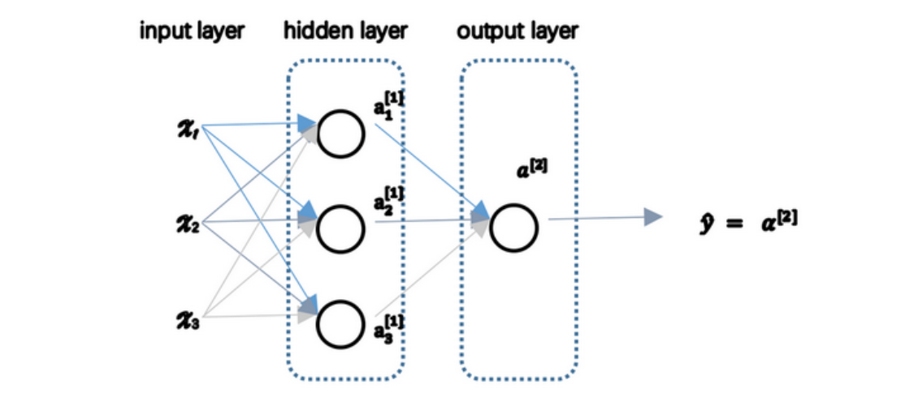
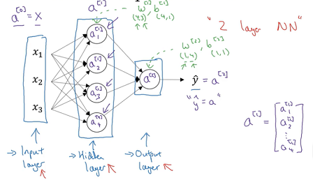
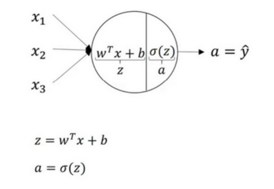
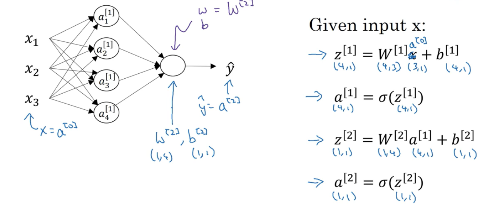
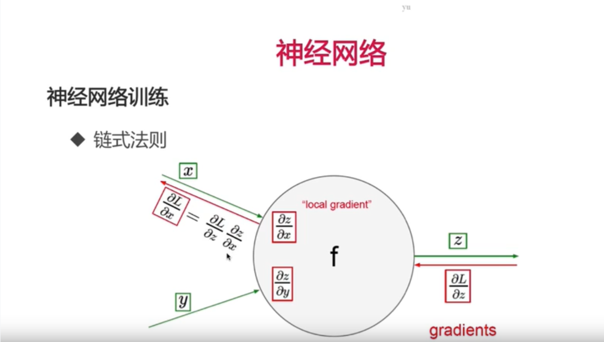
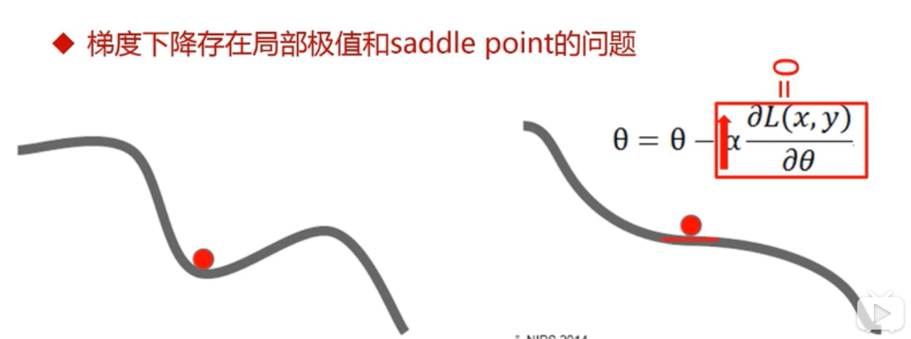
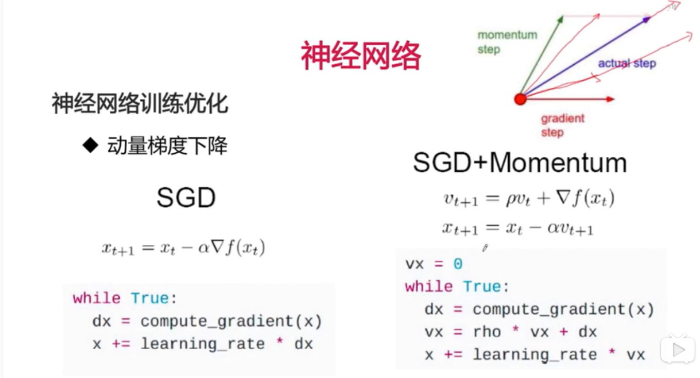
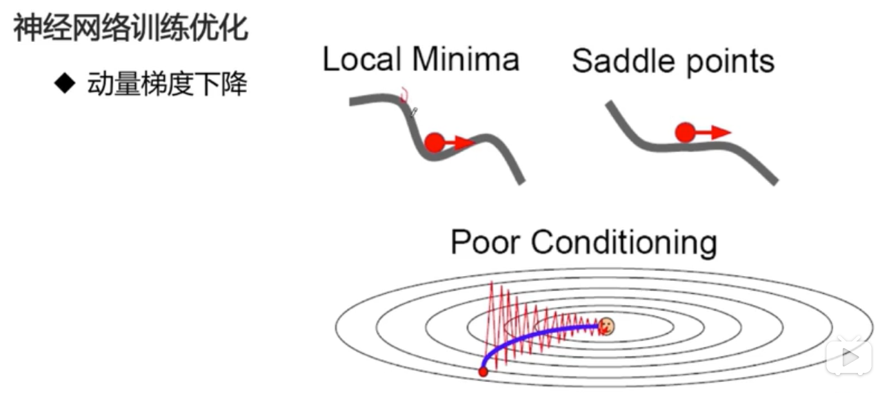

[TOC] 

# NN Representation

我们有输入特征$x_1$、$x_2$、$x_3$，它们被竖直地堆叠起来，这叫做神经网络的**输入层**。它包含了神经网络的输入；然后这里有另外一层我们称之为**隐藏层**。图中的最后一层只由一个结点构成，而这个只有一个结点的层被称为**输出层**，它负责产生预测值。

隐藏层的含义是在训练集中，这些中间结点的准确值我们是不知道到的，也就是说你看不见它们在训练集中应具有的值。你能看见输入的值，你也能看见输出的值，但是隐藏层中的东西，你是无法看到的。 

我们约定input layer不算做一个层，所以上图是一个两层的网络。hidden layer记作$a^{[1]}$，outputlayer记作$a^{[2]}$，$a$代表激活的意思，它意味着网络中不同层的值会传递到他们后面的层中，$a^{[1]}$中有三个节点，我们把第一个节点记作$a^{[1]}_1$，剩下的类推。
$$
a^{[1]}=\begin{bmatrix}
a^{[1]}_1\\ 
a^{[2]}_2\\ 
a^{[3]}_3\\ 
\end{bmatrix}
$$

$\bold w,\bold b$是$(4,3)$和$(4,1)$维的向量：

​	注意，$\bold w$是转置后的向量。

- $\bold w$的4代表4个单元，3代表3个对应着特征$x$的权重变量，即$\bold w_1^{[1]}$为$(1,3)$的向量；

- $\bold b$的4对应着4个单元中b的值。

# NN‘s Output Computing

神经网络的计算，以LR为例，如下图所示：用**圆圈**表示神经网络的计算单元， 逻辑回归的计算有两个步骤，首先你按步骤计算出$z$，然后在第二步中你以**sigmoid**函数为激活函数计算$a$，一个神经网络只是这样子做了好多次重复计算。 计算出每个神经元的值，然后传播给下一层计算。式子略。

**向量化计算**上述步骤， 向量化的过程是将神经网络中的一层神经元参数纵向堆积起来，每个向量$\bold w$对应着一个单元，把这些向量堆积起来，就会得到$\bold w$的矩阵，用$w^{[n]}$表示某一层的神经网络。

先计算$z$：
$$
\left[
		\begin{array}{c}
		z^{[1]}_{1}\\
		z^{[1]}_{2}\\
		z^{[1]}_{3}\\
		z^{[1]}_{4}\\
		\end{array}
		\right]
		 =
	\overbrace{
	\left[
		\begin{array}{c}
		...W^{[1]T}_{1}...\\
		...W^{[1]T}_{2}...\\
		...W^{[1]T}_{3}...\\
		...W^{[1]T}_{4}...
		\end{array}
		\right]
		}^{W^{[1]}}
		*
	\overbrace{
	\left[
		\begin{array}{c}
		x_1\\
		x_2\\
		x_3\\
		\end{array}
		\right]
		}^{input}
		+
	\overbrace{
	\left[
		\begin{array}{c}
		b^{[1]}_1\\
		b^{[1]}_2\\
		b^{[1]}_3\\
		b^{[1]}_4\\
		\end{array}
		\right]
		}^{b^{[1]}}
$$
之后带入到sigmoid：
$$
a^{[1]} =
	\left[
		\begin{array}{c}
		a^{[1]}_{1}\\
		a^{[1]}_{2}\\
		a^{[1]}_{3}\\
		a^{[1]}_{4}
		\end{array}
		\right]
		= \sigma(z^{[1]})
$$
隐藏层$a^{[1]}$完成，接下来输出层也是一样的：
$$
Z^{[2]}=w^{[2]}a^{[1]}+b^{[2]} 
\\
a^{[[2]]}=\sigma(z^{[2]})
$$

# Activation functions

在隐层接一个线性变换后 ，再接一个非线性变换(如sigmoid)，这个非线性变换叫做**传递函数或者激活函数**。上面的例子用的都是逻辑回归的Sigmoid激活函数，如果还不明白激活函数在哪，可以看下面这幅图。

1. **sigmoid函数**

   

   =\frac{1}{1+e^{-z}})

   ^{'}=\frac{d}{dz}g(z)=a(1-a))

2. **tanh(双曲正切)函数**

   事实上，**tanh** 函数是 **sigmoid** 的向下平移和伸缩后的结果。对它进行了变形后，穿过了(0,0)点，并且值域介于+1 和-1 之间。但有一个例外：在二分类的问题中，对于输出层，因为𝑦的值是 0 或 1，所以想让𝑦^的数值介于0和1之间，而不是在-1和+1之间。所以需要使用**sigmoid**激活函数。

   

   **sigmoid**函数和**tanh**函数两者共同的缺点是，在𝑧特别大或者特别小的情况下，导数的梯度或者函数的斜率会变得特别小，最后就会接近于 0，导致降低梯度下降的速度。

3. **ReLu(修正线性单元)函数**

   只要𝑧是正值的情况下，导数恒等于 1，当𝑧是负 值的时候，导数恒等于 0，当=0的时候可以设为0/1因为正好等于1的概率非常小，对于全局影响不大，所以取什么值无所谓。

   

   $$
   a=max(0,z)
   $$

   

   这有一些选择激活函数的经验法则： 如果输出是 0、1 值（二分类问题），则输出层选择 **sigmoid** 函数，然后其它的所有单 元都选择 **Relu** 函数。 

4. **softmax激活函数**

   - 非线性变换之前计算：}=W^{(l)}a^{(l-1)}+b^{(l)})
   - 经过非线性变换，临时变量：}})
   - $a^{l}=\frac{t_i}{\sum_{j=1}^{n}t_i}$归一化
   - $a^l$表示的就是第几个类别的概率值，这些**概率值和为1**

   之前，我们的激活函数都是接受单行数值输入，例如 **Sigmoid** 和 **ReLu** 激活函数，输入一个实数，输出一个实数。**Softmax** 激活函数的特殊之处在于，因为需要将所有可能的输出归一化，就需要输入一个向量，最后输出一个向量。

   **hardmax** 函数会观察𝑧的元素，然后在𝑧中最大元素的位置放上 1，其它位置放上 0，**Softmax** 所做的从𝑧到这些概率的映射更为温和。

   **Softmax** 回归将 **logistic** 回归推广到了两种分类以上。

## 优缺点

- 在𝑧的区间变动很大的情况下，激活函数的导数或者激活函数的斜率都会远大于0，在程序实现就是一个 **if-else** 语句，而 **sigmoid** 函数需要进行浮点四则运算，在实践中，使用 **ReLu** 激活函数神经网络通常会比使用 **sigmoid** 或者 **tanh** 激活函数学习的更快。
- **sigmoid** 和 **tanh** 函数的导数在正负饱和区的梯度都会接近于 0，这会造成梯度弥散，而 **Relu** 和 **Leaky ReLu** 函数大于 0 部分都为常数，不会产生梯度弥散现象。(同时应该注意到的是，**Relu** 进入负半区的时候，梯度为 0，神经元此时不会训练，产生所谓的稀疏性，而 **Leaky ReLu** 不会有这问题) 𝑧在 **ReLu** 的梯度一半都是 0，但是，有足够的隐藏层使得 z 值大于 0，所以对大多数的 训练数据来说学习过程仍然可以很快。 

## [BP]( https://blog.csdn.net/fendouaini/article/details/79789440 )

[反向传播的一个直观理解]( https://www.open-open.com/lib/view/open1441541390219.html#articleHeader3 )

## 训练的优化

梯度下降如果：

- 每次都在整个数据集上计算Loss和梯度的话
    - 计算量大，内存承载不住
    - 下降方向确定，步长依然不变的话依然会慢

优化：

- 随机梯度下降

    每次使用一个随机样本，不使用整个数据集

- Mini-Batch

    每次使用一小部分随机采用样本，不使用整个数据集

缺点：

- 存在震荡问题，batch-size越大越不明显，反之随机梯度下降最明显。

- 局部极值和鞍点(saddle point)问题

    - 局部极值：learning_rate是个关键
    - 如图，导数为0，导致参数得不到更新，这个

    

为了解决问题，提出SGD（动量梯度下降）：

优点：

- 开始训练时，积累动量，加速训练
- 局部极值附近震荡时，梯度为0，由于动量，跳出陷阱
- 梯度改变方向时，动量缓解动荡

如图所示：

