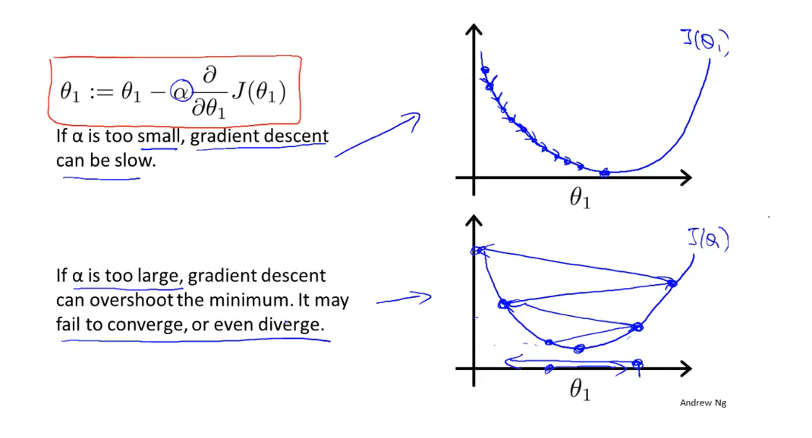

## 1. Introduction
目前存在集中不同的机器学习算法，大概可以分为两种，一种是监督学习，另一种是无监督学习。
- 监督学习：给定已有正确的数据集，运用这些样本学习算法，算出更正确的结果。
    - 回归问题：算法的输出为连续的值，即定量输出
    - 分类问题：算法的输出为离散的值，即定性输出
- 无监督学习：没有正确答案，只有一个数据集，让算法从中找到某种结构，典型例子就是聚类算法。

    鸡尾酒晏例子：看图

    

用算法把声音和音乐分开，使用Octave仅需要一行代码：
```octave
[W,s,v] = svd((repmat(sum(x.*x,1),size(x,1),1).*x)*x');
```

### 2. 单变量线性回归(Linear Regression with One Variable)

房价例子（监督学习/回归问题）：给定正确的俄勒冈州波特兰市的住房价格数据集，预测Size条件下房价Price的值；看图：


假如这个回归问题的训练集如图所示：


那么，在这里，我们把这个问题标记如下：

- m代表训练集中实例的数量
- x代表特征/输入变量
- y代表目标变量/输出变量
- (x,y)代表训练集中的实例
- 代表第i个观察实例
- h代表学习算法的解决方案或函数也称为假设（hypothesis）


这个是监督学习的工作方式，其中h根据x的输入得出y值，那么也可以说h是从x到y的函数映射

我将选择最初的使用规则h代表hypothesis，因而，要解决房价预测问题，我们实际上是要将训练集“喂”给我们的学习算法，进而学习得到一个假设h，然后将我们要预测的房屋的尺寸作为输入变量输入给h，预测出该房屋的交易价格作为输出变量输出为结果。那么，对于我们的房价预测问题，我们该如何表达 ？
一种可能的表达式为：，因为只含有一个特征/输入变量，因此这样的问题叫作单变量线性回归问题。

那么代价函数(Cost Function)就为：
这里的1/2m的参数无论怎么改变，其实都是一样的，只不过最后的曲线会小一些罢了

我们的目标就是调整和使代价函数的结果最小，即使得出的函数曲线尽量贴合数据

相关的式子：


我们将简化为)
代价函数在时，=0)，左边的函数曲线（直线）对应了所有的数据，


### 3. 轮廓图（等高线图）

略

### 4. 梯度下降

梯度下降是很常用的解决线性回归，最小化函数的方式；我们在这里使用梯度下降算法求代价函数的最小值。

梯度下降的思想是，给定一系列θ值，然后我们找到一个能让代价函数下降最多的值的集合，然后重复这个步骤知道找到局部的最小值（local minimum），但是我们没有尝试完所有的组合，所以这个最小值不是全局最小值（global minimum）

梯度下降的过程如图所示：


**批量梯度下降（batch gradient descent）**算法的公式为：


- α是学习率（learning rate），它决定了我们让代价函数下降的步长。
- 在批量梯度下降中，我们每一次都会让所有的参数同时变化（即所有的参数减去学习速率乘以代价函数的导数）
- 和其实是微分项

#### 梯度下降的直观理解

举例，我们的梯度下降算法如下：

))

描述：对θ赋值，使得按梯度下降最快方向进行，一直迭代下去，最终得到局部最小值。其中α是学习率（learning rate），它决定了我们沿着能让代价函数下降程度最大的方向向下迈出的步子有多大。

对于这个问题，变成了求下图红色斜线的斜率，也就是那条红色的切线，当我们娶到如图中的切点时，我们求导得到了正斜率，这个式子就变成了)
通过它，我们得到了一个新的，这个等于减去一个正数的斜率乘以


这里涉及到了两个问题：
- 太大或者太小会出现什么情况？
- 如果直接把放在局部最低点，接下来梯度下降算法该怎么做？

首先第一个问题，太大的话梯度下降法可能会直接越过最低点，甚至无法收敛


