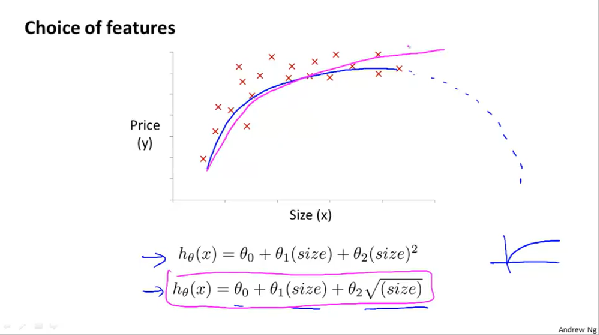

# 1. 多变量线性回归(Linear Regression with Multiple Variables)

## 1.1 多维特征
目前为止，我们探讨了单变量/特征的回归模型，现在我们对房价模型增加更多的特征，例如房间数楼层等，构成一个含有多个变量的模型，模型中的特征为)。

话不多说一图流：

- n为特征的数量
- }})代表第  个训练实例，是特征矩阵中的第行，是一个**向量**（**vector**）。

比方说，上图

- }\text{=}\begin{bmatrix}&space;1416\\\&space;3\\\&space;2\\\&space;40&space;\end{bmatrix})

})代表特征矩阵中第 行的第  个特征，也就是第  个训练实例的第  个特征，如上图的}=3,x_{3}^{\left(&space;2&space;\right)}=2)；

- 多维特征的假设表示为：={\theta_{0}}&plus;{\theta_{1}}{x_{1}}&plus;{\theta_{2}}{x_{2}}&plus;...&plus;{\theta_{n}}{x_{n}})，
那么假设有}=1)，那么上式就可以转换为={\theta_{0}}{x_{0}}&plus;{\theta_{1}}{x_{1}}&plus;{\theta_{2}}{x_{2}}&plus;...&plus;{\theta_{n}}{x_{n}})，
那么把转成，即这个n+1维的行向量与n+1维的X相乘，即={\theta^{T}}X)
话不多说再加个图：

##  2.2 多变量梯度下降

 
如图所示，我们假设$\theta_0$项乘以一个$x_0$，那么，常数参数$\theta_0$, $\theta_1$...可以看作是一个向量$\theta$ ，那么看图，梯度下降算法的第二项中被框起来的部分，可以看作是求以向量$\theta$为参数的代价函数的偏导数

即： 

求偏导后得：

## 2.3 梯度下降技巧——特征缩放（feature scalling）

**在我们面对多维特征问题的时候，我们要保证这些特征都具有相近的尺度，这将帮助梯度下降算法更快地收敛。**

以房价问题为例，假设我们使用两个特征，房屋的尺寸和房间的数量，尺寸的值为 0-2000平方英尺，而房间数量的值则是0-5，以两个参数分别为横纵坐标，绘制代价函数的等高线图能，看出图像会显得很扁，梯度下降算法需要非常多次的迭代才能收敛。

解决的方法是尝试将所有特征的尺度都尽量缩放到-1到1之间。如图：

最简单的方法是令：，其中 是平均值，是标准差。

## 2.4 梯度下降技巧——学习率
虽然梯度下降算法在理论上，代价函数可以自行收敛到最小，但是学习率α也是决定收敛效果如何的关键因素。

梯度下降算法的每次迭代受到学习率的影响，如果学习率过小，则达到收敛所需的迭代次数会非常高；如果学习率过大，每次迭代可能不会减小代价函数，可能会越过局部最小值导致无法收敛。

正常情况，代价函数J(θ)的变化情况大体如下图所示：

贴一张直观点的图

对于梯度下降何时收敛，我们进行自动收敛测试，也就是用一种算法，告诉你这个梯度下降算法何时收敛，举一个例子，如果J(θ)小于某些阈值，比如0.001、0.01、0.1等时，可以判断梯度下降算法收敛，但是这个阈值很难决定用哪些。

所以，还是看J(θ)的变化曲线，并且这个曲线也可以提前报告于你这个算法的运行情况，参考上图的描述，改变α，课程中α的值给的例子是

## 2.5 特征与多项式回归

举例，还是房价问题

假设h(θ)如下，={\theta_{0}}&plus;{\theta_{1}}\times{frontage}&plus;{\theta_{2}}\times{depth})

注意frontage和depth，这两个特征其实可以化成一个特征，即把这两个相乘为面积（），那么假设h(θ)为：

={\theta_{0}}&plus;{\theta_{1}}area)

所以，灵活利用特征的特征很重要

上例给出数据集如下：

对于这段数据，我们可以给出二次模型来拟合，但是二次函数曲线在size(即area)达到一定数值后就回下降，这显然不符合常理，所以，可以使用三次函数：={\theta_{0}}&plus;{\theta_{1}}{x_{1}}&plus;{\theta_{2}}{x_{2}^2}&plus;{\theta_{3}}{x_{3}^3})

根据函数图形特性，我们还可以使：

={{\theta&space;}_{0}}\text{&plus;}{{\theta&space;}_{1}}(size)&plus;{{\theta}_{2}}{{(size)}^{2}})

或者:

={{\theta&space;}_{0}}\text{&plus;}{{\theta&space;}_{1}}(size)&plus;{{\theta&space;}_{2}}\sqrt{size})

以期达到这样的效果：

上例总结如下：

如果我们采用多项式回归模型，特征的归一化是必要的，这样才能使数据变得有可比性。

## 2.6 正规方程

某些时候用正规方程是更好的解决方案；如下图：假设这是一个关于实数θ的二次函数J(θ)

那么我们最小化这个二次函数的方法是对它求导，令导数=0之后求出的就是令J(θ)最小的θ值。

**推导过程**

}^{-1}}{X^{T}}y) 的推导过程：

=\frac{1}{2m}\sum\limits_{i=1}^{m}{{{\left(&space;{h_{\theta}}\left(&space;{x^{(i)}}&space;\right)-{y^{(i)}}&space;\right)}^{2}}})
其中：={\theta^{T}}X={\theta_{0}}{x_{0}}&plus;{\theta_{1}}{x_{1}}&plus;{\theta_{2}}{x_{2}}&plus;...&plus;{\theta_{n}}{x_{n}})

将向量表达形式转为矩阵表达形式，则有=\frac{1}{2}{{\left(&space;X\theta&space;-y\right)}^{2}}) ，其中为行列的矩阵（为样本个数，为特征个数），为行1列的矩阵，为行1列的矩阵，对)进行如下变换

=\frac{1}{2}{{\left(&space;X\theta&space;-y\right)}^{T}}\left(&space;X\theta&space;-y&space;\right))

​     \left(X\theta&space;-y&space;\right))

​     )

接下来对)偏导，需要用到以下几个矩阵的求导法则:

所以有:

}{\partial&space;\theta&space;}=\frac{1}{2}\left(2{{X}^{T}}X\theta&space;-{{X}^{T}}y&space;-{}({{y}^{T}}X&space;)^{T}-0&space;\right))

)

​           

令}{\partial&space;\theta&space;}=0),

则有}^{-1}}{X^{T}}y)

梯度下降与正规方程的比较：

| 梯度下降             | 正规方程                                     |
| ---------------- | ---------------------------------------- |
| 需要选择学习率  | 不需要                                      |
| 需要多次迭代           | 一次运算得出                                   |
| 当特征数量大时也能较好适用 | 需要计算}^{-1}}) 如果特征数量n较大则运算代价大，因为矩阵逆的计算时间复杂度为)，通常来说当小于10000 时还是可以接受的 |
| 适用于各种类型的模型       | 只适用于线性模型，不适合逻辑回归模型等其他模型                  |

总结一下，只要特征变量的数目并不大，标准方程是一个很好的计算参数的替代方法。具体地说，只要特征变量数量小于一万，通常使用正规方程法，而不使用梯度下降法。

随着我们要讲的学习算法越来越复杂，例如，当我们讲到分类算法，像逻辑回归算法，我们会看到，实际上对于那些算法，并不能使用标准方程法。