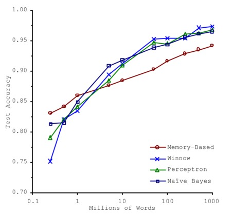

## sk&tf实用指南笔记
1.4.1 数据训练不足
在 2001 年发表的著名文章里，微软研究员 Michele Banko 和 Eric Brill 展示了不同的机器学习算法在一个较复杂的自然语言消歧问题上的表现情况，他们发现一旦有足够多的训练数据，各算法的表现都基本一致（如下图所示）。

但小型和中等数量的数据集仍然非常常见，而且想要获得大量的训练数据通常并不是一件简单的事情，所以还不能抛弃算法。

1.4.2 没有代表性的训练数据

使用有代表性的训练数据是非常重要的。但这通常比较困难，如果样本太少，容易引入采样噪声（即非代表性的数据）；即使是很多样本，如果采样方法有缺陷，也可能得到不好的数据，这被称为采样偏差（sampling bias）。

