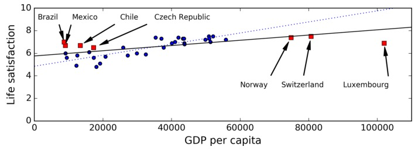

## sk&tf实用指南笔记
### 1.4.1 数据训练不足
在 2001 年发表的著名文章里，微软研究员 Michele Banko 和 Eric Brill 展示了不同的机器学习算法在一个较复杂的自然语言消歧问题上的表现情况，他们发现一旦有足够多的训练数据，各算法的表现都基本一致（如下图所示）。

但小型和中等数量的数据集仍然非常常见，而且想要获得大量的训练数据通常并不是一件简单的事情，所以还不能抛弃算法。

### 1.4.2 没有代表性的训练数据

使用有代表性的训练数据是非常重要的。但这通常比较困难，如果样本太少，容易引入采样噪声（即非代表性的数据）；即使是很多样本，如果采样方法有缺陷，也可能得到不好的数据，这被称为采样偏差（sampling bias）。

### 1.4.3 低质量数据

清洗数据的重要性是不用多说的：
- 对于离群点，通常的办法是剔除这个实例或者手动修正这个错误。
- 对于有特征缺失值的情况，可以选择
  - 删除这个特征
  - 删除缺失特征的实例样本
  - 填充缺失值（中值或平均值）
  - 分别训练包含该特征和不包含该特征的两个模型对比效果等方法

### 1.4.4 不相干特征
机器学习需要提取一些重要的特征来训练，提取特征并处理的过程我们称之为特征工程，具体包含：
- 特征选择：选择最有用的特征训练
- 特征提取：结合已有的特征产生更有用的特征（降维等）
- 通过收集新数据创建新特征

### 1.4.5 过拟合

诸如深层神经网络这种复杂模型可以检测出数据中的细微模式，但是如果训练集包含噪声，或者样本不多（带来采样噪声），模型很可能会拟合到了噪声本身的模式，带来过拟合。

当模型过于复杂时，容易发生过拟合，常用的解决办法是
- 选择少量的特征/简化模型，例如选择线性模型，而不是高阶模型。
- 获取更多的训练数据
- 减少训练数据中的噪声，例如修复数据的错误，移除离群点（打标QAQ）

限制模型复杂度，让它变简单，减少过拟合风险的做法称之为正则化。

我们的目标就是在完美拟合数据和简化模型之间找到平衡，让模型具有较好的泛化能力。

下图展示了三种模型：蓝色点线表示原始的线性模型，缺少一些国家的数据；红色短划线表示第二个线性模型，使用了所有国家的数据训练得到的；蓝色实线表示的模型与第一个类似，只是使用了正则化限制。可以看出正则化使得模型的斜率变小，对训练数据的拟合效果比第一种差一些，但是对新样本的拟合效果比第一种更好，泛化能力变强了。

正则化的程度由超参数控制。超参数是算法的参数（不是模型的参数），不受算法本身的影响。超参数在训练模型之前就设置好，整个训练过程中保持不变。如果将超参数设置很大的值，将会得到一个近似平坦的模型（斜率接近 0 ）。这时候不太可能出现过拟合，但是模型过于简单，对数据的拟合效果很差。这种情况叫做欠拟合，它和过拟合是两个对立的概念。

### 1.4.6 欠拟合
正如上文所说，欠拟合是与过拟合对立的概念：它发生在模型过于简单以至于不能很好地拟合数据的时候。

解决欠拟合得主要方法有：

- 选择更加强大得模型，带有更多参数。
- 增加更好得特征到学习算法中（特征工程）。
- 减小对模型的限制（例如减小正则化超参数）。

### 1.4.7 回顾
到目前为止，我们已经学习了很多机器学习概念知识，下面做个简单回顾：

- 机器学习就是让机器能够从数据中学习，在某些任务中做得更好，而不是简单地执行固定的程序。
- 机器学习类型有很多：监督式和非监督式，批量学习和在线学习，基于实例学习和基于模型学习等。

- 在一个机器学习工程中，我们收集数据作为训练集，使用学习算法在训练集上进行训练。如果算法是基于模型的，得到最佳的模型参数，使模型能够拟合训练集，并且对训练集之外的样本也能有较好的拟合效果。如果算法是基于实例的，学习过程就是简单的记忆，并使用相似性测量来归纳到新的样本中。

- 以下因素可能造成系统表现不好：训练集样本太少，数据不具有代表性，数据有噪声，受到不相关特征的污染。最后，模型不能过于简单（欠拟合），也不能过于复杂（过拟合）。

还有一点需要讨论：一旦训练了一个模型，不能仅仅是“希望”它的泛化能力好，我们还要去评估这个模型，必要的时候调试模型。下面就来介绍怎么去调试模型。

###1.5 测试和验证
通常把数据集划分为数据集和训练集。模型在新样本下的错误率被称为泛化误差（又叫样本外误差，out-of-sample error）。

如果模型的训练误差（模型在训练集上的误差）很小，而泛化误差很大，则说明模型很可能发生了过拟合。

问题在于我们是在同一测试集上多次测量泛化误差的，这样产生的最佳模型是适应测试集的，可能造成模型在测试集之外新的样本上表现得不太好。

解决这一问题通常的做法是除了设置训练集、测试集之外，还设置一个验证集。同样使用训练集来训练不同超参数的模型，每个模型在验证集上进行验证，选择表现最好的超参数对应的模型，最后该模型在测试集上进行测试得到的误差为最终的泛化误差。

为了避免验证集占用过多的训练样本，造成浪费，通常使用交叉验证（cross-validation）：将整个训练集划分为 N 份，取其中的 N-1 份作为训练集，另外的 1 份作为验证集，重复 N 次。然后将 N 次的验证误差求平均作为验证误差。一旦模型和超参数选定之后，使用该模型和超参数，在整个训练集上进行训练。最后，在测试集上测试得到泛化误差。

**无免费午餐定理**

模型是样本观测的一种简化。简化意味着丢弃一些多余的不具备泛化能力的细节。然而，决定哪些数据保留，哪些数据抛弃，我们必须做出假设。

## 数据获取与清洗
### 2.1 明确商业目标

目标决定了如何规划问题，选择什么算法，使用什么性能测量方式来评估模型，以及在调试的时候花费的时间。

- 数据处理组件的序列叫做数据管道（pipeline）。管道在机器学习系统中很常见，因为有许多数据要处理和转换。

  管道的各个组件是异步进行的。每个组件都会输入大量数据并处理，然后将结果传输给管道的下一个组件，下一个组件继续处理并输出结果，依次进行。每个组件相对独立，组件之间的接口就是简单的数据存储。这让系统更加简单且容易掌控（借助数据流程图），不同的团队可以专注于各自的组件。而且，即便是某个组件崩溃了，下游组件仍然能使用之前上游输出的数据进行正常工作（至少在一段时间内）。这让整个系统更加健壮。

  然而从另一方面来说，如果不能及时发现崩溃的组件，下游组件输入数据得不到及时更新，整个系统的性能也会下降。

- 下一步就要选择评估模型的性能指标。

  回归问题典型的性能指标是均方根误差（Root Mean Square Error, RMSE），即测量系统预测误差的标准差。

  

  其实就是代价函数开了个平方

  除了 RMSE 之外，还有其它性能指标。例如出现某些离群点，这种情况下可以使用平均绝对误差（Mean Absolute Error, MAE）作为性能指标。公式如下：

  
