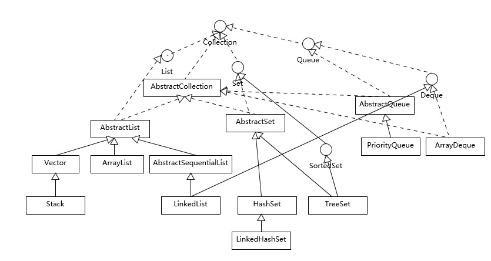

1. 什么是集合？

   集合是Java提供的数据结构和算法的api。不需要像C一样另造轮子，就能使用数据结构和算法了。

   ​

2. Collection接口

    

   

3. List

   

   - ArrayList:
     ```java
        package jihe.list;

        /**
         * 手写ArrayList
         * 底层维护了数组，增删效率低，查询效率高
         * @author xiasj
         *
         */
        public class TestArrayList<E> {

        	//List维护此数组
        	private Object[] elementData;
        	private int size;
        	//如果New一个新的ArrayList但是没指定默认大小，则设为10
        	private static final int DEFALT_CAPACITY=10;
        	/**
        	 * 构造
        	 */
        	public TestArrayList() {
        		elementData=new Object[DEFALT_CAPACITY];
        	}
        	public TestArrayList(int capacity) {
        		if(capacity<0) {
        			throw new RuntimeException("容量不合法"+capacity);
        		}else if(capacity==0){
        			elementData=new Object[DEFALT_CAPACITY];
        		}
        		elementData=new Object[capacity];
        	}

        	/**
        	 * get
        	 */
        	public E get(int index) {
        		return (E)elementData[index];
        	}
        	/**
        	 * set
        	 */
        	public void set(E element,int index) {

        		//对索引index判断
        		if(size<0 || index>size-1) {
        			throw new RuntimeException("索引不合法"+index);
        		}
        		elementData[index]=element;
        	}
        	/**
        	 * 扩容
        	 * @param element
        	 */
        	public void add(E element) {
        		//什么时候扩容
        		if(size==elementData.length) {
        			//扩容
        			Object[] newArray=new Object[elementData.length+(elementData.length>>1)];//x>>n=x/(2^n)
        			System.arraycopy(elementData, 0, newArray, 0, elementData.length);
        			elementData=newArray;

        		}
        		elementData[size++]=element;
        	}

        	/**
        	 * remove
        	 * 会完成自己给自己拷贝，把index后面的元素都拷贝一遍，所以效率低
        	 */
        	public void remove(E element) {
        		//将element和所有元素比较，第一个为true的，返回
        		for (int i = 0; i < size; i++) {
        			if(element.equals(get(i))) {

        				//将该元素从此处移除
        				remove(i);
        			}
        		}

        	}

        	public void remove(int index) {
        		//A B C D 删除1位置的B
        		//A C D 会完成自己给自己拷贝，把index后面的元素都拷贝一遍，所以效率低
        		if(elementData.length-index-1>0) {
        			System.arraycopy(elementData, index+1, elementData, index, elementData.length-index-1);
        		}

        		elementData[--size]=null;

        	}

        	@Override
        	public String toString() {
        		StringBuilder sb=new StringBuilder();

        		sb.append("[");
        		for(int i=0;i<size;i++) {
        			sb.append(elementData[i]+",");
        		}
        		sb.setCharAt(sb.length()-1,']');

        		return sb.toString();

        	}
        	public static void main(String[] args) {
        		TestArrayList<String> tl=new TestArrayList<String>();
        		for (int i = 0; i <100; i++) {
        			tl.add("text"+i);
        		}
        		tl.set("xxx", 1);
        		System.out.println(tl);

        		tl.remove(1);
        		System.out.println(tl);
        	}
        }

     ```
   - LinkedList:
     ```java
     package jihe.list;

     import javax.management.RuntimeErrorException;

     /**
      * 为双向链表：查询效率低，增删效率高线程不安全
      * 每个节点有
      * class  Node {
     		Node  previous;	  //前一个节点
     		Object  element;    //本节点保存的数据
     		Node  next;		  //后一个节点
        }
        删除ax就把ax-1的next指向ax+1，ax+1的previous指向ax-1
      *
      * @author xiasj
      *
      */
     public class TestLinkedList<E> {

     	private Node first;
     	private Node last;

     	private int size;

     	public TestLinkedList() {


     	}


     	/**
     	 * get
     	 * @param index
     	 * @return
     	 */
     	public E get(int index) {
     		checkIndex(index);
     		return getNode(index)!=null?(E)getNode(index).element:null;

     	}
     	/**
     	 *
     	 * @param index
     	 */
     	private void checkIndex(int index) {
     		if(index<0 || index>size-1) {
     			throw new RuntimeException("index不合法");
     		}
     	}
     	/**
     	 * getNode得到制定节点
     	 */
     	public Node getNode(int index) {
     		checkIndex(index);
     		Node temp=first;
     		//遍历节点直到index位置的节点然后返回，二分法
     		if(index<size>>1) {
     			for (int i = 0; i < index; i++) {
     				temp=temp.next;
     			}
     		}else{
     			temp=last;
     			for (int i = size-1; i > index; i--) {
     				temp=temp.previous;
     			}
     		}
     		return temp;
     	}

     	/**
     	 * add
     	 *
     	 */
     	public void add(int index,E element) {
     		checkIndex(index);
     		Node newNode =new Node(element);
     		Node temp= getNode(index);
     		if(temp!=null && index!=0 && index!=size-1) {
     			Node pre=temp.previous;
     			Node nex=temp.next;
     			pre.next=newNode;
     			newNode.previous=pre;

     			newNode.next=temp;
     			temp.previous=newNode;

     		}
     		if(index==0){
     			newNode.next=temp;
     			first=newNode;
     			temp.previous=newNode;
     			System.out.println(temp.previous);
     		}else if (index==size-1) {
     			newNode.previous=temp;
     			last=newNode;
     			temp.next=newNode;
     		}
     		size++;
     	}

     	// ["a","b"]加入["c"]或[]加入["c"]
     	public void add(E element) {
     		Node node =new Node(element);
     		//如果没有节点，那么first和last都是我node
     		if(first==null) {
     			first =node;
     			last=node;

     		}else {
     			//如果新加节点内容为node("c")，那么这个新节点的previous=最后一个last("b")
     			node.previous=last;
     			//新节点的下一个为null
     			node.next=null;

     			//原来的last指向新节点node("c")，新节点再换成last节点
     			last.next=node;
     			last=node;


     		}
     		size++;
     	}
     	/**
     	 * remove
     	 */
     	public void remove(int index) {
     		checkIndex(index);
     		Node temp=getNode(index);

     		if(temp!=null) {
     			Node pre=temp.previous;
     			Node nex=temp.next;
     			if(pre!=null) {
     				pre.next=nex;

     			}
     			if(nex!=null) {
     				nex.previous=pre;
     			}

     			if(index==0){
     				first=nex;
     			}else if (index==size-1) {
     				last=pre;
     			}


     			size--;
     		}
     	}
     	/**
     	 * 重写toString
     	 * @param args
     	 * @return
     	 */
     	public String toString() {
     		StringBuilder sb=new StringBuilder("[");
     		Node temp=first;
     		while(temp!=null) {
     			sb.append(temp.element+",");
     			temp=temp.next;
     		}
     		sb.setCharAt(sb.length()-1, ']');
     		return sb.toString();
     	}

     	public static void main(String[] args) {
     		TestLinkedList<String> ll=new TestLinkedList<String>();
     		ll.add("a");
     		ll.add("b");
     		ll.add("c");
     		ll.add("d");
     		ll.add("e");
     		System.out.println(ll.toString()+" "+ll.size);
     		ll.remove(3);
     		System.out.println(ll.toString()+" "+ll.size);
     		ll.remove(3);
     		System.out.println(ll.toString()+" "+ll.size);
     		ll.add(0,"a1");
     		ll.add(3,"a1");
     		System.out.println(ll.toString()+" "+ll.size);
     	}
     }

     ```
   - Vector:
     Vector底层是用数组实现的List，相关的方法都加了同步检查，因此“线程安全,效率低”。

4. Map

   

   - HashMap: 线程不安全，效率高。允许key或value为null；
        JDK1.8 之前 HashMap 由 数组+链表 组成的，数组是 HashMap 的主体，链表则是主要为了解决哈希冲突而存在的（“拉链法”解决冲突）
        .JDK1.8 以后在解决哈希冲突时有了较大的变化，当链表长度大于阈值（默认为 8）时，将链表转化为红黑树，以减少搜索时间。
   - HashTable: 线程安全，效率低。不允许key或value为null。
   - HashMap源码分析：
     1. 数据存储可以由数组和链表进行存储，它们有各自的特点：
        - 数组：占用的是连续的空间，随机访问快，但是增加删除效率低；
        - 链表：占用的是不连续的空间，访问慢，增加和删除快
        那么，结合了数组和链表的哈希表就非常重要了,好接下来分析源码：
     2. 源码：(Jdk1.7)
        数组+链表，
        1.HashMap通过key的hashcode通过“扰动函数”处理后得到hash值，
        2.然后通过hash&(n-1)得到存放到数组的位置，
        3.生成Entry对象，一个Entry对象包括 hash,key,value,指向下一个Entry对象的引用；
        4.如果当前位置存在元素的话，就判断该元素与要存入的元素的 hash 值以及 key 是否相同，
        如果相同的话，直接覆盖，不相同就通过拉链法解决冲突。

        **扰动函数**：就是hash方法，目的是：
            把hashcode这个整数，转化到[0,length-1]的范围内，但是要求尽量均匀的分布在其中，以减少hash冲突。
            jdk1.8在这进行了修改：
            由
            ```java
                h ^= (h >>> 20) ^ (h >>> 12);
                return h ^ (h >>> 7) ^ (h >>> 4);
            ```
            变成了
            ```java
                return (key == null) ? 0 : (h = key.hashCode()) ^ (h >>> 16);
            ```
            扰动了1次提升了效率。
        - 加载因子：loadFactor加载因子是控制数组存放数据的疏密程度，loadFactor越趋近于1，那么 数组中存放的数据(entry)也就越多，也就越密，也就是会让链表的长度增加，load Factor越小，也就是趋近于0，
          loadFactor太大导致查找元素效率低，太小导致数组的利用率低，存放的数据会很分散。loadFactor的默认值为0.75f是官方给出的一个比较好的临界值。 　

        - HashMap的部分源码：
            ```java
            public class HashMap<K,V> extends AbstractMap<K,V> implements Map<K,V>, Cloneable, Serializable {
                // 序列号
                private static final long serialVersionUID = 362498820763181265L;
                // 默认的初始容量是16
                static final int DEFAULT_INITIAL_CAPACITY = 1 << 4;
                // 最大容量
                static final int MAXIMUM_CAPACITY = 1 << 30;
                // 默认的填充因子
                static final float DEFAULT_LOAD_FACTOR = 0.75f;
                // 当桶(bucket)上的结点数大于这个值时会转成红黑树
                static final int TREEIFY_THRESHOLD = 8;
                // 当桶(bucket)上的结点数小于这个值时树转链表
                static final int UNTREEIFY_THRESHOLD = 6;
                // 桶中结构转化为红黑树对应的table的最小大小
                static final int MIN_TREEIFY_CAPACITY = 64;
                // 存储元素的数组，总是2的幂次倍
                transient Node<k,v>[] table;
                ...
            }

            ```
            Node节点：
            ```java
            // 继承自 Map.Entry<K,V>
            static class Node<K,V> implements Map.Entry<K,V> {
                   final int hash;// 哈希值，存放元素到hashmap中时用来与其他元素hash值比较
                   final K key;//键
                   V value;//值
                   // 指向下一个节点
                   Node<K,V> next;
                   Node(int hash, K key, V value, Node<K,V> next) {
                        this.hash = hash;
                        this.key = key;
                        this.value = value;
                        this.next = next;
                    }
                    public final K getKey()        { return key; }
                    public final V getValue()      { return value; }
                    public final String toString() { return key + "=" + value; }
                    // 重写hashCode()方法
                    public final int hashCode() {
                        return Objects.hashCode(key) ^ Objects.hashCode(value);
                    }

                    public final V setValue(V newValue) {
                        V oldValue = value;
                        value = newValue;
                        return oldValue;
                    }
                    // 重写 equals() 方法
                    public final boolean equals(Object o) {
                        if (o == this)
                            return true;
                        if (o instanceof Map.Entry) {
                            Map.Entry<?,?> e = (Map.Entry<?,?>)o;
                            if (Objects.equals(key, e.getKey()) &&
                                Objects.equals(value, e.getValue()))
                                return true;
                        }
                        return false;
                    }
            }
            ```
            put方法：
            ```java
            final V putVal(int hash, K key, V value, boolean onlyIfAbsent,
                           boolean evict) {
                Node<K,V>[] tab; Node<K,V> p; int n, i;
                //如果table==0/null，则进行扩容
                if ((tab = table) == null || (n = tab.length) == 0)
                    n = (tab = resize()).length;
                //确定位置
                if ((p = tab[i = (n - 1) & hash]) == null)
                    tab[i] = newNode(hash, key, value, null);
                else {
                    Node<K,V> e; K k;
                    // 比较有没有值
                    if (p.hash == hash &&
                        ((k = p.key) == key || (key != null && key.equals(k))))
                        e = p;
                        // 是否为树节点
                    else if (p instanceof TreeNode)
                        e = ((TreeNode<K,V>)p).putTreeVal(this, tab, hash, key, value);
                        // 链表
                    else {
                    // 找到链表最后
                        for (int binCount = 0; ; ++binCount) {
                            if ((e = p.next) == null) {
                                p.next = newNode(hash, key, value, null);
                                // 长度大8 转为红黑树
                                if (binCount >= TREEIFY_THRESHOLD - 1) // -1 for 1st
                                    treeifyBin(tab, hash);
                                break;
                            }
                            if (e.hash == hash &&
                                ((k = e.key) == key || (key != null && key.equals(k))))
                                break;
                            p = e;
                        }
                    }
                    if (e != null) { // existing mapping for key
                        V oldValue = e.value;
                        if (!onlyIfAbsent || oldValue == null)
                            e.value = value;
                        afterNodeAccess(e);
                        return oldValue;
                    }
                }
                ++modCount;
                if (++size > threshold)
                    resize();
                afterNodeInsertion(evict);
                return null;
            }
            ```
5. ConcurrentHashMap
